# C++L Architecture

This document defines the implementation architecture of C++L.

It describes:

- compiler stages
- component ownership
- dependency direction
- data flow
- verification flow
- C++ / Clang integration
- proof-kernel boundaries
- runtime lowering and proof erasure
- diagnostics
- incremental verification
- caching
- editor integration
- concurrency
- testing
- CI
- packaging
- release architecture

It does **not** redefine language semantics or trust policy.

Authoritative documents:

```text
SPEC.md
    language semantics

TRUST.md
    Trusted Computing Base and trust boundaries

FOUNDATIONS.md
    mathematical foundations

DESIGN.md
    design rationale

COMPATIBILITY.md
    C++ / ABI / ecosystem compatibility

STATUS.md
    implementation maturity

ARCHITECTURE.md
    implementation structure and data flow
```

---

# 1. Architectural mission

C++L is a source-compatible C++ superset that adds formal specification and machine-checkable proof while preserving the C++ runtime, ABI, ecosystem, and native toolchain.

The architecture must support:

```text
ordinary C++
+
C++L formal constructs
+
machine-checkable proofs
+
incremental adoption
+
ordinary Clang / LLVM native output
```

The compiler must not introduce a mandatory theorem runtime, VM, garbage collector, or alternative execution environment.

The target system is:

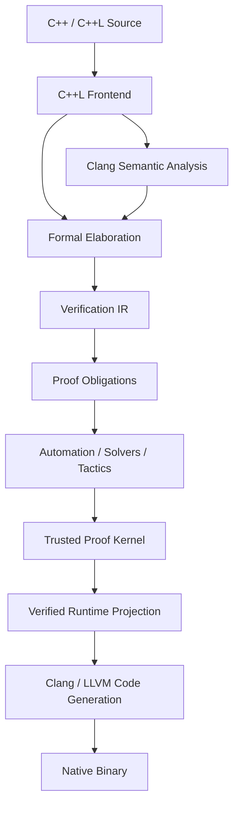

The architecture has one fundamental rule:

> Formal proof authority and native code generation are separate responsibilities.

---

# 2. Architectural invariants

The following invariants are mandatory.

## 2.1 One proof authority

The final authority for theorem validity is the trusted proof kernel.

```text
frontend       ─┐
elaborator      │
solver          ├── produce evidence
tactics         │
AI              │
                 ↓
              kernel
                 ↓
              accept
               or
              reject
```

No other component may independently promote a proposition to `PROVEN`.

---

## 2.2 One runtime semantic path

The runtime program verified by C++L must be the same runtime program supplied to Clang/LLVM for native compilation.

Do not maintain:

```text
verification implementation
```

and separately:

```text
runtime implementation
```

that can drift.

The compiler must derive both from the same authoritative lowered representation.

---

## 2.3 C++ semantics are not reimplemented unnecessarily

Clang remains authoritative for ordinary C++ semantics where practical.

C++L should consume Clang semantic information for:

- parsing ordinary C++
- declarations
- types
- name lookup
- overload resolution
- template instantiation
- concepts
- conversions
- constexpr
- object layout
- ABI information
- source locations

C++L adds formal semantics.

It does not attempt to create a second independent implementation of C++.

---

## 2.4 C++L-specific syntax is isolated

C++L syntax must not contaminate ordinary C++ semantics.

The frontend owns:

- C++L contextual constructs
- formal declarations
- proof syntax
- ghost syntax
- C++L runtime extensions where defined

Clang owns ordinary C++ semantics after C++L-specific syntax has been projected into valid ordinary C++.

---

## 2.5 Proof-only information cannot affect runtime behavior

Proof and ghost information may influence whether compilation succeeds.

It must not silently influence runtime execution after erasure.

---

## 2.6 Unsupported verification fails closed

Unsupported formal semantics must result in:

```text
UNVERIFIED
UNSAFE
TRUSTED
UNRESOLVED
```

as appropriate.

They must never silently become:

```text
PROVEN
```

---

## 2.7 Incremental adoption is architectural

An ordinary C++ project must not need wholesale migration to C++L.

The architecture must support:

```text
ordinary C++
    +
verified C++L regions
    +
explicit boundaries
```

inside the same application.

---

## 2.8 Determinism is designed in

Semantic identities, proof results, cache keys, artifact formats, and kernel checking must not depend on unstable process state such as:

- memory addresses
- thread scheduling
- filesystem iteration order
- wall-clock time
- non-recorded randomness

---

# 3. System context

C++L sits between existing developer tooling and the native C++ toolchain.

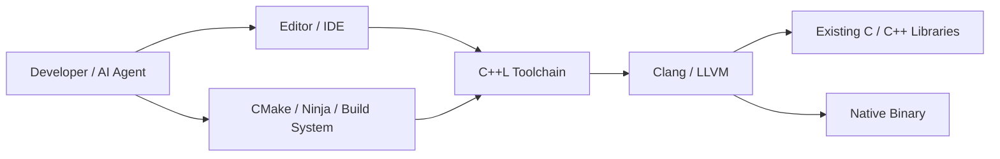

C++L should integrate with existing build systems rather than replace them.

---

# 4. Major components

The compiler is divided into components with explicit responsibilities.

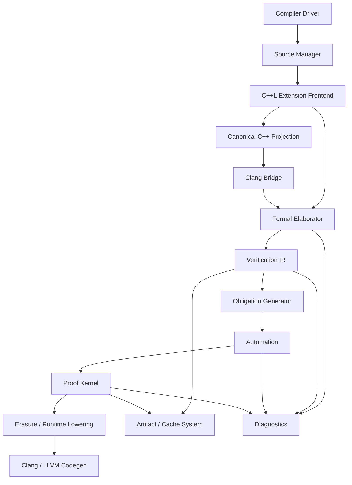

---

# 5. Compiler driver

The compiler driver is the user-facing orchestration layer.

Target command:

```bash
cppl main.cpp
```

The driver should behave as closely as practical to a Clang-compatible compiler driver.

Responsibilities:

- parse C++L-specific command-line options
- preserve compatible Clang options
- resolve target triple
- resolve C++ standard mode
- establish verification policy
- construct compilation graph
- invoke compiler stages
- manage artifacts
- coordinate diagnostics
- invoke Clang/LLVM backend
- determine final process exit status

The driver is **not** a proof authority.

---

# 6. Compilation modes

Verification policy belongs in the driver/policy layer rather than being hard-coded into proof semantics.

The architecture should support at least:

```text
compatibility
verification
strict verification
```

Conceptually:

```bash
cppl main.cpp

cppl --verify main.cpp

cppl --require-fully-verified main.cpp
```

## Compatibility mode

Ordinary supported C++ is allowed.

Explicit C++L verification constructs are checked.

Unverified ordinary regions may remain.

## Verification mode

All explicitly requested verification obligations must succeed.

Ordinary unverified code may remain where policy permits.

## Strict verification mode

Configured non-proven statuses may cause the build to fail.

For example:

```text
UNVERIFIED
UNSAFE
TRUSTED
UNRESOLVED
```

The proof engine determines facts.

The policy layer determines whether those facts permit the requested build.

---

# 7. Source manager

The source manager owns source identity and location mapping.

Responsibilities:

- source files
- include relationships
- stable file identities
- source ranges
- macro provenance
- generated-source mappings
- C++L-to-C++ projection mappings
- diagnostic locations
- content hashing

No downstream component should invent independent source-location systems.

The source manager must preserve enough provenance to map:

```text
kernel obligation
    ↓
VIR
    ↓
Clang semantic entity
    ↓
original C++L source
```

---

# 8. C++L extension frontend

The C++L frontend parses only semantics that C++ itself does not already own.

Examples may include:

```text
law
proof
ghost
pure
verified
trusted
unsafe
refinement syntax
C++L-specific type constructs
C++L-specific pattern constructs
```

The exact grammar belongs to `SPEC.md`.

The frontend must not become an independent C++ semantic engine.

Its responsibilities are:

- identify contextual C++L syntax
- construct C++L extension AST
- preserve original source locations
- produce runtime C++ projection information
- associate formal constructs with corresponding C++ entities

---

# 9. Contextual syntax architecture

C++L-specific words should be recognized contextually.

Example ordinary C++:

```cpp
int law = 5;
void proof();
```

must remain ordinary C++ where the surrounding grammar does not identify a C++L construct.

The frontend should therefore operate from grammatical context rather than globally replacing tokens.

Forbidden architecture:

```text
token == "law"
    ↓
always C++L keyword
```

Required architecture:

```text
token + grammatical context
    ↓
ordinary identifier
or
C++L construct
```

---

# 10. Canonical C++ projection

C++L source is projected into ordinary C++ for Clang semantic analysis and native compilation.

Conceptually:

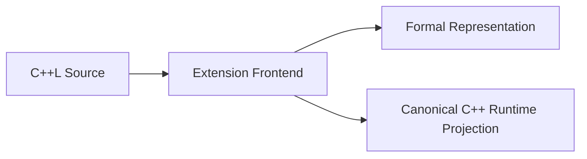

The projection:

- removes or lowers proof-only syntax
- lowers runtime C++L extensions where necessary
- preserves ordinary C++ source semantics
- maintains source mappings
- produces valid Clang input

This projection is a critical architectural boundary.

There must not be separate independently implemented:

```text
analysis lowering
```

and:

```text
production lowering
```

with potentially different behavior.

---

# 11. Single-projection invariant

The C++ runtime representation consumed during semantic verification must correspond to the representation eventually compiled into native code.

Preferred architecture:

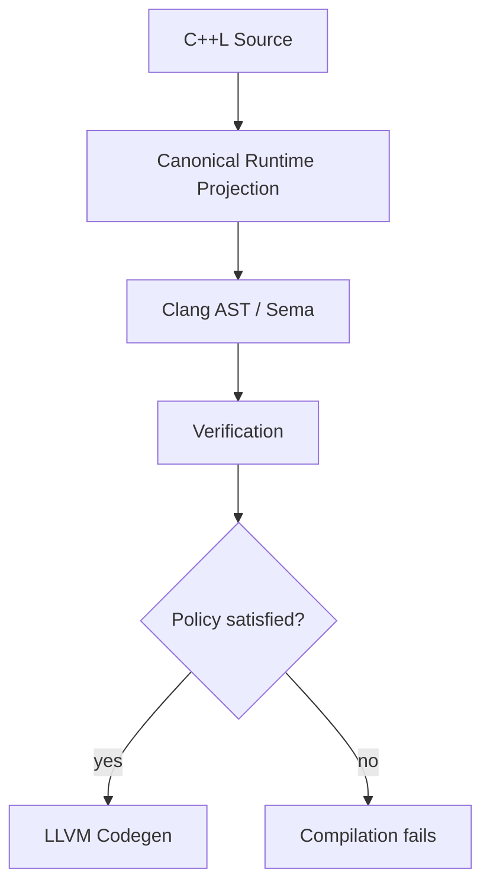

Code generation is gated by the verification policy.

The compiler should not lower the program a second time after proof acceptance.

---

# 12. Clang bridge

The Clang bridge exposes resolved C++ semantics to C++L.

Responsibilities include access to:

- declarations
- canonical types
- template specializations
- overload selections
- resolved calls
- constants
- control-flow information
- object layout
- source mappings
- ABI information
- target properties

The bridge translates relevant Clang semantics into stable C++L representations.

It must not expose raw pointer identity as semantic identity.

---

# 13. Stable semantic identity

Compiler-internal memory addresses must never serve as persistent semantic identifiers.

Stable identities should derive from appropriate combinations of:

- Clang USRs where applicable
- canonical declaration identities
- source identity
- qualified names
- template arguments
- semantic content hashes
- stable generated IDs

These identities are used for:

- dependency graphs
- caching
- diagnostics
- proof artifact references
- LSP operations

---

# 14. Formal elaborator

The elaborator connects source-level C++L constructs to formal meaning.

Inputs:

```text
C++L extension AST
+
resolved Clang semantic information
```

Output:

```text
formal core terms
and/or
typed Verification IR
```

Responsibilities:

- name resolution between Laws and C++ declarations
- implicit argument insertion
- type elaboration
- proposition construction
- refinement elaboration
- effect/purity interpretation
- verification-status propagation
- provenance tracking
- generation of formal identities

The elaborator may be complex.

It is not the final proof authority.

---

# 15. Formal core boundary

The formal core represents the minimum logical language required for proof checking.

Conceptually:

```text
surface C++L
    ↓ elaborate
formal core
    ↓ check
kernel
```

The core should avoid:

- source syntax accidents
- editor-specific metadata
- Clang AST implementation details
- diagnostics-only structures
- solver-specific encodings

The core representation must be sufficiently explicit for deterministic checking.

---

# 16. Verification IR

The Verification IR (VIR) models executable behavior relevant to proofs.

It separates:

```text
C++ syntax
```

from:

```text
proof-relevant operational meaning
```

The VIR should model concepts such as:

- values
- control flow
- state
- reads
- writes
- calls
- branches
- loops
- preconditions
- postconditions
- assertions
- assumptions with provenance
- machine arithmetic
- lifetime events
- ownership facts
- exceptional flow where supported

---

# 17. VIR design properties

VIR must be:

- strongly typed
- deterministic
- explicit
- provenance-preserving
- serializable where useful
- hashable
- independent of irrelevant syntax
- stable enough for incremental verification
- suitable for VC generation

Avoid:

```text
stringly typed semantics
magic numeric tags
raw AST pointer identity
implicit hidden state
```

---

# 18. VIR ownership

The VIR owns proof-relevant imperative semantics.

It does **not** own:

- C++ parsing
- C++ overload resolution
- C++ template semantics
- final proof validity
- native code generation

Those belong to:

```text
Clang
Clang
Clang
kernel
Clang / LLVM
```

respectively.

---

# 19. Verification-condition generation

The obligation generator transforms VIR and formal declarations into explicit proof obligations.

Conceptually:

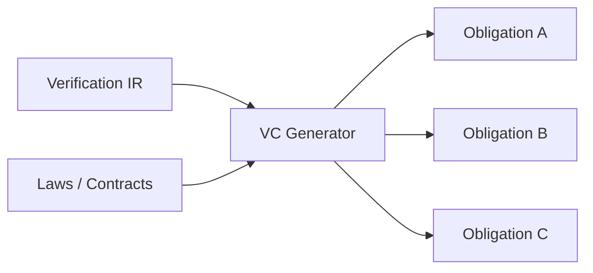

Possible techniques include:

- weakest preconditions
- symbolic execution
- path-condition generation
- refinement obligations
- lifetime obligations
- arithmetic obligations

The generated obligations must retain provenance back to their source.

---

# 20. Obligation model

Every proof obligation should have stable metadata.

Conceptually:

```text
ObligationId
LawId
source range
formal goal
local context
dependencies
trusted assumptions
target semantics
verification mode
```

This allows the same obligation to support:

- proof checking
- caching
- diagnostics
- LSP presentation
- trust reporting
- CI reporting

---

# 21. Automation layer

Automation helps produce proofs.

Components may include:

- simplification
- rewriting
- induction tactics
- arithmetic tactics
- SMT
- SAT
- proof search
- decision procedures
- counterexample generation

The automation layer should be architecturally replaceable.

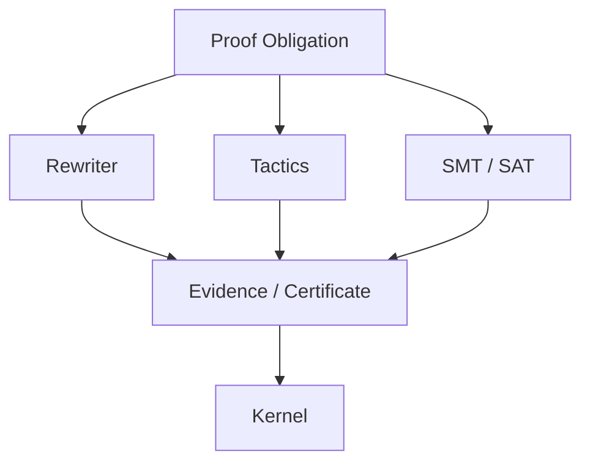

Automation may be complex and parallel.

The kernel remains the authority.

---

# 22. Solver isolation

External solver integrations should be isolated behind narrow interfaces.

Preferred architecture:

```text
verification obligation
    ↓
solver adapter
    ↓
external solver process
    ↓
result / certificate / model
```

Running third-party solvers out of process is preferred where practical because it provides:

- crash isolation
- resource control
- timeout enforcement
- version isolation
- easier replacement

A solver timeout, crash, `unknown`, malformed result, or unsupported theory must fail closed.

---

# 23. Trusted proof kernel

The kernel checks proof evidence against the formal core.

It should have minimal dependencies.

Preferred dependency direction:

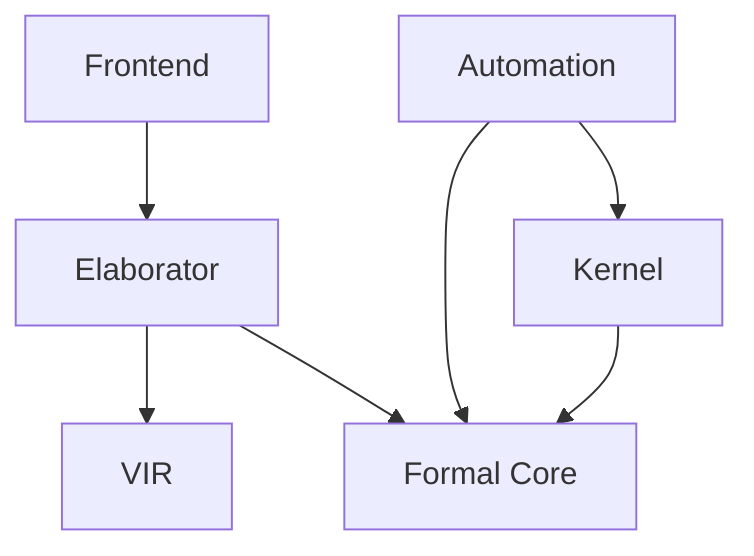

The kernel must not depend on:

- editor tooling
- LSP
- frontend recovery
- solver APIs
- CMake
- Clang AST implementation details
- diagnostics formatting
- AI tooling

---

# 24. Kernel API

The kernel API should remain intentionally small.

Conceptually:

```cpp
CheckResult check(
    const Context& context,
    const Proposition& proposition,
    const ProofTerm& proof
);
```

Actual APIs may differ.

The architectural principle is:

```text
explicit input
→ deterministic validation
→ explicit result
```

Avoid globally mutable proof state.

---

# 25. Verification status propagation

Verification status is data.

It must not be reconstructed heuristically by UI or diagnostics.

Statuses such as:

```text
PROVEN
TRUSTED
RUNTIME-CHECKED
UNSAFE
UNVERIFIED
UNRESOLVED
```

should flow through a single typed model.

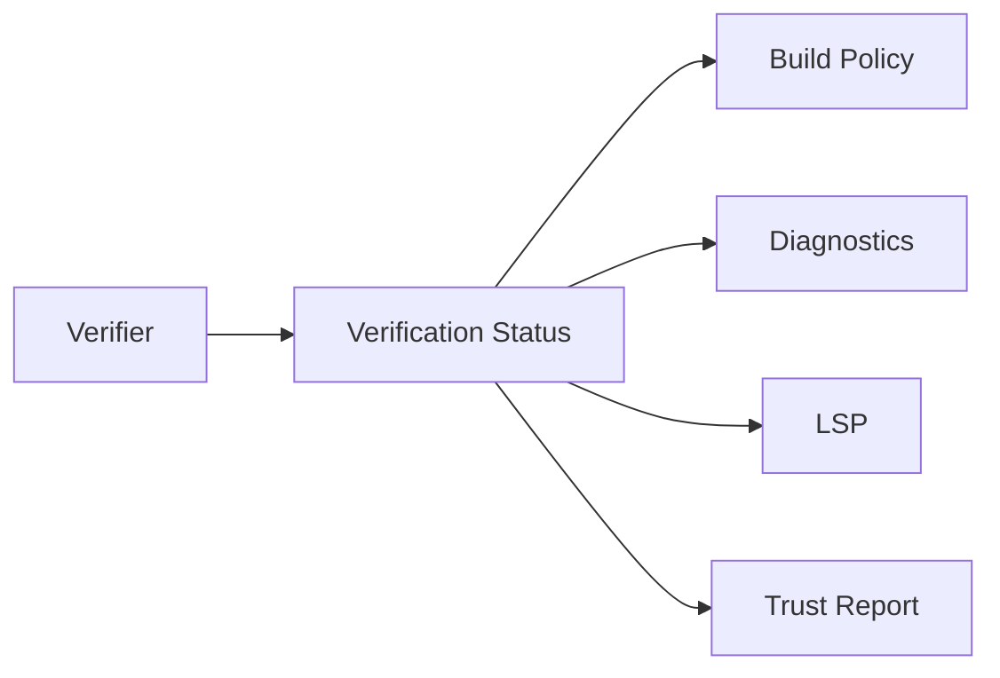

---

# 26. Proof erasure and runtime lowering

Proof-only structures must be absent from native execution unless explicitly represented as runtime data by language semantics.

Erasure owns removal of:

- proof terms
- ghost declarations
- compile-time-only evidence
- theorem-only indices
- proof-search artifacts

Runtime lowering owns C++L constructs that have executable meaning.

These concerns may share infrastructure but must remain conceptually distinguishable:

```text
erasure
    removes non-runtime semantics

runtime lowering
    translates C++L runtime semantics into C++
```

---

# 27. Erasure equivalence target

The architecture must make it possible to establish:

```text
observable_runtime_behavior(C++L)
=
observable_runtime_behavior(runtime_projection)
```

for the semantics claimed by C++L.

No later stage may silently modify proof-relevant runtime meaning.

---

# 28. Native code generation

C++L does not implement its own optimizing native backend.

Native code generation is delegated to Clang/LLVM.

Responsibilities retained by existing toolchain:

- LLVM IR generation
- optimization
- instruction selection
- object generation
- debug information
- native ABI
- linking
- LTO where supported

This reduces C++L's implementation and trust surface.

---

# 29. Ordinary C++ fast path

Ordinary C++ without C++L constructs should have a low-overhead path.

Conceptually:

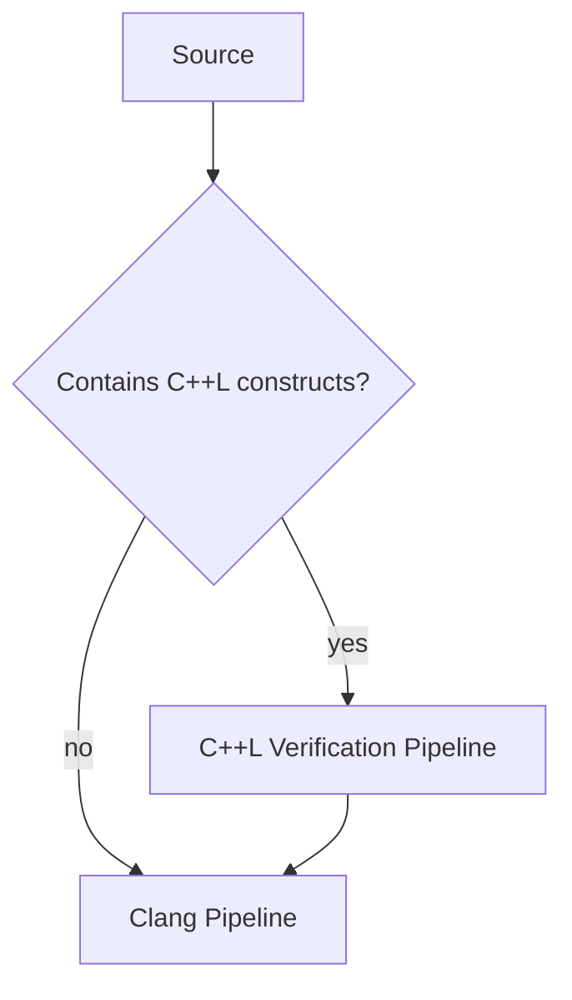

The exact implementation may still require lightweight source inspection.

It must not perform expensive proof work when no proof work exists.

---

# 30. Incremental verification architecture

C++L must not re-verify the entire project after every edit.

The architecture should maintain a semantic dependency graph.

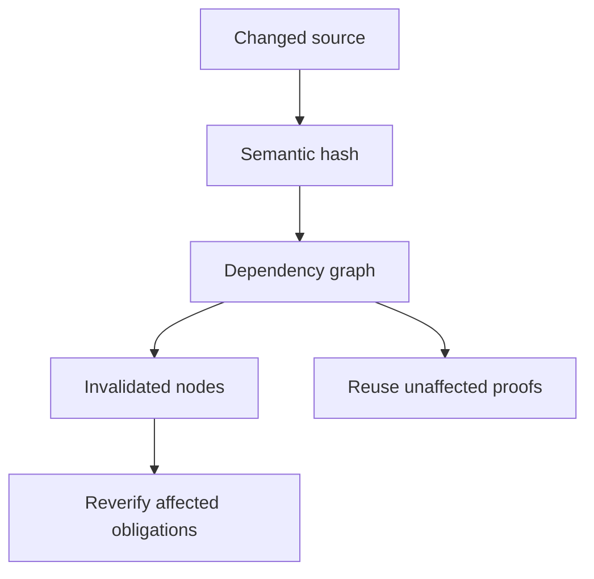

Target cost:

```text
changed semantic region
+
invalidated dependency closure
+
affected proof obligations
```

rather than:

```text
entire project × all Laws
```

---

# 31. Dependency graph

The dependency graph should model relationships such as:

```text
function → type
function → function
Law → type
Law → function
proof → Law
proof → theorem
obligation → implementation
obligation → assumption
artifact → compiler semantics
```

Dependency edges must be semantic.

Formatting-only edits should not invalidate unrelated proofs.

---

# 32. Semantic hashing

Proof cache keys should derive from semantically relevant content.

Possible inputs include:

- canonical Law representation
- canonical implementation representation
- imported formal definitions
- imported proof identities
- VIR
- trusted assumptions
- kernel version
- formal-core version
- target triple
- machine model
- relevant compiler flags
- C++ standard mode
- solver trust mode

Do not use:

```text
file modification time
memory address
random process identity
```

as proof validity.

---

# 33. Proof artifacts

Proof artifacts should be:

- immutable
- versioned
- content-addressed where practical
- self-describing enough for validation
- deterministic
- safe to reject when incompatible

Conceptual metadata:

```text
artifact version
C++L version
formal-core version
kernel version
target model
Law identity
proof identity
dependency hashes
trusted-assumption closure
```

---

# 34. Local artifact storage

A project-local cache may use a structure such as:

```text
.cppl/
├── cache/
├── proofs/
├── vir/
├── reports/
└── index/
```

The exact layout is non-normative.

Generated artifacts must not become source-of-truth replacements for checked source.

---

# 35. Remote cache architecture

Enterprise builds may eventually use a remote proof cache.


Remote cache contents must be treated as untrusted input.

A remote artifact cannot bypass compatibility checks or kernel validation merely because it originated from trusted infrastructure.

---

# 36. Parallel verification

Independent proof obligations may be processed concurrently.

Recommended parallelism:

```text
translation-unit level
obligation level
solver-worker level
```

The architecture must preserve deterministic final results.

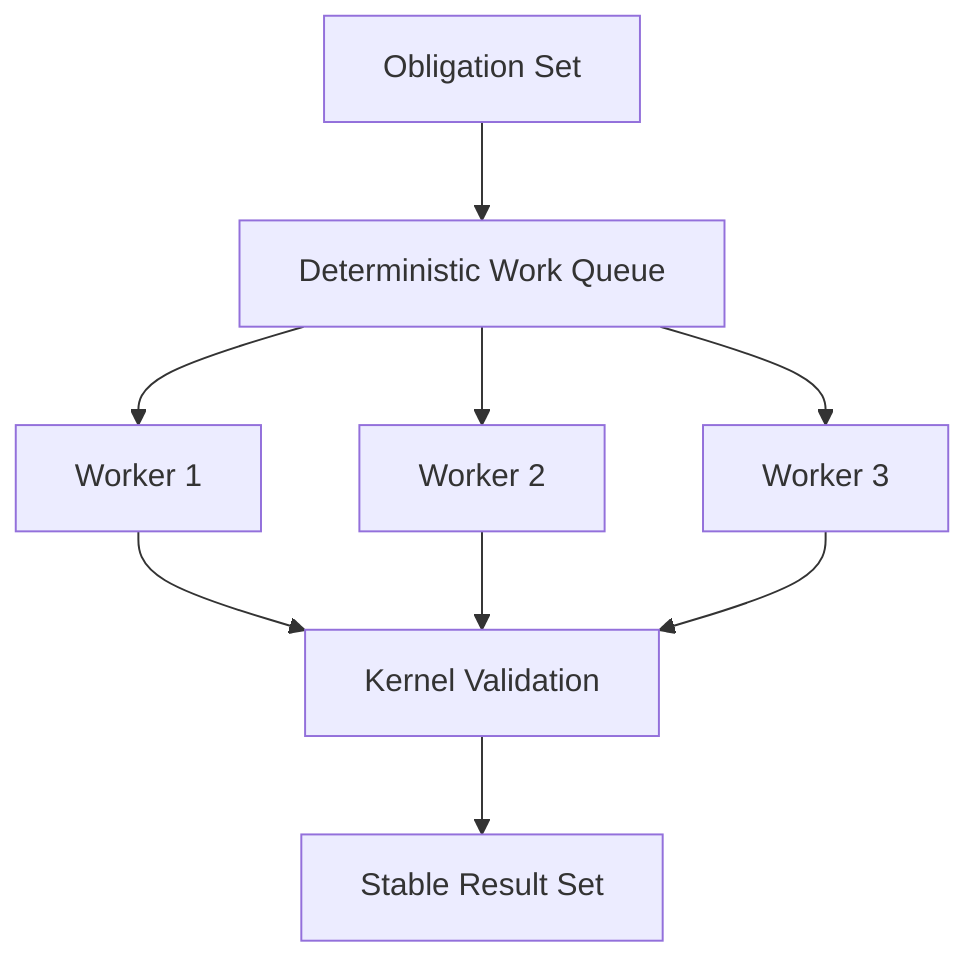

Scheduling order must not alter theorem validity.

---

# 37. Resource governance

Compiler and solver execution should support explicit resource limits.

Examples:

```text
solver timeout
memory limit
maximum proof-search depth
maximum generated obligation size
maximum parallel workers
```

Resource exhaustion should produce:

```text
UNRESOLVED
resource-limit diagnostic
```

rather than unsound acceptance.

---

# 38. Failure model

Every compiler stage must fail explicitly.

Broad failure classes should include:

```text
syntax error
C++ semantic error
C++L elaboration error
unsupported semantics
proof failure
solver timeout
solver unknown
kernel rejection
artifact corruption
internal compiler error
backend failure
```

Do not collapse all of these into:

```text
verification failed
```

---

# 39. Fail-closed behavior

Critical verification infrastructure follows:

```text
unknown
corrupt
unsupported
ambiguous
timeout
internal inconsistency
    ↓
not PROVEN
```

A compiler crash or infrastructure failure can never promote a proposition.

---

# 40. Diagnostics architecture

Diagnostics should be generated from structured data.

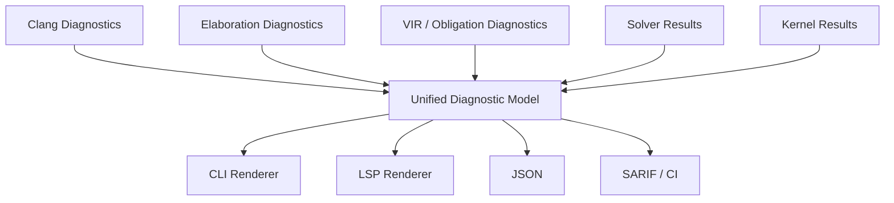

Human wording is presentation.

Diagnostic category and semantic status are structured data.

---

# 41. Diagnostic provenance

A proof diagnostic should be able to trace:

```text
source expression
    ↓
C++ declaration
    ↓
VIR statement
    ↓
proof obligation
    ↓
failed proof step
```

This trace should not be reconstructed from textual guesses.

Provenance must be carried through the pipeline.

---

# 42. Counterexamples

Counterexample generation belongs to automation/diagnostics.

It does not belong to the proof kernel.

A counterexample may demonstrate that a proposition is false.

Failure to find one does not establish proof.

The diagnostic system must preserve this distinction.

---

# 43. Library architecture

The compiler should be internally library-oriented.

Conceptually:

```text
libcppl-source
libcppl-frontend
libcppl-clang
libcppl-vir
libcppl-verifier
libcppl-kernel
libcppl-diagnostics
libcppl-artifacts
```

Actual build targets may use different names.

The purpose is to prevent the CLI from becoming the implementation itself.

---

# 44. Dependency direction

Dependencies should flow downward toward smaller semantic authorities.

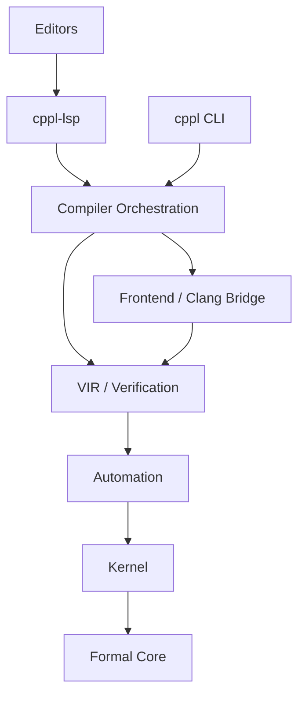

Forbidden reverse dependencies include:

```text
kernel → solver
kernel → LSP
kernel → VS Code
VIR → editor plugin
formal core → Clang UI
```

---

# 45. Repository architecture

Target repository layout:

```text
cppl/
├── compiler/
│   ├── driver/
│   ├── frontend/
│   ├── elaboration/
│   ├── obligations/
│   ├── automation/
│   ├── erasure/
│   ├── diagnostics/
│   └── artifacts/
│
├── kernel/
│   ├── core/
│   └── checker/
│
├── vir/
│
├── clang/
│
├── lsp/
│   └── cppl-lsp/
│
├── editors/
│   ├── vscode/
│   ├── visual-studio/
│   ├── neovim/
│   └── jetbrains/
│
├── stdlib/
│
├── tests/
│   ├── unit/
│   ├── kernel/
│   ├── soundness/
│   ├── negative/
│   ├── conformance/
│   ├── integration/
│   ├── e2e/
│   ├── fuzz/
│   └── performance/
│
├── docs/
│   └── rfcs/
│
├── scripts/
│
├── .agents/
│   └── skills/
│
├── AGENTS.md
├── ARCHITECTURE.md
├── COMPATIBILITY.md
├── DESIGN.md
├── FOUNDATIONS.md
├── GUIDE.md
├── ROADMAP.md
├── SECURITY.md
├── SPEC.md
├── STATUS.md
└── TRUST.md
```

Directories should be introduced when their implementation exists rather than maintained as ceremonial empty structure.

---

# 46. LSP architecture

Editor intelligence belongs in `cppl-lsp`.

The compiler must not depend on the LSP.

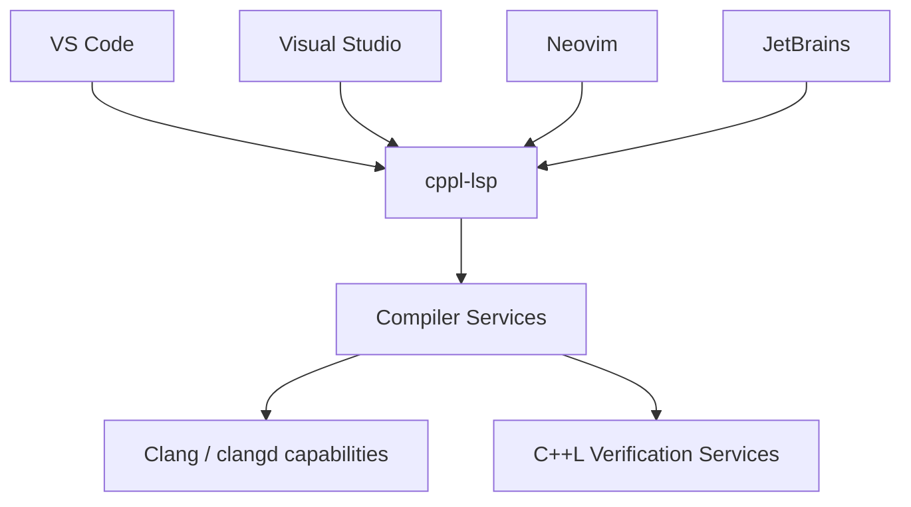

Editor plugins should remain thin adapters wherever possible.

---

# 47. clangd integration

C++L should avoid rebuilding mature C++ editor intelligence.

Where practical, ordinary C++ functionality should reuse or compose with clangd capabilities such as:

- completion
- references
- rename
- navigation
- ordinary C++ diagnostics
- semantic tokens

C++L-specific capabilities can add:

- Law navigation
- proof navigation
- verification status
- proof obligations
- counterexamples
- trust dependencies
- proof dependency graphs
- C++L semantic highlighting

---

# 48. LSP compiler-service boundary

`cppl-lsp` should consume stable compiler-service APIs rather than invoke internal implementation classes directly.

Conceptually:

```cpp
class VerificationService {
public:
    VerificationResult verify(FileId);
    std::vector<Obligation> obligations(SymbolId);
    TrustInfo trust(SymbolId);
};
```

Actual APIs may differ.

The important rule is:

> Editor tooling must consume semantic services, not duplicate compiler logic.

---

# 49. No editor-specific semantics

The following must produce the same formal result:

```text
CLI compilation
VS Code verification
Neovim verification
JetBrains verification
CI verification
```

Editor plugins may alter presentation.

They may not alter theorem meaning.

---

# 50. Build-system integration

C++L should integrate with existing build systems through compiler-driver compatibility.

Primary target:

```bash
cmake -DCMAKE_CXX_COMPILER=cppl ..
```

C++L should preserve relevant compiler arguments for:

- includes
- defines
- optimization
- warnings
- target architecture
- language mode
- sanitizers
- debug information
- linking
- LTO where compatible

The C++L compiler should not require adoption of a proprietary build system.

---

# 51. Compilation database integration

The toolchain should support:

```text
compile_commands.json
```

where practical.

This supports:

- LSP
- standalone verification
- repository analysis
- editor tooling
- CI tooling

One canonical compile configuration should feed both native build semantics and verification semantics.

---

# 52. Header architecture

Headers are first-class compiler input.

C++L must support formal constructs associated with declarations in:

```text
.h
.hpp
.hh
```

where defined by the language.

Changes to authoritative declarations must propagate through dependency analysis.

Header verification cannot rely only on textual file identity because one header may be instantiated under different:

- templates
- defines
- target settings
- language modes

---

# 53. Template architecture

Template verification must operate on resolved semantic instantiations where proof relevance depends on instantiated types or values.

Do not prove:

```text
template text
```

and assume that every instantiation inherits the same runtime facts unless the formal rule justifies it.

Template caching must distinguish semantically distinct instantiations.

---

# 54. Standard-library models

Formal models of standard-library facilities live under:

```text
stdlib/
```

They represent proof-facing contracts.

They must remain conceptually separate from:

```text
libc++
libstdc++
MSVC STL
```

implementations.

A model does not automatically prove the external runtime implementation.

Trust implications belong in `TRUST.md`.

---

# 55. FFI architecture

Foreign code enters through explicit boundaries.

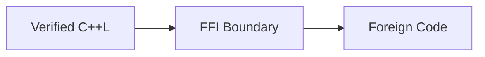

The boundary owns:

- formal contract
- ownership expectations
- lifetime assumptions
- runtime validation
- trust classification
- mutation/effect declaration

Foreign code must never construct proof evidence directly.

---

# 56. Runtime validation architecture

Dynamic external values enter verified regions through explicit validation.

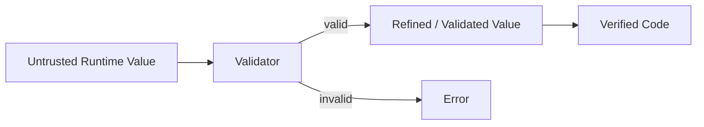

Validation code remains runtime code and must not be erased.

---

# 57. Security boundaries

Security-sensitive boundaries include:

- proof artifact parsing
- kernel input
- solver output
- FFI
- serialized VIR
- remote cache
- compiler plugins
- generated source
- runtime-validation boundaries

External data must be treated as untrusted until validated.

---

# 58. Plugin architecture

Plugins must not silently extend proof authority.

Any plugin system should live outside the kernel.

Plugins may provide:

- diagnostics
- tactics
- proof search
- IDE integration
- build integration

A plugin wishing to introduce trusted propositions must use an explicit trust mechanism visible to trust reporting.

---

# 59. AI architecture

AI systems may interact with C++L through ordinary developer interfaces.

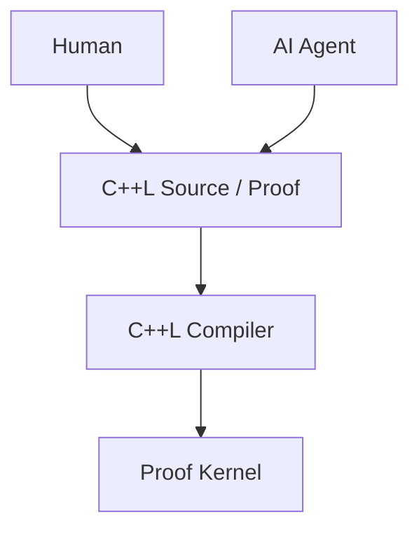

AI receives no privileged proof path.

AI-generated code and proof evidence must pass the same compiler and kernel as human-written code.

---

# 60. Agent-facing architecture

Repository automation should provide:

```text
AGENTS.md
    hard invariants

.agents/skills/
    task-specific procedures

scripts/
    canonical development commands

CMakePresets.json
    canonical build configurations

GitHub Issues
    task definition

CI
    independent enforcement
```

The repository itself should contain enough information for a capable coding agent to work without a vendor-specific master prompt.

---

# 61. Testing architecture

Testing is divided by responsibility.

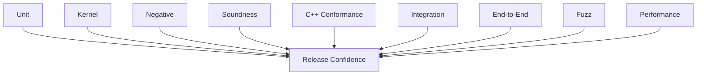

No single suite substitutes for another.

---

# 62. Unit tests

Unit tests cover isolated implementation behavior.

Examples:

- parser helpers
- canonical hashing
- source maps
- VIR transformations
- diagnostic rendering

Unit tests alone do not establish proof-system soundness.

---

# 63. Kernel tests

Kernel tests directly test acceptance/rejection rules.

Every proof rule requires:

```text
valid case
invalid case
malformed case
boundary case
```

Kernel tests should avoid depending on the full frontend where possible.

---

# 64. Negative tests

Negative tests ensure invalid programs and proofs remain rejected.

Examples:

- false equality
- forged proof
- invalid induction
- termination violation
- refinement violation
- hidden trust
- ghost leakage
- invalid FFI assumption

Negative coverage is mandatory for proof features.

---

# 65. Soundness regression suite

Every discovered soundness bug receives a permanent regression.

This suite has priority over superficial compatibility with formerly unsound behavior.

---

# 66. C++ conformance suite

A separate suite must verify:

```text
valid supported C++
    remains
valid C++L
```

It should cover:

- declarations
- templates
- concepts
- `requires`
- macros
- modules
- constexpr
- exceptions
- RTTI
- ABI-sensitive constructs
- supported extensions
- relevant standard modes

---

# 67. Differential testing

Where appropriate, ordinary C++ behavior should be compared against the configured Clang behavior.

Conceptually:

```text
clang++ program.cpp
cppl program.cpp
```

should produce equivalent C++ semantics for source that uses no C++L extensions.

Differential testing is particularly valuable for source compatibility.

---

# 68. Fuzzing

High-priority fuzzing targets include:

- C++L extension parser
- proof deserialization
- kernel
- normalization
- VIR serialization
- solver certificate handling
- artifact cache
- source mapping
- erasure

Fuzzing must search for:

```text
crash
nondeterminism
incorrect acceptance
incorrect rejection
artifact corruption
```

not only parser crashes.

---

# 69. Performance testing

Performance tests should measure separately:

```text
ordinary C++ overhead
frontend overhead
elaboration
VIR construction
obligation generation
solver time
kernel checking
cache hit/miss
incremental edit latency
LSP latency
memory consumption
```

Avoid aggregate benchmarks that hide which stage regressed.

---

# 70. Performance architecture target

For ordinary C++:

```text
cppl cost
≈
Clang cost
+
small compatibility overhead
```

For verified code:

```text
cppl cost
=
Clang semantic work
+
formal elaboration
+
affected verification obligations
```

Incremental verification should avoid whole-project recomputation.

---

# 71. CI architecture

CI should call the same scripts developers and agents use locally.

```mermaid
flowchart LR
    DEV["Developer"]
    AGENT["Agent"]
    CI["CI"]

    SCRIPT["Canonical scripts/*"]

    DEV --> SCRIPT
    AGENT --> SCRIPT
    CI --> SCRIPT
```

Avoid separate undocumented CI-only build logic.

---

# 72. Canonical development commands

Target scripts:

```text
scripts/bootstrap.sh
scripts/format.sh
scripts/build.sh
scripts/test.sh
scripts/verify.sh
scripts/conformance.sh
scripts/check.sh
```

Conceptually:

```text
check.sh
    ↓
format check
build
unit tests
negative tests
soundness tests
conformance
verification
```

---

# 73. CMake presets

Stable presets should define reproducible build environments.

Example target interface:

```bash
cmake --preset dev
cmake --build --preset dev
ctest --preset dev
```

Additional presets may include:

```text
release
asan
ubsan
fuzz
coverage
kernel
```

Do not make developers or agents reconstruct required compiler flags manually.

---

# 74. Enterprise CI stages

A mature pipeline may use:

```mermaid
flowchart LR
    LINT["Format / Static Checks"]
    BUILD["Build"]
    UNIT["Unit Tests"]
    PROOF["Proof / Negative Tests"]
    CONF["C++ Conformance"]
    SAN["Sanitizers"]
    FUZZ["Fuzz Smoke"]
    PERF["Performance Guard"]
    PKG["Package"]
    SIGN["Sign / Provenance"]

    LINT --> BUILD
    BUILD --> UNIT
    UNIT --> PROOF
    PROOF --> CONF
    CONF --> SAN
    SAN --> FUZZ
    FUZZ --> PERF
    PERF --> PKG
    PKG --> SIGN
```

Expensive jobs may run at different frequencies, but release gates must remain explicit.

---

# 75. Reproducible builds

Where practical, release artifacts should record:

- C++L version
- source revision
- kernel version
- formal-core version
- Clang/LLVM version
- solver versions
- target platform
- build configuration

Proof validity must not depend on undocumented environment state.

---

# 76. Supply-chain architecture

Release engineering should support:

- dependency pinning
- dependency provenance
- SBOM generation
- artifact checksums
- signed release artifacts
- reproducible metadata
- vulnerability scanning

Supply-chain tooling does not become part of the proof kernel.

---

# 77. Packaging

Expected primary artifacts:

```text
cppl
cppl-lsp
C++L standard/formal models
editor integrations
documentation
```

The native program produced by C++L should not require `cppl` to be installed at runtime.

---

# 78. Version dimensions

C++L has several independently relevant versions:

```text
language version
compiler version
formal-core version
kernel version
artifact-format version
stdlib-model version
```

These should not be conflated blindly.

A compiler release may preserve language syntax while invalidating old proof artifacts because kernel or core semantics changed.

---

# 79. Compatibility dimensions

Treat these separately:

```text
source compatibility
proof compatibility
artifact compatibility
ABI compatibility
tooling compatibility
```

Example:

```text
source compatible
but
proof cache incompatible
```

is a valid release state if reported accurately.

---

# 80. Observability

Compiler observability should help diagnose engineering problems without changing semantics.

Useful measurements include:

- stage timings
- cache hit rates
- obligation counts
- solver time
- kernel-check time
- peak memory
- invalidation size
- LSP request latency

Source code and proof contents should not be uploaded by default merely for telemetry.

---

# 81. Structured build report

The compiler should eventually support a machine-readable report containing:

```text
files analyzed
Laws discovered
obligations generated
proven
trusted
runtime-checked
unsafe
unverified
unresolved
cache hits
cache misses
solver usage
kernel version
```

This supports:

- CI
- IDEs
- dashboards
- enterprise policy enforcement

---

# 82. Recovery and internal compiler errors

Compiler recovery must not compromise proof status.

If an internal stage becomes inconsistent:

```text
verification result for affected obligation = invalid
```

The compiler may continue gathering unrelated diagnostics where safe.

It must not continue using corrupted formal state as proof evidence.

---

# 83. Crash containment

External components such as solvers should be isolated so that failure does not corrupt compiler state.

Where practical:

```text
main compiler process
    ↓ IPC
solver worker
```

is preferable to embedding unstable external engines inside the trusted process.

---

# 84. Memory ownership

Compiler internals should use explicit ownership boundaries.

Preferred C++ patterns include:

- RAII
- value semantics where appropriate
- immutable semantic nodes where practical
- arena allocation only with explicit lifetime boundaries
- typed IDs rather than raw cross-component pointers

Persistent artifacts must never depend on in-process pointer identity.

---

# 85. Thread safety

Shared services must document thread-safety guarantees.

Particular care is required for:

- source manager
- Clang instances
- caches
- diagnostic sinks
- solver workers
- artifact indexes

Prefer immutable data and message passing across parallel verification workers where practical.

---

# 86. Deterministic merge

Parallel results must be merged in deterministic semantic order.

For example:

```text
ObligationId
SourceLocation
StableSymbolId
```

rather than worker completion order.

This ensures reproducible diagnostics and artifacts.

---

# 87. Architecture for large repositories

C++L must eventually support multi-million-line C++ codebases without requiring whole-program formal loading into one process.

The architecture should permit:

- translation-unit analysis
- module-level summaries
- persistent semantic indexes
- proof summaries
- distributed cache
- dependency-based invalidation
- parallel verification

Whole-program reasoning should be performed only where a Law actually requires it.

---

# 88. Proof summaries

A verified component should eventually be able to expose a compact proof-facing interface.

Conceptually:

```text
implementation
    ↓ verified
formal summary / contract
    ↓
downstream verification
```

Downstream users should not need to re-analyze every implementation detail when a stable verified interface is sufficient.

---

# 89. Module boundaries

Formal module boundaries should align with ordinary C++ module/library boundaries where practical.

A module should expose:

```text
runtime API
formal contract
trusted assumptions
verification status
```

without exposing unnecessary implementation internals.

---

# 90. Architectural evolution

Architecture changes should be made by moving toward:

```text
fewer semantic authorities
smaller TCB
stronger provenance
more deterministic artifacts
better incremental verification
less duplicated C++ behavior
```

Avoid architecture changes that merely redistribute complexity without clarifying authority.

---

# 91. Prohibited architectures

The following are explicitly undesirable.

## Independent C++ compiler frontend

```text
C++ parser #1 = Clang
C++ parser #2 = C++L
```

with duplicated language semantics.

## Twin theorem authorities

```text
kernel accepts
OR
solver accepts
```

## Twin runtime implementations

```text
implementation verified in VIR
but
different implementation emitted to C++
```

## Hidden fallback

```text
verification failed
    ↓
compile anyway as PROVEN
```

## Proof runtime dependency

```text
native executable
requires
theorem VM
```

## Editor-owned semantics

```text
VS Code extension
implements different verification rules
```

## Cache authority

```text
cached "PROVEN" bit
bypasses
kernel validation / compatibility checks
```

---

# 92. Architecture decision records

Major architectural choices should be captured through RFCs or Architecture Decision Records if ADRs are introduced.

Decisions worth recording include:

- frontend strategy
- Clang integration strategy
- formal-core representation
- VIR semantics
- kernel API
- solver certificate model
- artifact format
- caching model
- concurrency model
- LSP integration
- standard-library modeling strategy

The reason for a decision matters as much as its implementation.

---

# 93. Architecture review checklist

For a substantial architectural change, ask:

```text
Does this create another semantic authority?

Does this duplicate C++ behavior already owned by Clang?

Does this enlarge the TCB?

Does this create a second runtime lowering path?

Can verification and native execution drift?

Does this preserve provenance?

Does this preserve deterministic checking?

Does this invalidate proof artifacts?

Does incremental verification remain correct?

Can unsupported behavior fail closed?

Does editor behavior remain independent of theorem semantics?

Does ARCHITECTURE.md need updating?

Does TRUST.md need updating?

Does SPEC.md need updating?
```

---

# 94. Target mature architecture

The long-term architecture is:

```mermaid
flowchart TD
    USER["Human / AI"]
    SOURCE["C++ / C++L Source"]

    DRIVER["cppl Driver"]
    FRONT["C++L Extension Frontend"]
    RUNTIME["Canonical C++ Runtime Projection"]
    CLANG["Clang Sema / AST"]

    ELAB["Formal Elaboration"]
    CORE["Formal Core"]
    VIR["Verification IR"]
    VC["Verification Conditions"]

    AUTO["Untrusted Automation"]
    SMT["SMT / Decision Procedures"]
    TACTIC["Tactics / Proof Search"]

    KERNEL["Small Trusted Proof Kernel"]

    POLICY["Verification Policy"]
    CODEGEN["Clang / LLVM"]
    BINARY["Native Binary"]

    ART["Content-Addressed Proof Cache"]
    DIAG["Structured Diagnostics"]
    LSP["cppl-lsp"]

    USER --> SOURCE
    SOURCE --> DRIVER

    DRIVER --> FRONT

    FRONT --> RUNTIME
    RUNTIME --> CLANG

    FRONT --> ELAB
    CLANG --> ELAB

    ELAB --> CORE
    ELAB --> VIR

    VIR --> VC
    VC --> AUTO

    AUTO --> SMT
    AUTO --> TACTIC

    SMT --> AUTO
    TACTIC --> AUTO

    AUTO --> KERNEL
    CORE --> KERNEL

    KERNEL --> POLICY

    POLICY -->|accepted| CODEGEN
    RUNTIME --> CODEGEN
    CODEGEN --> BINARY

    VIR --> ART
    KERNEL --> ART
    ART --> KERNEL

    ELAB --> DIAG
    VC --> DIAG
    AUTO --> DIAG
    KERNEL --> DIAG

    DIAG --> LSP
    LSP --> USER
```

---

# 95. Architectural success criteria

The architecture is succeeding when:

```text
existing supported C++ requires minimal or zero migration

C++L semantics have one authoritative interpretation

Clang remains the C++ semantic authority

proof validity has one final authority

proof-only information disappears from runtime

native ABI remains ordinary C++ ABI

verified runtime behavior corresponds to emitted runtime behavior

large projects can verify incrementally

cached proofs cannot bypass soundness

editor tooling does not duplicate compiler semantics

AI receives no privileged proof path

unsupported semantics fail closed

the TCB can shrink over time
```

---

# 96. Final architectural rule

Every part of C++L should fit into one of four roles:

```text
understand source
derive formal meaning
check formal evidence
produce ordinary native C++
```

The boundaries between those roles must remain explicit.

The architecture must always preserve this chain:

```text
C++ / C++L source
        ↓
authoritative C++ semantics
        +
formal C++L semantics
        ↓
explicit proof obligations
        ↓
machine-checkable evidence
        ↓
small trusted kernel
        ↓
verified runtime projection
        ↓
Clang / LLVM
        ↓
ordinary native binary
```

No optimization, compatibility shortcut, solver integration, editor feature, cache, plugin, or AI system may bypass that chain.

**C++L adds proof to C++. It must not replace C++ with a second, drifting implementation of C++.**

---

# 97. Implemented architecture

This section records the structure that exists today, and the decisions taken
while building it. Everything above describes the target architecture;
`STATUS.md` records how much of it is implemented.

## 97.1 Components

```text
compiler/source/        source identity, presumed locations, content digests
kernel/                 the formal core and the proof checker
vir/                    the Verification IR
clang/                  the Clang semantic bridge
compiler/diagnostics/   the structured diagnostic model
compiler/frontend/      lexer, contextual recognizer, projection
compiler/elaboration/   Clang semantics + C++L syntax -> VIR
compiler/obligations/   VIR + Laws -> core definitions and goals
compiler/automation/    evidence production
compiler/erasure/       runtime program selection and its erasure check
compiler/driver/        argument handling, orchestration, exit status
```

`compiler/source` is the source manager of section 7. It is a leaf: the VIR and
the Clang bridge both depend on it, so no component invents its own notion of
"where this came from".

The kernel links nothing at all. `tests/architecture` enforces that by both
inspecting its includes and checking that the built library resolves no symbol
from any other component.

## 97.2 Stage order as implemented

```mermaid
flowchart TD
    SRC["Source file"]
    PP["Clang preprocessing"]
    LEX["Lexer + contextual recognizer"]
    FAST{"Contains C++L syntax?"}
    PROJ["Projection: analysis text + runtime text"]
    BRIDGE["libclang parse of the analysis text"]
    ELAB["Elaboration to VIR"]
    OBL["Obligations + admitted definitions"]
    AUTO["Evidence"]
    KERNEL["Kernel"]
    ERASE["Erasure check"]
    CG["Clang code generation"]

    SRC --> PP
    PP --> LEX
    LEX --> FAST
    FAST -->|no| CG
    FAST -->|yes| PROJ
    PROJ --> BRIDGE
    BRIDGE --> ELAB
    ELAB --> OBL
    OBL --> AUTO
    AUTO --> KERNEL
    KERNEL --> ERASE
    ERASE --> CG
```

## 97.3 The frontend runs after preprocessing

C++L syntax is recognized in the preprocessed translation unit, as `SPEC.md` 3.2
requires. Two consequences are architectural rather than incidental:

- a Law written in a header is verified in every unit that includes it, which a
  scan of the unpreprocessed source would miss entirely;
- macros are already expanded, so C++L never reinterprets a token the
  preprocessor would have replaced.

The cost is one additional Clang invocation per unit. A unit containing no C++L
syntax then takes the ordinary path of section 29: the original file is handed
to Clang untouched.

## 97.4 One projector, two texts

The projector emits both the text analysed and the text compiled, from the same
spans in the same pass:

- the **runtime text** is the preprocessed text with every C++L-only span
  blanked, preserving every byte position and every line;
- the **analysis text** is the same text with each Law replaced by an ordinary
  C++ specification function, bracketed by `#line` directives so positions still
  refer to the user's source.

This keeps the single-projection invariant of section 11: there is one lowering,
with one output selected for code generation. The relationship is checked rather
than asserted — `compiler/erasure` verifies that the runtime text differs from
the analysed text only by blanking inside recorded spans, and that line
numbering is unchanged. Because erasure can only delete, it cannot introduce a
construct from a standard later than the one the user selected.

## 97.5 A Law is projected into a C++ specification function

The proposition of a Law is a C++ expression (`SPEC.md` 6, 7.3). Rather than
interpret it, C++L emits it as the body of a generated function in the position
the Law occupies, and lets Clang resolve it: name lookup, overload resolution,
implicit conversions and canonical types all come from Clang. The elaborator
then reads the resolved expression. Nothing in C++L parses C++ expressions.

The generated function carries the Law's own name, so a Law occupies a formal
declaration namespace associated with its C++ scope (`GRAMMAR.md` 46). That is
what lets a proof name a Law: `proves(L(x))` is an ordinary call, bound by
Clang, and the elaborator meets the Law again through the symbol Clang
resolved rather than through the spelling the author used.

## 97.5.1 A written proof is elaborated, never believed

A proof declaration is projected the same way. Its `proves` clause becomes the
body of a generated function, so the proposition it claims is resolved by
Clang; its statements are C++L and are never projected into C++ at all.

A statement may instantiate the proof it names, as in `exact q(t);`. Each `t`
is an ordinary C++ expression, so each is projected too: one generated function
per argument, returning that term with its type deduced from the expression, in
the proof's own scope. Clang resolves them; the elaborator reads them back.
That is why C++L still has no parser for C++ expressions, and why an argument's
diagnostics carry the line and column the author wrote it at — the argument's
bytes are copied into the generated function at the column they came from.

A Law's `expects` clause is projected the same way, under a generated name
rather than the Law's own: the Law's name states what the Law concludes. So is
the proposition an `assume` statement names. Every specification expression in
the language reaches Clang by the one mechanism.

Elaboration resolves what the author wrote — which Law, at which arguments,
using which other proof or assumed premise, instantiated at which terms — into
typed VIR steps. A name an `exact` or `apply` uses is resolved against the
premises the body has assumed before it is resolved against the unit's proof
declarations, because a premise is the more local binding.

`compiler/obligations` lowers those steps into kernel proof terms. The
proposition a proof claims is the Law's proposition instantiated at the
arguments of its `proves` clause and closed over the proof's own parameters; a
Law that states a precondition claims the implication from it to the conclusion.
`refl` becomes that proposition's quantifier and premise introductions followed
by reflexivity; `exact` and `apply` become the named evidence wrapped in one
universal elimination per argument. Steps are lowered in dependency order, so
circular evidence never produces a term.

An instantiated statement is compared with the goal as it stands, and, failing
that, with the goal underneath the quantifiers it leads with. Both are readings
of one written statement, they are tried in that fixed order, and neither is a
search: an argument may be a closed term, in which case the statement stands on
its own, or it may mention the proof's parameters, in which case the goal is its
closure.

### The body is a sequence, and a premise is a goal

A proof body is a statement sequence, walked once, in written order
(`GRAMMAR.md` 4). Each statement acts on the goal standing at that point:

- `refl` closes it by definitional equality;
- `exact e` closes it with evidence for the goal itself;
- `assume h : P` names the premise the goal supposes, introduces the
  implication, and leaves the conclusion as the goal. A goal that supposes no
  premise has none to name, and the statement is refused there;
- `apply e` discharges the premises between `e`'s conclusion and the goal, each
  of which becomes a goal that the statements after it close;
- `rewrite e` transforms the goal with an equality and leaves what it
  transformed it into as the goal.

A rewrite is where this layer decides something the kernel deliberately does
not: which occurrences of a term the goal's context abstracts. Every occurrence
is the rule, and that is the whole rule — nothing is searched for and nothing is
weighed. The context is then handed to the kernel as part of the proof term,
and the kernel checks the equality, checks what is transported through the
context, and derives the resulting proposition by its own substitution. A choice
made here can therefore only fail to prove something; it can never prove the
wrong thing.

How many premises an application has to discharge is settled from the two
propositions alone, before any statement is consumed for them, so the walk stays
deterministic. A body that ends with a goal still open is refused; so is one
with a statement left over after every goal is closed.

The term then goes to the kernel like any other. No step is admitted because of
what it is called, and a premise is never admitted at all: the hypothesis a
proof uses exists only because an implication introduction the kernel checked
placed it in the kernel's own context. A Law whose written proof was refused is
left open, and so is a Law that written proofs name but none of them discharges:
the compiler does not look for evidence the author did not ask for.

## 97.6 The Clang bridge is libclang, in process

The bridge uses libclang, Clang's stable C API, and translates the facts C++L
needs into C++L's own types. It is the only place in the project that includes a
Clang header, and no Clang data structure or pointer leaves it.

A transport based on `-ast-dump=json` was measured and rejected: a single unit
including `<iostream>` produces roughly 490 MB of JSON. Consuming Clang's
in-memory AST through a stable API is both cheaper and less brittle than parsing
a debug format.

The same Clang installation supplies both libclang and the `clang++` driver used
for preprocessing and code generation, so the semantics C++L verifies and the
semantics Clang compiles come from one toolchain.

## 97.7 Termination in the current core

The core admits no recursion. `Context::define` type-checks a definition against
the context as it stands, so a definition can only call definitions already
admitted and the definition graph is acyclic by construction. Normalization
therefore terminates, and divergence cannot manufacture evidence. A step budget
and a depth limit are kept as defence in depth, and exhausting either rejects.

When recursive definitions are admitted, this argument disappears and a
termination checker becomes a prerequisite, not an improvement.

## 97.8 Intermediate artifacts

Projections are written under the system temporary directory, in a directory
named by a digest of the input's absolute path. They are inputs to Clang and
diagnostics aids; nothing reads them back as a source of truth, and no proof
result depends on them.
