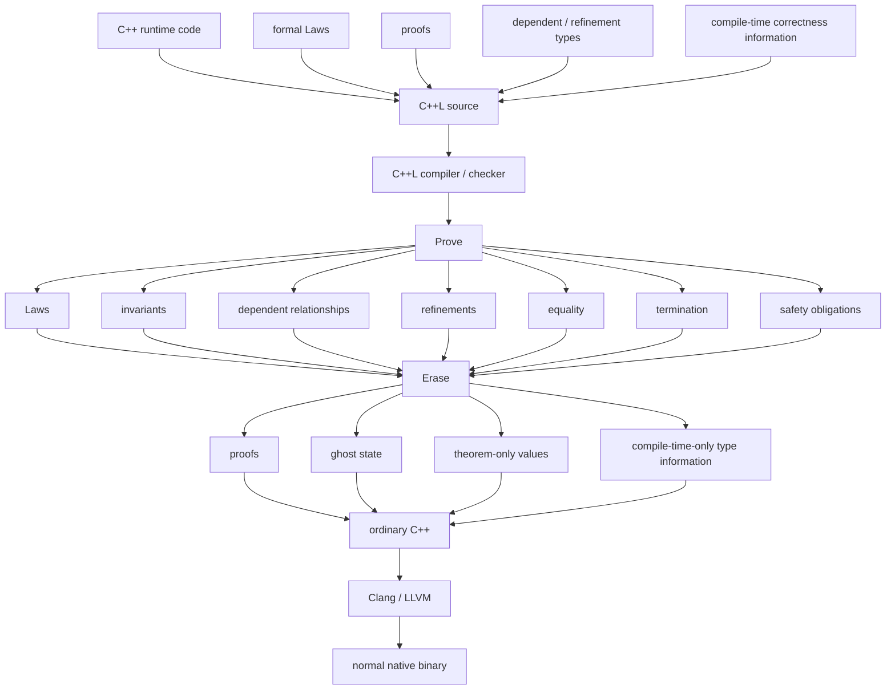

<p align="center">
  
</p>

# C++L - C++ with Laws

<b>C++L</b> is <b>C++ with Laws</b>: an ambiguity-free, proof-carrying superset of C++ in which humans or Agentic AIs can specify intent as machine-checkable Laws, implementations are accepted only when those Laws are proven, and all proof machinery erases to ordinary optimized C++ compiled by Clang/LLVM.

C++L makes formal intent and proof <b>first-class language constructs</b> while remaining a source-compatible C++ superset, then erases that formal layer into normal native C++.

It means that the C++L keeps <b>standard C++ as the runtime language</b> and adds a formal compile-time layer for intent, proof, and correctness. What we do here is a true C++ source-compatible superset with first-class Laws, propositions/proofs, dependent/refinement types, termination checking, proof erasure, and ordinary Clang/LLVM runtime output.

<p align="center">
C++L makes semantic laws first-class program declarations and requires evidence that they actually hold, making it provable.<br>
  <b>C++ ⊂ C++L</b><br>
  <b>C++L = C++ + Laws</b><br>
  <b>Laws → Obligations → Evidence</b>
</p>

## Project Status

> **Experimental / Pre-Alpha - under active development**

C++L is currently an experimental language project. The core architecture, language model, and verification foundations are defined, while the compiler, proof system, verification coverage, and developer tooling are still being implemented and refined. The project is built around one central compatibility invariant that **every valid C++ program should remain a valid C++L program.**

C++L does not attempt to replace or reimplement C++. Ordinary C++ parsing, typing, overload resolution, templates, and related language semantics are delegated to Clang-compatible infrastructure. C++L adds an optional layer for laws, proofs, contracts, and verified reasoning on top of standard C++.

Current work focuses on:

- stabilizing the language specification and proof semantics;
- implementing the C++L frontend and verification pipeline;
- expanding the practically useful subset supported inside `verified` code;
- integrating C++ and C++L diagnostics through `cppl-lsp`;
- preserving clean erasure/delegation boundaries with ordinary C++;
- building conformance tests, examples, and proof fixtures.

The syntax, proof rules, diagnostics, and tooling APIs should currently be considered **unstable and subject to change**.

**C++L is not yet production-ready.**

## Motivation

The project started from a simple chain of thought:

> If a human or AI state precise intent, can the compiler mechanically prove the implementation satisfies it, and can the proof layer erase to fast native C++ without any runtime addition?
> Humans and AIs need an ambiguity-free language for specifying what software must do, a mechanically checkable way to prove that an implementation satisfies that intent, and a path to high-performance native execution. Can we do that without creating entirely new language and work with existing tooling?
> What if these requirements could be part of the C++ language itself rather than remaining in tests, comments, fixtures, and engineering conventions?

C++L is an attempt to answer that question while preserving the C++ runtime, ABI, ecosystem, and Clang/LLVM toolchain. The project was initiated by Mateusz Czapliński equipped with AI, steming from this practical need. The goal is to make a Provable C++.

## Core idea

### Mathematical Model

C++L is designed as a conservative extension of C++: every valid C++ program remains valid C++L, while additional language constructs express Laws, proofs, refinements, and other compile-time correctness information. Verification establishes the required obligations before these proof-only constructs are erased, yielding ordinary C++ with the same runtime meaning. The equations below summarize that relationship.

```math
\forall p \in C^{++}, \quad p \in C^{++}L
```

```math
C^{++}L
=
C^{++}
\oplus
\mathcal{L}
\oplus
\mathcal{P}
\oplus
\mathcal{R}
```

```math
\mathcal{L} = \mathrm{Laws},
\quad
\mathcal{P} = \mathrm{Proofs},
\quad
\mathcal{R} = \mathrm{Refinements}
```

```math
L \in \mathcal{L}
\Longrightarrow
\mathrm{obligations}(L)
=
\{O_1, \ldots, O_n\}
```

```math
\forall O_i,
\quad
\Gamma \vdash e_i : O_i
```

```math
\Gamma \vdash e : L
\Longrightarrow
\Gamma \models L
```

```math
\mathrm{Law}
\longrightarrow
\mathrm{Obligation}
\longrightarrow
\mathrm{Evidence}
\longrightarrow
\mathrm{Theorem}
```

```math
\mathrm{verify}(p) = \checkmark
\Longrightarrow
\mathrm{erase}(p) \in C^{++}
```

```math
\mathrm{erase}
:
C^{++}L_{\mathrm{verified}}
\longrightarrow
C^{++}
```

```math
\mathrm{Sem}_{\mathrm{runtime}}(p)
=
\mathrm{Sem}_{\mathrm{runtime}}(\mathrm{erase}(p))
```

```math
\mathrm{erase}
(
\mathrm{runtime}
+
\mathrm{proof}
+
\mathrm{ghost}
+
\mathrm{refinement}
)
=
\mathrm{runtime}
```

```math
\mathrm{erase}(\mathrm{proof})
=
\mathrm{erase}(\mathrm{ghost})
=
\varnothing
```

```math
\mathrm{Sem}_{C^{++}L}
=
\mathrm{Sem}_{C^{++}}
\oplus
\mathrm{Sem}_{\mathrm{proof}}
```

```math
p \in C^{++}
\Longrightarrow
\mathrm{Sem}_{C^{++}L}(p)
=
\mathrm{Sem}_{C^{++}}(p)
```

```math
C^{++}L
\longrightarrow
C^{++}L^{\checkmark}
\longrightarrow
C^{++}
\longrightarrow
\mathrm{Native}
```

```math
\mathrm{verify}
\quad\longrightarrow\quad
\mathrm{erase}
\quad\longrightarrow\quad
\mathrm{Clang/LLVM}
```

```math
\boxed{
C^{++} \subset C^{++}L
\;\land\;
\mathrm{erase}(C^{++}L_{\mathrm{verified}}) \subseteq C^{++}
\;\land\;
\mathrm{Sem}_{\mathrm{runtime}}(p)
=
\mathrm{Sem}_{\mathrm{runtime}}(\mathrm{erase}(p))
}
```

### C++L Flow



C++L requires no dedicated proof VM, theorem runtime, garbage collector, or alternate execution model.

Proofs and Laws are checked at compile time and erased before native code generation.

Runtime checks occur only when explicitly required to validate values that cannot be known statically.

C++L adds new syntax and semantics such as:

```cpp
law
proves
proof
pure
verified
ghost
unsafe
trusted
where
expects
ensures
decreases
cases
induction
```

while ordinary supported C++ remains valid C++L. C++L adds no new data types: Laws and proofs reason directly over the C++ types a program already uses.

| C++         | C++L                                                                |
| ----------- | ------------------------------------------------------------------- |
| types       | C++ types                                                           |
| concepts    | C++ concepts                                                        |
| `constexpr` | C++ `constexpr`                                                     |
|             | **+**                                                               |
|             | Laws                                                                |
|             | contracts                                                           |
|             | proofs                                                              |
|             | quantified propositions                                             |
|             | ghost state                                                         |
|             | refinement and dependent types                                      |
|             | proof-only case analysis                                            |
|             | induction                                                           |
|             | equality rewriting                                                  |
|             | termination checking                                                |
|             | verified functions, with explicit `trusted` and `unsafe` boundaries |

The additions are checked at compile time and erased before code generation.

## Mission

C++L exists to enable this workflow:

```text
Human / AI expresses intent
        ↓
formal Law

AI writes implementation
        ↓
C++L

C++L proves implementation satisfies Law
        ↓

proof succeeds
        ↓

proof information erased
        ↓

ordinary optimized C++
        ↓

native binary
```

The implementation is accepted because the compiler can prove the specification, not because a test suite happened to pass.

## Usage

Compile C++ with `cppl`:

```bash
cppl main.cpp -o main
```

C++L is designed for incremental adoption. Ordinary supported C++ remains ordinary C++; verification constructs are added only where stronger guarantees are needed.

A runtime function can carry a compile-time contract:

```cpp cppl-example
verified int increment(int x)
    ensures (result == x + 1)
{
    return x + 1;
}
```

The function body is runtime C++. The `verified` modifier and `ensures` clause are verification-only: C++L proves the contract at compile time and removes the verification syntax before ordinary C++ compilation.

C++L can also state compile-time Laws:

```cpp cppl-example
pure int identity(int x)
{
    return x;
}

law identity_returns_input(int x)
    proves (identity(x) == x);
```

A Law is a theorem, not a runtime assertion, Boolean test, unit test, or comment. If C++L cannot establish the proposition, verified compilation fails.

For practical C++L usage, including contracts, Laws, proofs, refinement types, `ghost`, `cases`, induction, loop invariants, termination, trusted boundaries, headers and source files, templates, formatting, and project organization, see [DEVELOPER_GUIDE.md](DEVELOPER_GUIDE.md).

For the normative language definition, see [SPEC.md](SPEC.md).

For the proof model and trusted computing base, see [TRUST.md](TRUST.md).

For currently implemented language coverage and remaining limitations, see [STATUS.md](STATUS.md).

## Usage

Compile ordinary C++ with `cppl`:

```bash
cppl -std=c++17 main.cpp -o main
```

C++L is designed for incremental adoption: existing supported C++ can continue to compile unchanged, while formal verification is added where needed.

Example:

```cpp cppl-example
pure int identity(int x) {
    return x;
}

law identity_returns_input(int x)
    proves (identity(x) == x);
```

A Law is a formal statement of required behavior. A Law is not:

- a unit test
- a fuzz property
- a runtime assertion
- documentation
- a comment
- a Boolean function that happens to return `true`

A Law is a proof obligation. If the compiler cannot prove it, verified compilation fails.

A Law states a proposition. A proof declaration supplies the evidence for one, and the kernel decides whether that evidence holds:

```cpp cppl-example
pure int identity(int x) {
    return x;
}

law identity_returns_input(int x)
    proves (identity(x) == x);

proof identity_returns_input_holds(int x)
    proves (identity_returns_input(x))
{
    refl;
}
```

A Law holds for every value of its parameters, so its proof can be used at any one of them:

```cpp cppl-example
pure unsigned identity(unsigned x) {
    return x;
}

law identity_returns_input(unsigned x)
    proves (identity(x) == x);

proof identity_general(unsigned x)
    proves (identity_returns_input(x))
{
    refl;
}

law identity_of_41()
    proves (identity(41u) == 41u);

proof identity_at_41()
    proves (identity_of_41())
{
    exact identity_general(41u);
}
```

A Law can be stated under a precondition. `expects` does not assert that the precondition holds: it says what the Law concludes under it, and a proof may name that premise and use it:

```cpp cppl-example
pure unsigned add_one(unsigned x) {
    return x + 1u;
}

law increment_is_stable(unsigned x)
    expects (add_one(x) == x)
    proves (add_one(x) == x);

proof increment_is_stable_holds(unsigned x)
    proves (increment_is_stable(x))
{
    assume premise : add_one(x) == x;
    exact premise;
}
```

Applying a Law that supposes a premise leaves that premise to prove:

```cpp cppl-example
pure unsigned identity(unsigned x) {
    return x;
}

pure unsigned add_one(unsigned x) {
    return x + 1u;
}

law guarded_increment(unsigned x)
    expects (identity(x) == x)
    proves (add_one(x) == add_one(x));

proof guarded_increment_holds(unsigned x)
    proves (guarded_increment(x))
{
    refl;
}

law increment_is_itself(unsigned x)
    proves (add_one(x) == add_one(x));

proof increment_is_itself_holds(unsigned x)
    proves (increment_is_itself(x))
{
    apply guarded_increment_holds(x);
    refl;
}
```

A premise is worth supposing because it can be _used_. `rewrite` transforms the goal with an equality that has already been established:

```cpp cppl-example
pure unsigned identity(unsigned x) {
    return x;
}

law identity_at_zero(unsigned x)
    expects (x == 0u)
    proves (identity(x) == 0u);

proof identity_at_zero_holds(unsigned x)
    proves (identity_at_zero(x))
{
    assume h : x == 0u;
    rewrite h;
    refl;
}
```

`assume` is valid here because the Law's `expects` clause makes the goal an implication whose premise is `x == 0u`. It names that premise; it never grants one. `rewrite h;` then replaces `x` by `0u` in the goal, leaving `identity(0u) == 0u` to prove. The kernel performs the substitution itself and checks the result.

Contracts can also verify an executable function directly:

```cpp cppl-example
verified int identity(int x)
    ensures (result == x)
{
    return x;
}
```

The obligation comes from the Clang-resolved return expression. `result` names
that value only in the specification; every obligation must pass the kernel.
The current fragment supports pure integer return expressions and contracts:

```cpp cppl-example
verified unsigned inc(unsigned x)
    ensures (result == x + 1u)
{
    return x + 1u;
}

verified unsigned zero_if_zero(unsigned x)
    expects (x == 0u)
    ensures (result == 0u)
{
    return x;
}
```

Preconditions become proof hypotheses, never trusted facts or runtime checks.
Verified functions can also call one another through their contracts:

```cpp cppl-example
verified unsigned bump_zero(unsigned x)
    expects (x == 0u)
    ensures (result == 1u)
{
    return x + 1u;
}

verified unsigned bump_one(unsigned x)
    expects (x == 1u)
    ensures (result == 2u)
{
    return x + 1u;
}

verified unsigned two_from_zero(unsigned x)
    expects (x == 0u)
    ensures (result == 2u)
{
    return bump_one(bump_zero(x));
}
```

The inner call's proven postcondition discharges the outer call's precondition.
The caller uses those contracts, and the kernel checks their connection to the
actual body. Erased C++ retains both calls with no runtime checks.

Branches generate a separate proof obligation for each return path:

```cpp cppl-example
verified unsigned clamp(unsigned x)
    ensures (result <= 10u)
{
    if (x <= 10u)
        return x;
    return 10u;
}
```

The first path uses `x <= 10u` as evidence; the second computes `10u <= 10u`.
Both paths must pass the kernel. The runtime `if` and returns stay unchanged.
All six integer comparisons are supported, including in call preconditions.
See [SPEC.md](SPEC.md#127-path-sensitive-verification) for the boundary.

Bodies may also use ordinary locals and assignments:

```cpp cppl-example
verified unsigned pick(unsigned x, bool wide)
    ensures (result <= 10u)
{
    unsigned limit = 0u;

    if (wide)
        limit = 10u;

    return limit;
}
```

Each write is a logical version of that local, and each return proves its
contract from the versions its own path established. What follows a branch is
verified once per arm, so nothing merges and no kernel rule is added. A call
bound to a local proves its precondition where the body makes the call, not
where the value is read. See [SPEC.md](SPEC.md#128-locals-and-assignments) for
the boundary.

Unsigned arithmetic is reasoned about as the machine performs it, modulo
`2^32` here:

```cpp cppl-example
verified unsigned distance_below(unsigned x, unsigned y)
    ensures (result <= x)
{
    if (y <= x)
        return x - y;
    return x;
}

verified unsigned next_index(unsigned i, unsigned n)
    expects (i < n)
    ensures (result <= n)
{
    return i + 1u;
}
```

Every ring identity of `+`, `-` and `*` holds definitionally, so `(x + y) - y`
is `x` and `x * (y + 1u)` is `x * y + x`. Order consequences are not identities:
that `i < n` gives `i + 1u <= n` is proven by a linear-arithmetic certificate
the kernel checks against constraints it derives itself, including the
possibility that `i + 1u` wraps. Without `y <= x`, `x - y` could wrap past `x`,
and the contract would be rejected. Signed arithmetic is rejected until its
overflow obligations exist. See [SPEC.md](SPEC.md#711-machine-integer-arithmetic)
for the rules.

Loops are verified against the invariants written on them:

```cpp cppl-example
verified unsigned count_to(unsigned n)
    ensures (result == n)
{
    unsigned i = 0u;
    while (i < n)
        invariant (i <= n)
    {
        ++i;
    }
    return i;
}
```

The invariant must hold on entry and after every iteration; after the loop,
only the invariant and `!(i < n)` are known, which together give `i == n`.
This is partial correctness: termination is not proven, so the contract is
reported as partial and `count_to` never becomes a definition a Law could
unfold. The runtime loop is unchanged. See
[SPEC.md](SPEC.md#243-verified-loops) for the boundary.

The remaining examples use features this implementation does not accept yet.
Laws are meant to state domain requirements over user-defined types:

```cpp cppl-planned
law no_duplicate_authority(const Interpretation& x)
    proves (financialAuthorityCount(x) <= 1);
```

This example proves a property of an ordinary C++ `unsigned` by induction:

```cpp cppl-planned
pure unsigned add(unsigned a, unsigned b)
    decreases (a)
{
    return a == 0u ? b : add(a - 1u, b) + 1u;
}

law add_zero(unsigned x)
    proves (add(x, 0u) == x);

proof add_zero_holds(unsigned x)
    proves (add_zero(x))
{
    induction x;
}
```

The `add_zero` Law means:

```text
∀ x : unsigned,
    add(x, 0u) = x
```

C++L does not enumerate every `unsigned` value.

`induction x;` applies the induction principle for `unsigned`: prove the case `0u`, then prove the case `n + 1u` from the case `n` for every `n` below the type's maximum, so the step never wraps.

Case analysis works the same way. `cases r { ... }` creates one proof obligation for each case of a C++ value. That includes states C++ permits beyond the named ones, such as an `enum class` value that matches no enumerator or a valueless `std::variant`. There is no catch-all arm.

Neither `induction` nor `cases` is runtime control flow. Both are erased before runtime code generation and leave no runtime representation.

For installation, compiler options, project integration, Laws, proofs, verification statuses, and examples, see [DEVELOPER_GUIDE.md](DEVELOPER_GUIDE.md).

## Key capabilities

Beyond the additions in the table above, C++L is intended to provide:

- proof-relevant equality
- definitional equality and normalization
- explicit handling of unsafe C++ and undefined behavior
- machine-accurate arithmetic reasoning
- a small trusted proof kernel
- proof automation and counterexamples
- ordinary C++ ABI and ecosystem interoperability

## Verified and ordinary C++

C++L is a syntactic superset of C++.

That does not mean arbitrary C++ automatically becomes formally verified.

```text
C++L
├── ordinary C++
│   └── executable but not automatically proven
│
└── verified C++L
    └── formal guarantees apply
```

The boundary must be explicit.

## Runtime model

C++L does not replace the C++ execution model.

```text
C++L
    ↓ proof/type erasure
C++
    ↓
Clang / LLVM
    ↓
native executable
```

C++L should remain compatible with:

- normal C++ ABI
- libc++
- C libraries
- JNI
- Objective-C++
- N-API
- WASM
- platform APIs
- existing native libraries

## Non-negotiable guarantees

1. Laws represent formal intent.
2. Laws are universally proven rather than tested.
3. False Laws are rejected.
4. Proof evidence cannot be forged by ordinary executable code.
5. Proof-producing computation cannot exploit nontermination.
6. Types may express value-dependent relationships.
7. Equality can be formally reasoned about.
8. Universal properties of C++ values can be proven by induction rather than enumeration.
9. Proof-only information can be erased.
10. Erasure preserves executable semantics.
11. Unsafe operations cannot silently contaminate verified proofs.
12. C++ undefined behavior cannot invalidate verified guarantees.
13. Trusted assumptions are explicit.
14. Verification is deterministic.
15. Automation does not silently become the source of truth.
16. Runtime code remains ordinary optimized C++.
17. Existing C++ interoperability is preserved.
18. No mandatory theorem runtime is introduced.

## Non-goals

The following alone do **not** constitute C++L:

```text
C++ + unit tests
C++ + property tests
C++ + fuzzing
C++ + assertions
C++ + static_assert
C++ + concepts
C++ + contracts
C++ + annotations
C++ + Z3
C++ + external linting
```

All of those may be useful tools.

None alone provide the intended proof-aware language model.

## Documentation

- [DEVELOPER_GUIDE.md](DEVELOPER_GUIDE.md) - practical developer guide with examples
- [SPEC.md](SPEC.md) - normative C++L language semantics
- [ARCHITECTURE.md](ARCHITECTURE.md) - compiler structure, component boundaries, and data flow
- [DESIGN.md](DESIGN.md) - design rationale and major language/compiler decisions
- [FOUNDATIONS.md](FOUNDATIONS.md) - mathematical foundations and intellectual lineage
- [TRUST.md](TRUST.md) - Trusted Computing Base, assumptions, and trust boundaries
- [COMPATIBILITY.md](COMPATIBILITY.md) - C++ source, ABI, toolchain, and standard compatibility
- [STATUS.md](STATUS.md) - current implementation status and verification maturity
- [ROADMAP.md](ROADMAP.md) - planned implementation sequence and milestones
- [SECURITY.md](SECURITY.md) - soundness and security policy
- [ACKNOWLEDGEMENTS.md](ACKNOWLEDGEMENTS.md) - intellectual and project credits
- [CONTRIBUTING.md](CONTRIBUTING.md) - contribution and development process
- [AGENTS.md](AGENTS.md) - mandatory repository rules for AI agents and automated contributors

## Definition of done

C++L succeeds when a human or AI can:

1. express software intent as formal Laws;
2. implement the software in a C++-compatible language;
3. mechanically prove that the implementation satisfies those Laws;
4. inspect all assumptions and unsafe boundaries;
5. erase all proof-only information;
6. compile the remaining code with normal Clang/LLVM;
7. obtain a normal high-performance native binary.

```text
FORMAL INTENT
+
MACHINE-CHECKED PROOFS
+
DEPENDENT / REFINEMENT TYPES
+
C++ SYSTEMS PROGRAMMING
+
C++ ABI AND ECOSYSTEM
+
ZERO-COST PROOF ERASURE
+
CLANG / LLVM
=
C++L
```

**C++L is C++ with Laws.**
