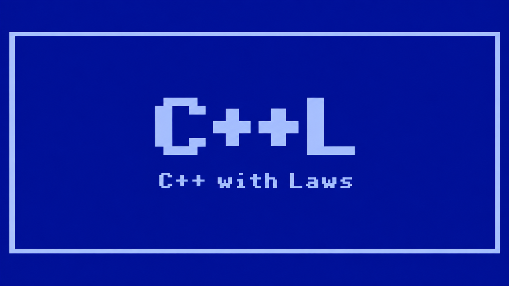
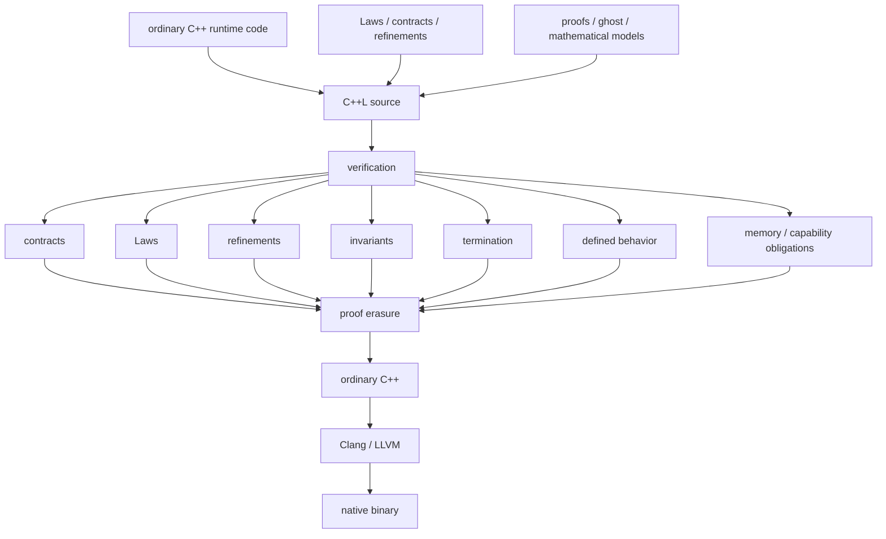

<p align="center">
  
</p>

# C++L — C++ with Laws

<p align="center">
  <strong>Provable C++, without replacing C++.</strong><br>
  State what must be true. Prove it. Erase the proof layer. Ship ordinary native C++.
</p>

<p align="center">
  <strong>C++ ⊂ C++L</strong><br>
  <strong>C++L = C++ + formal specification + proof</strong><br>
  <strong>Laws → Obligations → Evidence</strong>
</p>

C++L is a source-compatible superset of supported C++ that adds a formal compile-time language for **Laws, contracts, proofs, refinements, quantified propositions, invariants, termination, mathematical models, and explicit trust boundaries**.

The runtime language remains C++.

C++L does not replace the C++ object model, ABI, templates, overload resolution, machine arithmetic, or native toolchain with a new execution model. Instead, it adds a proof layer that can reason about real C++ semantics and then erase proof-only information before ordinary C++ compilation.

The goal is simple:

> **Make C++ provable without making it stop being C++.**

A C++L program can say not only **what to execute**, but also **what must be true**, **why it is true**, **which assumptions it depends on**, and **where guarantees stop**.

---

## Status

> **Experimental / Pre-Alpha — under active development**

C++L currently has a normative target specification and an implementation that is still growing toward it.

The specification defines the language C++L intends to be. Repository code, tests, and `STATUS.md` describe how much of that language is implemented today.

The syntax, proof coverage, diagnostics, and tooling should currently be considered unstable.

**C++L is not yet production-ready.**

See [STATUS.md](docs/STATUS.md) for implementation coverage and [SPEC.md](docs/SPEC.md) for the normative language definition.

---

## Motivation

The project started from a simple chain of thought:

> If a human or AI state precise intent, can the compiler mechanically prove the implementation satisfies it, and can the proof layer erase to fast native C++ without any runtime addition?
> Humans and AIs need an ambiguity-free language for specifying what software must do, a mechanically checkable way to prove that an implementation satisfies that intent, and a path to high-performance native execution. Can we do that without creating entirely new language and work with existing tooling?
> What if these requirements could be part of the C++ language itself rather than remaining in tests, comments, fixtures, and engineering conventions?

C++L is an attempt to answer that question while preserving the C++ runtime, ABI, ecosystem, and Clang/LLVM toolchain. The project was initiated by Mateusz Czapliński equipped with AI, steming from this practical need. The goal is to make a Provable C++.

---

# Why C++L?

C++ already gives developers exceptional control over memory, layout, performance, platforms, ABIs, and hardware.

What C++ does not natively provide is a general language for stating and mechanically establishing semantic facts such as:

```text
this result is always within range

this index is valid for this container

this function preserves this invariant

this loop terminates

this state transition cannot violate this rule

this value satisfies this refinement

this pointer access is valid on every verified path

this arithmetic argument is valid under actual C++ machine semantics

this property holds for every value, not just the values a test happened to cover
```

Today, such intent is often spread across:

```text
comments
documentation
unit tests
fuzz tests
assertions
code review
static analysis
tribal knowledge
AI prompts
```

All of those can be valuable.

But none of them, by itself, means:

> **The language has a proposition, the program generated the corresponding proof obligations, and valid evidence was mechanically checked.**

C++L adds that missing layer directly to C++.

---

# The central idea

C++L separates four things that ordinary software development often mixes together:

```text
runtime code
    says what executes

Laws and contracts
    say what must be true

proofs
    establish why it is true

trust / unsafe / runtime validation
    state exactly where proof comes from or where it stops
```

Then:

```text
C++L source
    ↓
proof obligations
    ↓
checked evidence
    ↓
proof erasure
    ↓
ordinary C++
    ↓
Clang / LLVM
    ↓
native binary
```

The proof layer is allowed to decide whether compilation succeeds.

It is not supposed to become a second runtime.

---

# The mathematical model

C++L is designed as a conservative extension of C++: every valid C++ program remains valid C++L, while additional language constructs express Laws, proofs, refinements, and other compile-time correctness information. Verification establishes the required obligations before these proof-only constructs are erased, yielding ordinary C++ with the same runtime meaning. The equations below summarize that relationship.

```math
\forall p \in C^{++}, \quad p \in C^{++}L
```

```math
C^{++}L
=
C^{++}
\oplus
\mathcal{L}
\oplus
\mathcal{P}
\oplus
\mathcal{R}
```

```math
\mathcal{L} = \mathrm{Laws},
\quad
\mathcal{P} = \mathrm{Proofs},
\quad
\mathcal{R} = \mathrm{Refinements}
```

```math
L \in \mathcal{L}
\Longrightarrow
\mathrm{obligations}(L)
=
\{O_1, \ldots, O_n\}
```

```math
\forall O_i,
\quad
\Gamma \vdash e_i : O_i
```

```math
\Gamma \vdash e : L
\Longrightarrow
\Gamma \models L
```

```math
\mathrm{Law}
\longrightarrow
\mathrm{Obligation}
\longrightarrow
\mathrm{Evidence}
\longrightarrow
\mathrm{Theorem}
```

```math
\mathrm{verify}(p) = \checkmark
\Longrightarrow
\mathrm{erase}(p) \in C^{++}
```

```math
\mathrm{erase}
:
C^{++}L_{\mathrm{verified}}
\longrightarrow
C^{++}
```

```math
\mathrm{Sem}_{\mathrm{runtime}}(p)
=
\mathrm{Sem}_{\mathrm{runtime}}(\mathrm{erase}(p))
```

```math
\mathrm{erase}
(
\mathrm{runtime}
+
\mathrm{proof}
+
\mathrm{ghost}
+
\mathrm{refinement}
)
=
\mathrm{runtime}
```

```math
\mathrm{erase}(\mathrm{proof})
=
\mathrm{erase}(\mathrm{ghost})
=
\varnothing
```

```math
\mathrm{Sem}_{C^{++}L}
=
\mathrm{Sem}_{C^{++}}
\oplus
\mathrm{Sem}_{\mathrm{proof}}
```

```math
p \in C^{++}
\Longrightarrow
\mathrm{Sem}_{C^{++}L}(p)
=
\mathrm{Sem}_{C^{++}}(p)
```

```math
C^{++}L
\longrightarrow
C^{++}L^{\checkmark}
\longrightarrow
C^{++}
\longrightarrow
\mathrm{Native}
```

```math
\mathrm{verify}
\quad\longrightarrow\quad
\mathrm{erase}
\quad\longrightarrow\quad
\mathrm{Clang/LLVM}
```

```math
\boxed{
C^{++} \subset C^{++}L
\;\land\;
\mathrm{erase}(C^{++}L_{\mathrm{verified}}) \subseteq C^{++}
\;\land\;
\mathrm{Sem}_{\mathrm{runtime}}(p)
=
\mathrm{Sem}_{\mathrm{runtime}}(\mathrm{erase}(p))
}
```

Runtime validation is different: when a property genuinely depends on a runtime value, an **explicit runtime check** may establish a fact for the successful path. C++L does not silently insert hidden runtime checks to make failed proofs pass.

---

# What makes C++L special?

## 1. Laws are first-class formal intent

A `law` is a proposition.

It is not a unit test, assertion, comment, solver hint, or Boolean function that happens to return `true`.

```cpp cppl-example
pure unsigned identity(unsigned x)
{
    return x;
}

law identity_returns_input(unsigned x)
    proves (identity(x) == x);
```

Conceptually:

```math
\forall x : \mathrm{unsigned},
\quad
\mathrm{identity}(x) = x
```

A Law must have valid evidence unless it is explicitly declared trusted.

Failure to prove a required proposition is a verification failure, not permission to silently weaken the claim.

---

## 2. Executable C++ can carry compile-time contracts

Runtime functions remain runtime functions.

C++L can attach preconditions and postconditions that are checked as formal obligations:

```cpp cppl-example
verified unsigned clamp(unsigned x)
    ensures (result <= 10u)
{
    if (x <= 10u)
        return x;

    return 10u;
}
```

Each reachable return path must establish the postcondition.

Contracts compose across calls. A caller must establish the callee's `expects` conditions and may use the callee's established `ensures` facts.

C++L also provides specification bindings such as:

```text
result
old(...)
self
```

for normal return values, entry-state values, and refinement candidates.

---

## 3. Refinement types make semantic constraints part of typing

C++L can define a verification-level type whose runtime representation is still an ordinary C++ representation:

```cpp cppl-example
type Percentage =
    int where (self >= 0 && self <= 100);
```

A value may cross into that refinement only when the predicate is established.

The verifier must not quietly insert a hidden check.

The important difference is that the property becomes part of the verification model:

```text
int
    arbitrary C++ integer

Percentage
    C++ integer + proven membership predicate
```

Refinements can also participate in indexed and value-dependent relationships.

That makes it possible to express properties such as:

```text
an index is valid for this exact bound

a buffer has this logical length

a state value satisfies this invariant

a return value belongs to a constrained domain
```

without changing the underlying native representation merely because verification information exists.

---

## 4. Universal and existential propositions are language concepts

C++L is not limited to assertions over one execution.

It can state propositions over entire domains.

Universal quantification:

```cpp cppl-example
law every_value_equals_itself()
    proves (forall (unsigned x) { Eq<unsigned>(x, x) });
```

Existential quantification:

```cpp cppl-planned
law some_value_is_zero()
    proves (exists (unsigned x) { x == 0u });
```

These are proof-domain constructs.

They do not create runtime loops or runtime searches.

This matters because:

```text
tested for many values
```

is fundamentally different from:

```text
proved for every value in the stated domain
```

---

## 5. C++L has an actual proof language

Proofs can be written, reused, composed, and independently checked.

Core proof operations include:

```text
refl
exact
apply
assume
rewrite
cases
decompose
induction
```

For example:

```cpp cppl-example
pure unsigned identity(unsigned x)
{
    return x;
}

law identity_returns_input(unsigned x)
    proves (identity(x) == x);

proof identity_returns_input_holds(unsigned x)
    proves (identity_returns_input(x))
{
    refl;
}
```

Proofs are not runtime objects.

They exist to establish evidence, then erase.

---

## 6. Equality is something the language can reason about

C++L distinguishes between merely evaluating expressions and proving that two expressions are equal.

It supports:

```text
definitional equality
normalization
checked substitution
equality rewriting
reusable equality evidence
```

For example, an established equality can transform a later proof goal with `rewrite`.

That makes algebraic and structural reasoning compositional instead of depending on textual coincidence or ad-hoc compiler heuristics.

---

## 7. Induction proves universal properties without enumeration

Some properties cannot be established by checking a finite list of examples.

C++L includes proof-side induction so that recursive or structurally decreasing properties can be established from a base case and induction step.

Conceptually:

```text
prove P(0)

prove P(n) → P(n + 1)

therefore prove P(n) for the represented domain
```

Induction is proof machinery.

It is not runtime iteration and leaves no runtime representation after erasure.

---

## 8. Loop invariants and termination are separate obligations

C++L distinguishes:

```text
partial correctness
    if execution reaches the result, the claimed property holds

total correctness
    the claimed property holds and the computation terminates
```

A loop can carry an invariant:

```cpp cppl-example
verified unsigned count_to(unsigned n)
    ensures (result == n)
{
    unsigned i = 0u;

    while (i < n)
        invariant (i <= n)
    {
        ++i;
    }

    return i;
}
```

When termination is part of the required property, a well-founded decreasing measure can be supplied:

```cpp cppl-example
verified unsigned count_to(unsigned n)
    ensures (result == n)
{
    unsigned i = 0u;

    while (i < n)
        invariant (i <= n)
        decreases (n - i)
    {
        ++i;
    }

    return i;
}
```

`decreases` is not documentation. It creates a proof obligation that the measure is well-founded and strictly decreases on every continuing iteration.

---

## 9. It reasons about machine numbers as machine numbers

This is a systems-language requirement, not a detail.

C++L does **not** silently pretend that:

```text
unsigned
int
std::uint32_t
double
```

are mathematical integers or real numbers.

Verified arithmetic must respect the selected C++ semantics, including where relevant:

```text
unsigned modular arithmetic
signed overflow and undefined behavior
integer promotions
division constraints
shift constraints
floating-point rounding
NaN
infinity
signed zero
target behavior
```

A proof that is valid over mathematical integers is not automatically valid over bounded machine integers.

That distinction is essential for proving real systems code.

---

## 10. It also gives proofs exact mathematical domains

Sometimes the specification should talk about mathematics rather than machine representation.

C++L therefore has proof-only mathematical domains such as:

```text
@N
@Z
@Seq
@Set
@Map
```

For example:

```text
@Z(x)
@N(x)
```

can model a machine integer as an exact mathematical value in specification space, subject to the required proof conditions.

There is no silent conversion back into a machine integer.

This gives C++L both sides of the equation:

```text
real C++ machine semantics
+
exact mathematical reasoning
```

without pretending they are the same thing.

---

## 11. Proof-side case analysis understands real C++ states

C++L proof-side `cases` is exhaustive over the semantic states the modeled C++ type can actually have.

That includes states developers often forget.

For example, a `std::variant` proof must account for its alternatives and, where applicable, its valueless state.

An enum proof must account for underlying values that do not correspond to a named enumerator.

Conceptually:

```cpp cppl-planned
#include <variant>

using V = std::variant<int, unsigned>;

law every_alternative_is_covered(V v)
    proves (Eq<V>(v, v));

proof every_alternative_is_covered_holds(V v)
    proves (every_alternative_is_covered(v))
{
    cases v {
        alternative<0>(x) => { refl; }
        alternative<1>(y) => { refl; }
        valueless => { refl; }
    }
}
```

This is not runtime pattern matching.

It is proof decomposition over C++ semantics and erases completely.

---

## 12. Runtime values can enter verified code through explicit validation

Some facts cannot be known at compile time:

```text
int raw = read_from_network();
```

C++L does not pretend the compiler can predict that value.

Instead, runtime validation can establish a proposition about the **concrete value that actually arrived**.

Conceptually:

```text
dynamic value
    ↓
explicit runtime validation
    ↓
successful branch establishes a fact
    ↓
value may cross into stronger verified code
```

This creates a clean bridge between the static proof world and real external input.

C++L keeps the distinction visible:

```text
PROVEN
    statically established proposition

RUNTIME-CHECKED
    property established dynamically for a concrete value
```

---

## 13. Trust is explicit instead of accidental

C++L distinguishes assurance states rather than flattening everything into “verified”.

| State             | Meaning                                                                           |
| ----------------- | --------------------------------------------------------------------------------- |
| `PROVEN`          | Valid formal evidence exists under explicit premises.                             |
| `TRUSTED`         | A proposition is accepted explicitly as an assumption.                            |
| `RUNTIME-CHECKED` | A property was established by runtime validation for a concrete value/path.       |
| `UNSAFE`          | Execution crossed a region where the strongest formal guarantees are not claimed. |
| `UNVERIFIED`      | No proof claim has been established.                                              |
| `UNRESOLVED`      | A proof obligation exists but has not been discharged.                            |

These states are intentionally different.

In particular:

```text
unsafe ≠ trusted
trusted ≠ proven
runtime-checked ≠ proven
unverified ≠ proven
```

A theorem may depend on trusted premises, but that dependency remains part of its provenance.

---

## 14. Unsafe code cannot manufacture proof facts

C++ needs low-level operations.

C++L does not attempt to ban them.

Instead, it requires proof boundaries to be explicit.

An `unsafe` operation may execute as normal C++, but it does not automatically contribute arbitrary propositions to the proof context.

Its possible effects must also be treated conservatively so that verified reasoning cannot keep stale facts after unknown mutation.

That is a much stronger rule than simply attaching an `unsafe` label to syntax.

---

## 15. Verified code must respect C++ undefined behavior

A proof about an execution that relies on undefined behavior is not a meaningful C++ guarantee.

For verified paths, C++L therefore treats the conditions required for defined C++ behavior as proof obligations.

Examples include:

```text
signed overflow
division by zero
invalid shifts
out-of-bounds access
invalid dereference
use-after-lifetime
uninitialized reads
invalid pointer arithmetic
invalid casts
data races
```

Ordinary unverified C++ remains ordinary C++.

The stronger rule applies where stronger guarantees are claimed.

---

## 16. Memory reasoning is about objects, not just addresses

C++L does not reduce pointers to integers.

Verified memory reasoning must respect relevant C++ concepts such as:

```text
object lifetime
storage duration
provenance
bounds
alignment
initialization
aliasing
construction
destruction
moves
dynamic type
readability
writability
```

The proof model can express capabilities such as:

```text
readable
writable
```

without pretending that “non-null” means “safe to dereference”.

This is essential for a proof system intended for systems programming.

---

## 17. Ghost state can help proofs without entering the binary

`ghost` information exists only for verification.

It can help express intermediate facts, models, measures, or proof structure, but runtime behavior must not depend on ghost values.

After erasure:

```math
\mathrm{erase}(\mathrm{ghost}) = \varnothing
```

That means richer reasoning does not require carrying theorem-only state in production memory layouts or calling conventions.

---

## 18. Proof-only features do not redefine the native ABI

Verification-only constructs are designed not to change an existing C++ function's ABI merely because verification was added.

This includes, among other things:

```text
verified
pure
expects
ensures
proves
proof declarations
quantifiers
proof commands
ghost state
invariants
termination measures
proof-only mathematical domains
refinement predicates
trusted / unsafe verification metadata
```

Refinement types use the runtime representation and ABI of their underlying C++ base type unless the specification explicitly says otherwise.

Proof metadata needed across translation units is verification metadata, not native calling-convention state.

---

## 19. Existing C++ can be adopted incrementally

C++L does not require rewriting an entire codebase into a theorem-proving dialect.

A project may contain:

```text
ordinary C++
verified C++L
trusted boundaries
unsafe boundaries
runtime-validated boundaries
```

at the same time.

The intended migration model is:

```text
existing C++
    ↓
add contracts where valuable
    ↓
add Laws for domain invariants
    ↓
introduce refinements around important values
    ↓
prove critical algorithms and boundaries
    ↓
expand verified coverage over time
```

Verification is additive.

---

## 20. It is designed for humans and coding agents

C++L is especially interesting in an AI-assisted development world.

An AI can generate:

```text
implementation
proof
proof repair
candidate invariant
candidate Law
```

But the AI does not get to decide that its own output is correct.

The language reduces the final question to something mechanically checkable:

```text
Human / AI proposes intent and implementation
        ↓
C++L generates obligations
        ↓
Human / AI supplies or searches for evidence
        ↓
checker validates the evidence
        ↓
only valid evidence earns PROVEN
```

That creates a useful separation:

> **AI may search. The proof system decides.**

Failure to find a proof proves nothing.

Success by an untrusted search procedure is useful only when it produces evidence the trusted checking path accepts.

---

# C++L in one table

| Ordinary C++                      | C++L adds                                 |
| --------------------------------- | ----------------------------------------- |
| C++ types                         | refinement and indexed verification types |
| C++ values                        | propositions about those values           |
| functions                         | `verified` contracts                      |
| preconditions by convention       | `expects` obligations                     |
| postconditions by convention      | `ensures` obligations                     |
| comments describing invariants    | machine-checkable Laws and invariants     |
| tests over selected examples      | proofs over stated domains                |
| machine arithmetic                | machine-accurate verification             |
| no built-in exact proof math      | `@N`, `@Z`, `@Seq`, `@Set`, `@Map`        |
| control flow                      | path-sensitive proof obligations          |
| loops                             | invariants and termination measures       |
| recursive reasoning by convention | induction and checked termination         |
| unchecked semantic assumptions    | explicit `trusted` dependencies           |
| low-level escape hatches          | explicit `unsafe` proof boundaries        |
| runtime checks                    | explicit `RUNTIME-CHECKED` facts          |
| native ABI                        | native ABI after proof erasure            |
| Clang / LLVM                      | still Clang / LLVM                        |

---

# A small example

Consider a function whose result must never exceed a limit:

```cpp cppl-example
verified unsigned clamp(unsigned x)
    ensures (result <= 10u)
{
    if (x <= 10u)
        return x;

    return 10u;
}
```

C++L reasons per path:

```text
x <= 10
    → return x
    → prove x <= 10

x > 10
    → return 10
    → prove 10 <= 10
```

The runtime function remains ordinary C++ control flow.

The proof obligation exists only at compile time.

After erasure, the program does not need a theorem object or proof VM to execute the function.

---

# Laws are stronger than examples

Tests can show that selected executions behave as expected:

```text
assert(square(2) == 4);
assert(square(3) == 9);
```

A Law can state a property over an entire domain:

```text
forall x : T, P(x)
```

These answer different questions.

```text
test
    did these chosen examples behave correctly?

proof
    is the proposition derivable for the entire stated domain under the stated premises?
```

C++L is not intended to eliminate testing, fuzzing, sanitizers, static analysis, or runtime validation.

It is intended to add a guarantee those tools do not provide on their own:

> **machine-checked semantic evidence for explicit propositions.**

---

# Verification without a theorem runtime



C++L requires no mandatory:

```text
proof VM
theorem runtime
garbage collector
alternate execution engine
runtime proof object representation
```

Proof-only information exists to establish compile-time evidence.

Then it disappears.

---

# Core language surface

C++L introduces contextual language words including:

```text
law
proof
proves
pure
verified
ghost
unsafe
trusted
type
where
expects
ensures
decreases
invariant
forall
exists
```

Specification-only bindings include:

```text
result
old
self
```

Proof statements include:

```text
refl
exact
apply
assume
rewrite
cases
decompose
induction
```

Proof-only mathematical domains include:

```text
@N
@Z
@Seq
@Set
@Map
```

These constructs are not globally reserved as ordinary identifiers except where the C++L grammar gives them formal meaning.

C++L does not add runtime algebraic data types or runtime pattern matching. It reasons over ordinary C++ representations.

---

# The proof boundary is explicit

C++L is not:

```text
all C++ is automatically proven
```

It is:

```text
C++L
├── ordinary C++
│   └── executable with ordinary C++ semantics
│
└── verification-enabled C++L
    ├── explicit propositions
    ├── generated obligations
    ├── checked evidence
    └── explicit trust / unsafe / runtime-check boundaries
```

A verified caller cannot simply obtain arbitrary formal facts from an unknown unverified implementation.

Facts must come from a justified source such as:

```text
verified contract
proven Law
explicit trusted Law
successful runtime validation
```

If required evidence is unavailable, verification fails closed.

---

# What C++L deliberately refuses to fake

C++L is designed around several hard rules:

- A test passing is not a proof.
- An assertion not firing is not a proof.
- A solver timing out does not make a proposition false.
- A solver finding no counterexample does not make a proposition true.
- An unsupported construct does not authorize a weaker theorem.
- `trusted` is not silently upgraded to `PROVEN`.
- `unsafe` code does not manufacture formal facts.
- A proof about mathematical integers is not silently applied to machine integers.
- A non-null pointer is not silently treated as a valid dereference.
- A refinement crossing does not get a hidden runtime check.
- Proof syntax must not silently change ordinary C++ runtime behavior.
- Missing verification metadata must not be replaced with invented evidence.

The project prefers:

```text
small and sound
```

over:

```text
broad and unsound
```

while the implementation grows toward the full target specification.

---

# Compatibility philosophy

C++L is defined relative to a selected supported C++ language mode.

Ordinary C++ semantics remain ordinary C++ semantics, including:

```text
name lookup
types
templates
overload resolution
conversions
lifetimes
destruction
exceptions
evaluation order
machine arithmetic
object representation
ABI
```

The long-term model is interoperability with the normal native ecosystem, including where supported:

```text
libc++
C libraries
Objective-C++
JNI
N-API
WASM
platform APIs
existing native libraries
```

C++L verification metadata is additional compile-time information, not a replacement native runtime.

---

# Intended developer workflow

Start with normal C++:

```cpp cppl-example
unsigned clamp(unsigned x)
{
    return x <= 10u ? x : 10u;
}
```

Add the property that matters:

```cpp cppl-example
verified unsigned clamp(unsigned x)
    ensures (result <= 10u)
{
    return x <= 10u ? x : 10u;
}
```

State reusable domain truth as Laws.

Introduce refinements when a property should travel with a value.

Use invariants and `decreases` when loops or recursion need formal reasoning.

Use `trusted` only when an assumption is genuinely external to the proof.

Use runtime validation for dynamic input.

Use `unsafe` when execution crosses a boundary where the strongest proof guarantees do not apply.

Keep ordinary C++ everywhere else.

---

# Command-line usage

Compile supported C++ through `cppl`:

```bash
cppl -std=c++17 main.cpp -o main
```

C++L is intended for zero-change adoption of ordinary supported C++ and incremental addition of verification constructs.

For the exact set of commands and currently implemented compiler behavior, see [DEVELOPER_GUIDE.md](docs/DEVELOPER_GUIDE.md) and [STATUS.md](docs/STATUS.md).

---

# What C++L is not

The following are useful techniques, but none of them alone is C++L:

```text
C++ + unit tests
C++ + property tests
C++ + fuzzing
C++ + assertions
C++ + static_assert
C++ + concepts
C++ + contracts alone
C++ + annotations alone
C++ + an SMT solver alone
C++ + external linting alone
```

C++L's target is a language-level composition of:

```text
formal propositions
+
proof obligations
+
checked evidence
+
C++ semantics
+
explicit trust boundaries
+
proof erasure
```

---

# Design principles

1. **C++ remains the runtime language.**
2. **Supported C++ remains valid C++L when no C++L-specific semantics are requested.**
3. **Formal verification is additive and incremental.**
4. **Laws state propositions; proofs establish evidence.**
5. **Proof obligations may not be silently weakened.**
6. **Runtime behavior may not be silently strengthened to make a proof pass.**
7. **Machine arithmetic must be modeled as machine arithmetic.**
8. **Mathematical domains remain distinct from machine representations.**
9. **Undefined behavior cannot support a verified guarantee.**
10. **Trust dependencies are explicit and traceable.**
11. **Unsafe execution does not create proof facts.**
12. **Runtime validation is explicit and distinct from static proof.**
13. **Ghost and proof-only information must not leak into runtime behavior.**
14. **Proof-only language features erase.**
15. **Native ABI and ecosystem interoperability are preserved where specified.**
16. **Automation may search for evidence; it must not become the source of truth.**
17. **Verification fails closed when required evidence is missing.**
18. **The implementation must grow toward the specification, not shrink the specification to match the implementation.**

---

# Vision

C++L is aimed at software where both **performance** and **semantic confidence** matter:

```text
systems software
financial engines
parsers and compilers
safety-sensitive logic
protocol implementations
storage engines
native mobile cores
cryptographic infrastructure
high-assurance libraries
performance-critical business rules
AI-generated native code
```

The language is intended to let teams move important invariants out of prose and hope:

```text
"this should always be true"
```

and into mechanically checkable program meaning:

```text
this is the proposition
these are the premises
these are the obligations
this is the evidence
these are the trust dependencies
```

That is the core product idea.

Not safer-looking C++.

Not more annotations.

Not a theorem prover beside C++.

**Provable C++.**

---

# Documentation

- [SPEC.md](docs/SPEC.md) — normative C++L language semantics
- [GRAMMAR.md](docs/GRAMMAR.md) — concrete C++L grammar
- [DEVELOPER_GUIDE.md](docs/DEVELOPER_GUIDE.md) — practical usage and examples
- [ARCHITECTURE.md](docs/ARCHITECTURE.md) — compiler structure and data flow
- [DESIGN.md](docs/DESIGN.md) — design rationale and language/compiler decisions
- [FOUNDATIONS.md](docs/FOUNDATIONS.md) — mathematical foundations and proof calculus
- [TRUST.md](docs/TRUST.md) — trusted computing base and trust boundaries
- [COMPATIBILITY.md](docs/COMPATIBILITY.md) — supported C++/ABI/toolchain compatibility
- [STATUS.md](docs/STATUS.md) — current implementation coverage
- [ROADMAP.md](docs/ROADMAP.md) — implementation milestones
- [SECURITY.md](SECURITY.md) — soundness and security policy
- [ACKNOWLEDGEMENTS.md](ACKNOWLEDGEMENTS.md) — intellectual and project credits
- [CONTRIBUTING.md](CONTRIBUTING.md) — contribution process
- [AGENTS.md](AGENTS.md) — repository rules for AI agents and automated contributors

---

# Definition of success

C++L succeeds when a developer or coding agent can:

1. write ordinary supported C++;
2. state important semantic requirements directly in the language;
3. express universal, existential, refinement, equality, state, memory, and termination properties where needed;
4. generate precise proof obligations from real C++ semantics;
5. supply or automatically discover independently checkable evidence;
6. inspect every trust, unsafe, and runtime-validation dependency;
7. erase proof-only information;
8. compile the remaining program through the ordinary native C++ toolchain;
9. obtain the same intended runtime behavior without a mandatory theorem runtime.

In compact form:

```text
C++ SYSTEMS PROGRAMMING
+
FORMAL LAWS
+
MACHINE-CHECKED EVIDENCE
+
REFINEMENT / VALUE-DEPENDENT TYPES
+
EXACT PROOF MATHEMATICS
+
MACHINE-ACCURATE C++ REASONING
+
EXPLICIT TRUST BOUNDARIES
+
ZERO-COST PROOF ERASURE
+
CLANG / LLVM
=
C++L
```

<p align="center">
  <strong>C++L is C++ with Laws.</strong><br>
  <strong>State it. Prove it. Erase it. Ship C++.</strong>
</p>
