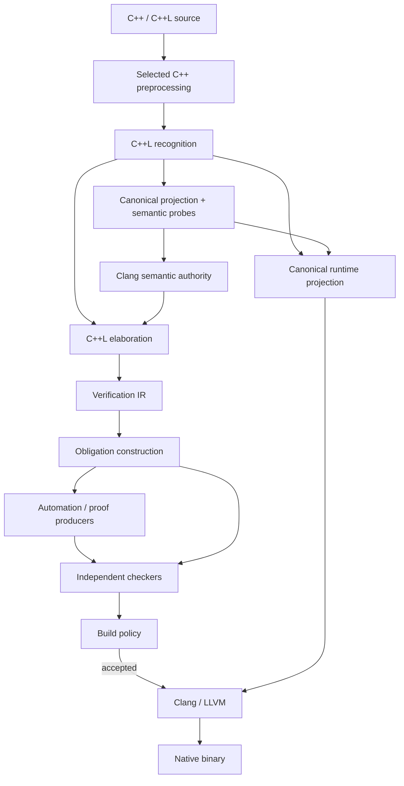
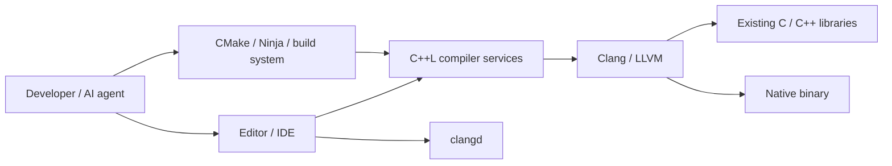
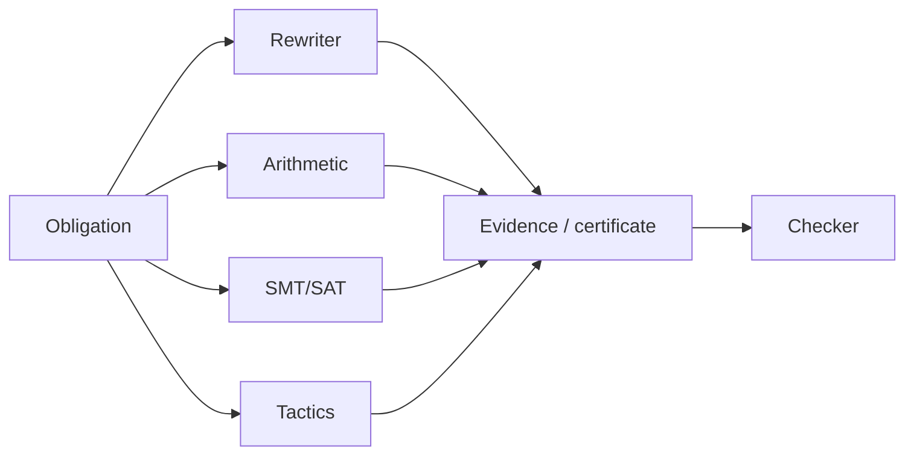
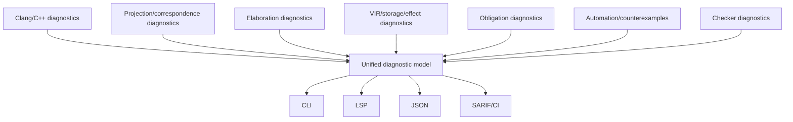
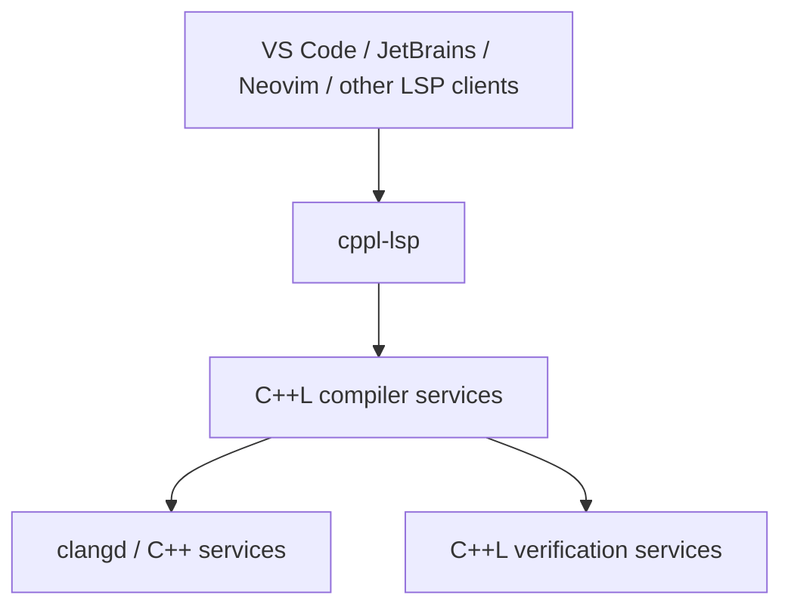
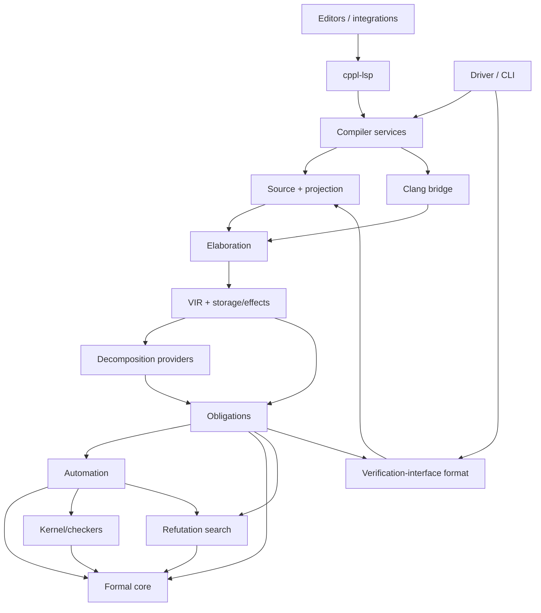

# C++L Architecture

**C++L — Production Compiler and Verification Architecture**

Status: Target implementation architecture

This document defines the implementation architecture of C++L.

It describes the component boundaries, dependency direction, data flow,
source-to-formal correspondence, verification pipeline, storage model,
proof-checking boundary, erasure path, cross-translation-unit metadata,
incremental verification, diagnostics, editor services, testing architecture,
and release-facing compiler structure required to implement the language defined
by `SPEC.md`.

This document is authoritative for **project architecture**, but it is not a
language specification and it does not redefine the Trusted Computing Base.

The documentation responsibilities are:

```text
SPEC.md
    normative language meaning

GRAMMAR.md
    normative concrete syntax

FOUNDATIONS.md
    formal calculus and mathematical foundations

TRUST.md
    Trusted Computing Base, correspondence trust, assumption provenance

DESIGN.md
    non-normative design rationale

ARCHITECTURE.md
    compiler structure, ownership, dependency direction and data flow

COMPATIBILITY.md
    supported C++ modes, Clang/LLVM combinations, platforms and ABI

STATUS.md
    implementation coverage only
```

When this document conflicts with `SPEC.md` on language meaning, `SPEC.md`
wins. When it conflicts with `TRUST.md` on what must be trusted, `TRUST.md`
wins. `STATUS.md` may report that a component is incomplete, but it MUST NOT be
used to redefine the target architecture in this document.

Implementation details that do not create durable architectural constraints
belong in source code, RFCs, ADRs, or `STATUS.md`, not here.

---

# 1. Architectural mission

C++L adds formal specification and machine-checkable proof to C++ while
preserving C++ as the runtime language and Clang/LLVM as the native compilation
path.

The architecture must support:

```text
ordinary C++
+
C++L specification and proof syntax
+
resolved real C++ semantics
+
formal verification
+
explicit trust boundaries
+
semantics-preserving erasure
+
ordinary native C++ ABI and code generation
```

The compiler must not require a theorem VM, proof garbage collector, alternate
runtime, mandatory wrapper ABI, or second runtime implementation.

The core pipeline is:



The architecture is built around one principle:

> C++L must prove properties of the C++ program that is actually compiled, not
> of a simpler shadow program.

---

# 2. Architectural invariants

The following invariants are non-negotiable project architecture requirements.

## 2.1 One C++ semantic authority

Ordinary C++ parsing and semantic questions are owned by the selected C++
semantic authority, normally Clang for the production implementation.

C++L must not independently guess or reimplement, except where unavoidable and
explicitly checked, such matters as:

- name lookup;
- overload resolution;
- template substitution and instantiation;
- implicit conversions;
- canonical C++ types;
- access control;
- value categories;
- `constexpr` evaluation used as C++ semantics;
- class hierarchy and virtual dispatch information;
- object layout and ABI information;
- selected language-mode semantics.

C++L owns the additional formal meaning defined by `SPEC.md`.

**[ARCH-INV-001]** There MUST NOT be two independent C++ semantic engines whose
answers can both affect verification.

## 2.2 One runtime program

Verification and native compilation must refer to one authoritative runtime
projection.

The architecture must not maintain:

```text
program A for verification
program B for execution
```

with independently implemented lowering.

**[ARCH-INV-002]** Runtime projection MUST be produced canonically from the same
recognized source model used for verification.

**[ARCH-INV-003]** No post-verification pass may rewrite proof-relevant runtime
semantics without invalidating or re-establishing the correspondence.

## 2.3 Proof production and proof authority are separate

Frontends, tactics, solvers, AI, rewriters and proof search may produce
candidate evidence.

They do not define truth.

```text
producer
    ↓
candidate evidence
    ↓
checker
    ↓
accepted or rejected
```

The exact TCB is defined by `TRUST.md`.

**[ARCH-INV-004]** No proof producer may set `PROVEN` by returning a Boolean
success flag that bypasses the relevant checker.

## 2.4 Correspondence is first-class architecture

A sound kernel can prove the wrong theorem if elaboration constructs the wrong
obligation.

Therefore source-to-C++ semantics, C++ semantics-to-VIR, VIR-to-obligation, and
runtime-projection correspondence are explicit architectural boundaries.

**[ARCH-INV-005]** Provenance MUST be preserved across every correspondence
boundary.

## 2.5 Unsupported semantics fail closed

Unknown, ambiguous, unsupported, malformed, timed out, resource exhausted, or
internally inconsistent verification state must never become `PROVEN`.

**[ARCH-INV-006]** Failure handling MUST preserve the assurance distinctions
defined by `SPEC.md` and `TRUST.md`.

## 2.6 Proof-only information cannot change runtime behavior

Proofs, Laws, proof-local binders, ghost state, mathematical domains and other
proof-only structures may affect whether compilation succeeds.

They must not create hidden runtime state or control flow after erasure.

**[ARCH-INV-007]** Any construct with runtime meaning must have that runtime
meaning defined by `SPEC.md`; it may not acquire runtime behavior merely because
an implementation technique finds that convenient.

## 2.7 One common storage model

Locals, members, nested members, reference referents, pointer pointees, array
elements, captures, temporaries and other modeled storage must use one common
place/version architecture.

**[ARCH-INV-008]** A new access syntax MUST NOT introduce a second read/write,
alias, lifetime, or refinement mechanism.

## 2.8 Semantic determinism

Stable semantic identity, proof acceptance, artifact hashes and deterministic
output ordering must not depend on:

- memory addresses;
- thread scheduling;
- unordered container iteration;
- temporary file names;
- wall-clock time;
- unrecorded randomness.

**[ARCH-INV-009]** Parallelism may change completion order, never theorem
meaning.

## 2.9 Status is not architecture

The target architecture does not shrink when the current implementation lacks a
feature.

**[ARCH-INV-010]** Temporary implementation limitations belong in `STATUS.md` or
an RFC and MUST NOT be turned into architectural prohibitions unless the project
makes a deliberate architecture decision.

---

# 3. System context

C++L sits between normal developer/build tooling and the native C++ toolchain.



C++L integrates with existing build systems; it does not require a proprietary
project model.

Ordinary C++ code remains first-class input. Verification is additive.

---

# 4. Component model

The production architecture is divided into explicit semantic components.

| Component               | Primary ownership                                          |
| ----------------------- | ---------------------------------------------------------- |
| Driver / orchestration  | command line, compilation policy, stage orchestration      |
| Source system           | file/content identity, ranges, macro/projection provenance |
| C++L recognizer         | contextual C++L syntax only                                |
| Projection system       | analysis/runtime projection and analysis-only probes       |
| Clang bridge            | resolved C++ semantic facts                                |
| Formal elaboration      | C++L surface meaning, formal types and propositions        |
| VIR                     | proof-relevant imperative C++ behavior                     |
| Storage/effect analysis | Place/Region/Capability/Version, aliases, call effects     |
| Decomposition providers | proof-visible structural state models                      |
| Obligation builder      | verification conditions and crossing obligations           |
| Automation              | candidate proof/evidence production                        |
| Formal core             | kernel-facing terms, propositions, proof terms             |
| Kernel/checkers         | independent evidence validation                            |
| Erasure validation      | runtime correspondence checks                              |
| Artifact/index service  | semantic metadata, summaries, caches                       |
| Diagnostics             | structured diagnostics/provenance                          |
| Compiler services       | reusable API for CLI/LSP/tools                             |
| `cppl-lsp`              | C++L editor protocol surface                               |

No component should own semantics already assigned to another component merely
for convenience.

---

# 5. Driver and compilation policy

The driver is the user-facing orchestration layer.

Its responsibilities include:

- accepting Clang-compatible compilation inputs where supported;
- selecting target and C++ mode;
- selecting verification/build policy;
- invoking preprocessing, recognition, projection, Clang analysis,
  verification and code generation;
- coordinating artifacts and diagnostics;
- determining process exit status.

The driver is not a theorem authority.

Verification status and build policy are different concepts.

```text
verification
    produces structured assurance facts

policy
    decides whether those facts permit this build
```

Strict CI policy must not change theorem semantics.

**[ARCH-DRV-001]** A policy layer MAY reject `TRUSTED`, `UNSAFE`, `UNVERIFIED` or
`UNRESOLVED` code according to project policy, but MUST NOT relabel it `PROVEN`.

---

# 6. Preprocessing and source ownership

C++L recognizes the semantic token stream produced according to the selected C++
preprocessing rules.

This is necessary so that:

- formal constructs in included headers are visible;
- macros expand before C++L interprets contextual forms;
- conditional compilation selects the same program for verification and native
  compilation;
- compile flags remain part of semantic identity.

The source system owns:

- content-addressed source identities;
- original and preprocessed ranges;
- include and module provenance;
- macro-expansion provenance;
- generated analysis/runtime mappings;
- semantic probe mappings;
- diagnostic source ranges.

**[ARCH-SRC-001]** Downstream components MUST use source identities supplied by
the source system rather than inventing parallel location models.

**[ARCH-SRC-002]** Presumed file/line/column locations are diagnostic labels,
not declaration identity.

**[ARCH-SRC-003]** Reuse keys MUST include every preprocessing input that can
change semantic meaning.

---

# 7. Contextual C++L recognition

The C++L recognizer owns only syntax that C++ itself does not own.

It recognizes the contextual forms defined by `GRAMMAR.md` and `SPEC.md`, such
as Laws, proofs, contracts, refinements, ghost constructs, formal proposition
forms and proof statements.

It must not become a second C++ parser for ordinary expressions.

Example:

```cpp
int law = 4;
void proof();
```

remains ordinary C++ unless the surrounding grammar establishes a C++L
construct.

The architecture is:

```text
token stream
+
grammatical context
    ↓
ordinary C++ region
or
C++L formal region
```

not:

```text
token spelling == contextual word
    ↓
always C++L
```

**[ARCH-REC-001]** Formal recognition MUST record exact physical source spans and
structural identities for later projection and diagnostics.

**[ARCH-REC-002]** The recognizer MUST preserve ordinary C++ text byte-for-byte
outside spans whose transformation is defined by the architecture and
`SPEC.md`.

---

# 8. Projection architecture

C++L needs Clang to resolve ordinary C++ semantics that occur inside and around
formal constructs.

The projection system therefore produces two related views from one recognized
source model:

```text
analysis projection
    valid C++ used to obtain C++ semantic answers

runtime projection
    ordinary C++ that will be compiled and executed
```

They are not independently authored translations.

A single projection ledger records, for every transformed formal span:

- source identity and range;
- formal construct identity;
- analysis replacement/probe identity;
- runtime replacement kind;
- source-to-generated mappings;
- lexical/template scope required by the probe;
- expected erasure class.

**[ARCH-PROJ-001]** Analysis and runtime projections MUST be generated from the
same recognition result and projection ledger.

**[ARCH-PROJ-002]** The runtime projection MUST NOT depend on proof outcome except
for whether code generation is permitted.

**[ARCH-PROJ-003]** Analysis-only scaffolding MUST never enter the runtime
projection.

---

# 9. Analysis-only semantic probes

C++L must obtain C++ semantic information for expressions embedded in formal
syntax without pretending those expressions have different C++ meaning.

The projection system may therefore emit analysis-only **semantic probes**.

A probe exists only to make Clang answer questions such as:

- which declaration a name denotes;
- which overload is selected;
- what conversions are applied;
- what canonical type an expression has;
- what template arguments are substituted;
- what value category or constant value Clang determines.

A probe is never proof evidence.

**[ARCH-PROBE-001]** Probe output MUST be linked back to the exact recognized
formal construct that requested it.

**[ARCH-PROBE-002]** Probe shape MUST be validated before its Clang result is
consumed; arbitrary generated AST shapes MUST NOT be interpreted as formal
meaning.

**[ARCH-PROBE-003]** A probe MUST preserve every lexical and semantic context
needed to resolve its C++ subexpressions correctly.

This includes, where applicable:

- namespace scope;
- class scope;
- function scope;
- template parameter lists;
- template constraints;
- dependent context;
- `this` context;
- access control;
- surrounding declarations required for lookup.

This rule is particularly important for templates: analysis helpers for a
template declaration must be generated in a context in which the same template
parameters and constraints exist. Emitting a non-template probe that mentions a
template parameter is an architectural defect.

**[ARCH-PROBE-004]** Formal intrinsics such as `Eq`, quantifiers, logical
connectives, mathematical-domain operations, `readable`, and `writable` MUST NOT
be implemented as accidental user-visible runtime helper functions merely to
make Clang accept a probe.

The projector should expose only the C++ operands that require C++ resolution and
retain the formal connective/intrinsic identity separately.

A probe may also exist to make an entity *reachable* rather than to ask a
question about one. An explicit instantiation instantiates a body in this unit,
but Clang's cursor API exposes no cursor for the instantiation, so nothing would
reach the specialization that now has a contract to discharge.

**[ARCH-PROBE-005]** Where a C++ entity that must be verified is not reachable
through Clang's cursor API, the projector MAY emit an analysis-only reference
that makes Clang expose it. Such a reference MUST name the entity with the
spelling the author wrote, MUST NOT select among candidates itself, and MUST NOT
appear in the runtime projection (ARCH-PROJ-003).

Reconstructing the entity from parts would make the projector decide which
specialization is meant. Naming it as written leaves that decision to Clang,
which is the same division every other probe observes.

---

# 10. Runtime projection and erasure classes

The runtime projection is produced according to the erasure/lowering classes
defined by `SPEC.md`.

Architecturally, source constructs fall into two broad groups:

```text
proof-only
    removed/blanked while preserving source correspondence

runtime-bearing C++L declaration
    lowered canonically to the ordinary C++ representation defined by SPEC
```

Refinement declarations, for example, have a runtime representation because the
program names the resulting C++ type alias even though the refinement predicate
is proof-only.

**[ARCH-ERASE-001]** Runtime-bearing lowering MUST be canonical and narrow; it is
not a general-purpose source-to-source optimizer.

**[ARCH-ERASE-002]** Erasure validation MUST independently verify that the
runtime projection conforms to the recognized construct classes and canonical
lowering rules.

**[ARCH-ERASE-003]** The compiler MUST preserve source mapping through erasure so
that diagnostics and debug information can still refer to user source.

In this implementation the driver writes the runtime program to a scratch file
only after erasure validation passes, from the text validated, and hands that
file to Clang as preprocessed input. Blanking keeps every line and column, and
the preprocessor's line markers carry the user's file names, so Clang's
diagnostics and `__builtin_LINE()` refer to user source. The file is named
`.ii`: for preprocessed input Clang names the compile unit in debug information
after the first line marker only when the file's extension also says it is
preprocessed, and otherwise after the scratch path, which is removed when the
build ends and differs in every build.

---

# 11. Clang semantic bridge

The Clang bridge is the sole project component that converts Clang-resolved C++
semantics into stable C++L-owned semantic data.

It provides, as required:

- declaration identity;
- canonical and sugared type information;
- parameter passing mode;
- value category;
- selected overload/callee;
- implicit and explicit conversions;
- template specialization and substitution data;
- class/base/member relationships;
- access control;
- constant values;
- control-flow structure needed by VIR construction;
- target properties;
- ABI/layout information when relevant to a claim;
- source mappings.

The production bridge may use libclang or a deeper Clang API behind this boundary,
but Clang implementation objects must not leak into the rest of the compiler as
semantic identity.

**[ARCH-CLANG-001]** Raw Clang pointers, allocation addresses and unstable AST
object identity MUST NOT become persistent C++L semantic identifiers.

**[ARCH-CLANG-002]** The bridge MUST expose the conversions Clang actually
selected. Verification must not reason directly from the source spelling when
C++ semantics inserted a conversion.

**[ARCH-CLANG-003]** Overloaded operators MUST remain resolved calls unless Clang
establishes that a built-in operator is the operation being modeled.

**[ARCH-CLANG-004]** The Clang installation used for semantic analysis and the
one used for runtime compilation MUST be compatibility-locked according to
`COMPATIBILITY.md`.

---

# 12. Stable semantic identity

Persistent verification cannot depend on process-local object identity.

The architecture defines stable identities for at least:

- source content/configuration;
- C++ declarations;
- template instantiations;
- Laws;
- proof declarations;
- contracts;
- formal types and indexed refinements;
- VIR functions;
- Places and regions within a semantic unit;
- obligations;
- imported summaries;
- trusted assumptions.

Identity may combine:

- canonical declaration identity from the C++ semantic authority;
- module/TU identity;
- template arguments;
- normalized formal content;
- target/C++ mode where semantically relevant;
- stable content hashes.

**[ARCH-ID-001]** File paths alone MUST NOT identify semantic declarations.

**[ARCH-ID-002]** Source line/column alone MUST NOT identify semantic declarations.

**[ARCH-ID-003]** Semantic hashes MUST exclude presentation-only data and include
every input whose change can affect the verified meaning.

---

# 13. C++L formal surface model

Recognition produces a C++L-owned surface representation for formal constructs.

This representation contains structure that Clang does not own, including:

- Law declarations;
- proof declarations and proof statements;
- contract clauses;
- refinement declarations;
- ghost declarations;
- proof-only `cases`, `decompose` and `induction` structure;
- mathematical-domain types;
- trusted declarations;
- loop invariant/decreases clauses.

Ordinary C++ subexpressions inside those constructs are represented by source/probe
references until the Clang bridge supplies their resolved semantics.

The formal surface model does not define a second runtime datatype language:
`data` and runtime `match` are not extension points. Proof-side `cases`,
`decompose` and `induction` operate over the normative C++/mathematical domains
defined by `SPEC.md`.

This avoids both extremes:

```text
reparse all C++ ourselves
```

and:

```text
encode every formal construct as fake runtime C++
```

---

# 14. Formal elaboration

Elaboration combines:

```text
recognized C++L structure
+
resolved C++ semantic facts
+
formal context
```

and produces typed C++L semantic objects and VIR.

Responsibilities include:

- resolving Law/proof references;
- elaborating formal propositions;
- constructing formal types;
- inserting and validating formal binders;
- classifying mathematical versus runtime values;
- constructing refinement predicates and indexed applications;
- binding `result`, `old` and `self` according to their normative contexts;
- mapping runtime C++ conversions separately from refinement crossings;
- establishing proof-only structural decomposition requests;
- preserving provenance.

Elaboration may be complex. It is not proof authority.

**[ARCH-ELAB-001]** Elaboration MUST never create a trusted fact as an error
recovery mechanism.

**[ARCH-ELAB-002]** An unsupported conversion or semantic form MUST remain
unsupported/fail closed rather than being approximated by a stronger formal
operation.

---

# 15. Formal core boundary

The formal core is the checker-facing language of:

- formal types;
- formal terms;
- propositions and constructive logical connectives;
- universal and existential binders;
- formal equality and substitution;
- proof terms;
- checked total definitions;
- proof contexts;
- the mathematical domains/abstract observations required by `FOUNDATIONS.md`.

It intentionally excludes:

- source formatting;
- editor metadata;
- Clang AST objects;
- diagnostics strings;
- runtime storage locations unless represented by a formally specified abstract
  value model;
- solver-specific encodings.

The formal core should be explicit, deterministic and serializable enough for
independent checking and adversarial testing.

The logical kernel operates on the formal core, not on C++ source.

---

# 16. Verification IR mission

The Verification IR (VIR) represents proof-relevant executable C++ behavior after
C++ semantics have been resolved.

It is the boundary between:

```text
resolved C++ execution
```

and:

```text
verification conditions
```

VIR owns semantic concepts such as:

- runtime values;
- control-flow structure;
- Places and storage versions;
- reads and writes;
- calls and call effects;
- object construction/destruction events relevant to proof;
- lifetime transitions;
- normal and exceptional exits;
- contracts and call sites;
- loop structure;
- formal observations of runtime objects;
- source provenance.

VIR does not own:

- C++ name lookup;
- overload resolution;
- final proof validity;
- native code generation.

---

# 17. VIR design properties

VIR must be:

- strongly typed;
- explicit;
- deterministic;
- provenance-preserving;
- structurally validated;
- independent of raw Clang object identity;
- suitable for semantic hashing;
- suitable for obligation generation;
- capable of representing every runtime distinction required by the claims being
  verified.

VIR should avoid:

```text
stringly typed semantics
magic integer tags
implicit hidden mutation
raw AST pointers
source-spelling-based resolution
feature-specific storage representations
```

**[ARCH-VIR-001]** Malformed VIR MUST be rejectable independently of the frontend
that produced it.

**[ARCH-VIR-002]** Information may be omitted from VIR only when it cannot affect
any verification claim made from that VIR.

---

# 18. Values, places, regions, capabilities and versions

C++L uses one generic storage architecture.

The conceptual model is:

```text
Region
    storage/lifetime/provenance/extent identity

Place
    a particular storage location within a Region

Capability
    permission/state fact required to access a Place

PlaceVersion
    the logical value currently associated with a Place at a program point

Value
    an immutable logical observation used in formal reasoning
```

A Place is not a Value.

Reading a Place yields a Value.

Writing a Place establishes a new PlaceVersion.

The Place itself never becomes an ordinary kernel term merely because runtime
storage exists.

---

# 19. Place structure

A Place has a root and zero or more projections.

Representative roots include:

```text
local storage
reference-parameter referent
object/temporary storage
capture-owned storage
pointee selected by a pointer value/version
modeled external storage
```

Representative projections include:

```text
field/base subobject
constant element
symbolic element
modeled tuple/product component
```

The exact C++L-owned data structure may evolve, but all access forms must lower to
this common representation.

Examples:

```text
s
s.x
s.x.y
a[3]
a[i]
(*p).field
```

are Places or projections of Places, not independent semantic categories.

**[ARCH-PLACE-001]** Member-of-member, element-of-member and member-of-element
access MUST compose structurally rather than requiring dedicated rules.

---

# 20. Dereference architecture

Dereference is the boundary from a pointer Value to a pointee Place.

Conceptually:

```text
pointer Value
+
current pointer version
+
region/capability evidence
    ↓
Deref Place
```

A dereference place must be tied to the pointer value/version that selects it.
Changing the pointer creates a different selection.

All syntactic forms that imply dereference must route through the same resolver:

```text
*p
p->m
p[i]
```

**[ARCH-DEREF-001]** Non-nullness MUST NOT bypass capability checks.

**[ARCH-DEREF-002]** No access syntax may have a private dereference rule.

---

# 21. Symbolic elements and extent

Array and indexed storage must support both constant and symbolic element
projections.

Conceptually:

```text
Element(ConstantIndex)
Element(SymbolicIndexTerm)
```

A Region or modeled aggregate provides the extent term against which bounds are
proved.

For symbolic `i` and `j`, the architecture must not assume distinctness merely
because the expressions differ textually.

```text
i != j
```

must be established when disjointness depends on it.

**[ARCH-ELEM-001]** Symbolic element identity MUST preserve the index term and its
semantic dependencies.

**[ARCH-ELEM-002]** Fully unrolling arrays into one component per element is not
a sufficient general representation for symbolic indexing.

An indexed array may participate in verification through two semantically
distinct routes:

```text
tracked storage
    -> Place + Element(index_term)
    -> capability / bounds
    -> read or write
    -> PlaceVersion / aliasing / effects

modeled value
    -> indexed observation(value, index_term)
    -> bounds
    -> element value
```

These are different questions rather than two implementations of one question.

The storage route applies when the C++ expression denotes storage, including
locals, array objects, reference parameters, pointees, members, and other
glvalues represented by the Place model. It owns all state-sensitive semantics:

```text
lifetime
capability
current PlaceVersion
writes
aliasing
havoc
effects
```

The value route applies when verification already has an aggregate/array as a
formal value rather than as current mutable storage. Examples include snapshots,
formal values produced by other expressions, proof/model values, and other
contexts in which the operation observes an existing value without designating a
writable Place.

It is a pure indexed observation and has no PlaceVersion of its own.

Both routes must use the same formal representation of the source index and must
establish the bounds required by the same C++ array semantics.

**[ARCH-ELEM-003]** The value route MUST lower through the ordinary expression
and VIR path onto the indexed observation defined by `FOUNDATIONS.md`. A separate
array-expression verifier, a second symbolic-index representation, or a bespoke
bounds checker for this route is a regression.

**[ARCH-ELEM-004]** For one source access, storage and value reasoning MUST use
the same formal index term. The applicable extent MUST be derived from the same
resolved C++ array semantics. One subsystem MUST NOT stringify, reconstruct,
renormalize, or otherwise create an independently identified index expression.

For a built-in array or array reference whose extent is part of its resolved
type, that extent is the corresponding formal bound. Storage forms whose extent
comes from another normative source, such as a checked capability, retain that
source rather than pretending the extent is encoded in the pointer type.

**[ARCH-ELEM-005]** Indexed observation of a modeled value is read-only. A C++
element write MUST use the storage route, because writes operate on Places and
therefore require capability checking, creation of a new logical version, and
alias/effect invalidation.

**[ARCH-ELEM-006]** A C++ glvalue MUST NOT be routed through value observation
merely because the current implementation failed to construct its Place. Missing
Place lowering is an implementation gap and MUST fail closed rather than silently
discard storage semantics.

---

# 22. Central read and write operations

All modeled storage reads route through one semantic read path.

All modeled storage writes route through one semantic write path.

A read performs, as applicable:

1. resolve access to a Place;
2. establish required capability/lifetime/initialization facts;
3. obtain the current PlaceVersion;
4. return the logical Value represented by that version;
5. expose refinement facts valid for that current version.

A write performs, as applicable:

1. resolve target Place;
2. establish writable/lifetime capability;
3. elaborate the runtime value being stored;
4. establish target semantic validity/refinement crossing;
5. create a new PlaceVersion;
6. invalidate/havoc every potentially aliased observation;
7. update containing aggregate validity facts that depend on the written
   subobject.

**[ARCH-RW-001]** Declaration initialization, assignment, compound assignment,
member writes, element writes, reference writes, pointer writes and call
post-state writes MUST converge on the same semantic write machinery.

---

# 23. Alias analysis

Alias analysis is deliberately conservative.

The system may prove disjointness from semantic structure that the C++ authority
has resolved, for example:

- distinct independent locals;
- distinct non-overlapping ordinary members when C++ object semantics justify it;
- indices proven unequal within one indexed region;
- distinct storage regions established by allocation/ownership semantics.

It must not infer disjointness merely from source spelling or from a type-based
shortcut whose validity presupposes the absence of undefined behavior being
proved.

Where disjointness is not established, mutation must conservatively invalidate
possibly affected facts.

**[ARCH-ALIAS-001]** Havoc MUST lose information; it must never strengthen the
proof context.

**[ARCH-ALIAS-002]** A possible alias write MUST NOT preserve a refinement or
capability fact that depends on the previous value/state of the aliased Place.

---

# 24. Region and lifetime model

A Region represents the storage/lifetime context shared by related Places.

Depending on the storage kind, a Region may carry:

- liveness state;
- object lifetime identity;
- extent;
- allocation provenance;
- ownership/borrowing metadata where modeled;
- dynamic object identity where required;
- relation to parent storage.

Lifetime transitions are explicit semantic events.

Examples include:

- construction begins/ends;
- object becomes initialized;
- destruction;
- deallocation;
- move-related state transitions where relevant;
- placement/reuse of storage where modeled.

**[ARCH-REGION-001]** A Place may not retain access capabilities after the
Region/lifetime event that invalidates them.

---

# 25. Capability channel

`SPEC.md` defines `readable(...)` and `writable(...)` as built-in
**specification-domain propositions**. Their source-level status as propositions
must be preserved.

Internally, the implementation may discharge state-sensitive memory propositions
through a dedicated storage/capability checker rather than encode liveness,
initialization, provenance, extent, readability and writability as ordinary value
predicates in the logical kernel.

Representative internal state facts include:

```text
live
initialized
readable
writable
region extent / provenance relation
```

The architecture therefore distinguishes two checker-facing channels while
preserving one source-level proposition semantics:

```text
logical proposition obligations
    equality, arithmetic, connectives, quantifiers, refinement predicates, Laws

storage/capability obligations
    liveness, initialization, readable/writable state, provenance/region facts
```

A source conjunction may require obligations from both channels. Splitting that
work is an implementation technique; it must preserve the conjunction,
implication and trust semantics defined by `SPEC.md` and `FOUNDATIONS.md`.

**[ARCH-CAP-001]** A missing capability MUST create a failed/unsatisfied access
obligation; it MUST NOT be inserted as a hypothesis merely because an operation
needs it.

**[ARCH-CAP-002]** Capability derivation MUST record provenance.

**[ARCH-CAP-003]** Capability invalidation MUST participate in aliasing, calls,
lifetime changes and exceptional flow.

**[ARCH-CAP-004]** Internal separation of capability checking from the logical
kernel MUST NOT cause `readable(...)` or `writable(...)` to lose their
source-level proposition meaning.

---

# 26. Trusted Laws and memory propositions

The language has one explicit trusted source surface: `trusted law` as defined by
`SPEC.md`.

Architecture must not invent a parallel source syntax such as:

```text
trusted capability
trusted pointer
trusted block
```

A trusted Law may admit a built-in memory proposition such as
`readable(p, n)` or `writable(p, n)` exactly as `SPEC.md` permits.

Elaboration records the proposition as an explicit trusted assumption and routes
the state-sensitive part to the checker/channel responsible for capability
semantics. It must not disguise that assumption as a derived capability.

The trusted-Law identity and source provenance remain attached transitively to
every result that depends on it.

**[ARCH-CAP-TRUST-001]** No capability may appear without either modeled semantic
derivation or an explicit trusted-Law assumption path permitted by `SPEC.md`.

---

# 27. Bounds are proved, not hidden inside capabilities

Storage accessibility and arithmetic bounds are related but distinct.

For a subscript:

```text
storage capability
+
0 <= index < extent
```

may both be required.

The bounds relation is an ordinary formal proposition when its values are
representable in the formal model.

It should be discharged through normal proof/automation rather than encoded as an
opaque Boolean capability.

This separation keeps arithmetic reasoning visible and reusable.

---

# 28. Refinement architecture

Refinement types are implemented on top of the general value/storage model.

There must not be a second refinement-specific state system.

Architecturally, a refinement provides:

- verification-level type identity;
- a semantic validity predicate;
- crossing obligations;
- erasure to the base runtime representation.

It does not provide:

- a runtime wrapper;
- hidden validator;
- hidden constructor;
- runtime tag;
- separate ABI.

---

# 29. Recursive semantic validity

The common elaboration notion `Valid(T, v)` implements the semantic-validity rules
of `SPEC.md` §17, including the approved recursive-validity model for
refinement-bearing subobjects.

At minimum:

```text
ordinary modeled T with no refinement-bearing subobjects
    Valid(T,v) adds no refinement predicate

type R = T where (P)
    Valid(R,v) = Valid(T,v) && P[v/self]

object / aggregate
    validity recursively includes each live refinement-bearing subobject

array
    validity recursively includes each live element

union
    only the active member contributes

reference
    validity applies to the referred current logical version

pointer
    pointer validity does not recursively imply pointee validity or capability
```

A verified parameter of semantic type `T` receives `Valid(T, parameter)` as an
entry premise. That premise is recursive for aggregates/classes/arrays containing
refinement-bearing subobjects. It is a formal precondition, not a hidden runtime
check.

The architecture must implement semantic validity in one reusable operation used
for:

- local introduction;
- argument crossing;
- parameter entry premises;
- return crossing;
- member/base construction;
- member/base writes;
- element construction/writes;
- dereference writes;
- copy/move construction;
- copy/move assignment;
- aggregate construction;
- temporary construction;
- verified call post-state.

Current semantic validity is about the current logical value/version. A verified
boundary does not require proof of every historical construction path merely to
use validity already supplied by the boundary; later writes/havoc invalidate the
affected current-version facts.

**[ARCH-REFINE-001]** A refined member MUST NOT require a separate member-only
validity system.

**[ARCH-REFINE-002]** Validity facts attach to logical values/current versions,
not permanently to storage names.

**[ARCH-REFINE-003]** Pointer validity MUST NOT recursively manufacture pointee
validity, readability or writability.

---

# 30. Refinement crossings and C++ conversions

The compiler must distinguish:

```text
C++ runtime conversion
```

from:

```text
verification-level refinement crossing
```

Clang resolves the C++ conversion.

The refinement layer determines whether the resulting value may inhabit the
requested semantic refinement.

A cast does not manufacture proof.

A conversion whose C++ runtime behavior is known but whose refinement obligation
cannot be established may be valid ordinary C++ while remaining invalid as a
verified refinement crossing.

**[ARCH-REFINE-004]** Every crossing form MUST use the same validity obligation
construction.

---

# 31. Indexed refinements

Parameterized refinements reuse the normal formal type system plus C++-style type
application.

Their semantic identity includes:

- refinement declaration identity;
- elaborated index arguments;
- dependent substitutions.

Applications with distinct indices are distinct verification types even when they
erase to the same C++ base type.

The architecture must support indexed refinements in:

- locals;
- members;
- parameters;
- returns;
- templates;
- dependent contexts;
- storage targets;
- cross-TU metadata.

Erasure identity and verification identity are deliberately separate.

---

# 32. `old` and snapshots

`old(expr)` exists only in the function-postcondition context permitted by
`SPEC.md`. The architecture must not generalize it into an arbitrary proof
expression, statement, ghost operator or runtime API.

It is implemented using explicit entry-state/snapshot semantics, not by
performing a runtime copy.

For storage-based expressions, `old` binds to the relevant entry PlaceVersions or
entry observations before mutation occurs. The snapshot expression itself must be
well-defined in the entry state and obey the `SPEC.md` restrictions, including no
nested `old` and no `result` inside `old`.

**[ARCH-OLD-001]** `old` MUST NOT read the current PlaceVersion and merely label
it historical.

**[ARCH-OLD-002]** Snapshot dependencies MUST participate in obligation identity
and invalidation.

**[ARCH-OLD-003]** No runtime snapshot object may be inserted merely to implement
the proof meaning of `old`.

---

# 33. Ghost-state architecture

The current language surface defines `ghost` only for local simple declarations
inside verification-enabled blocks. Ghost parameters, members and globals are
not architecture extension points unless `SPEC.md` is changed first.

Ghost values live in a proof-only state channel.

They may support proof bookkeeping and formal snapshots but must not become
runtime Places that influence executable behavior.

The ghost subsystem reuses formal values/types where possible while enforcing:

- no runtime escape;
- no runtime branch dependency;
- no runtime return-value dependency;
- no observable construction/destruction side effects;
- no runtime FFI escape;
- deterministic erasure.

Ghost access must not bypass normal proof typing or trust rules.

**[ARCH-GHOST-001]** Architecture MUST NOT add new ghost storage classes merely
because the internal representation could support them.

The realized flow of a ghost declaration:

```text
recognizer   `ghost` at the start of a statement, decided C++-first once the
             unit is read (Syntax::ghost_declarations); refused outside a
             verified body, as a statement's body, and in an unsafe block
projection   the runtime text loses the whole declaration; the analysis text
             keeps it, after a marker declaration named where `ghost` was
bridge       before any path is lowered, GhostScan decides the body's ghost
             state: its type, storage and value, an initializer with no effect,
             the calls it makes, and every reference to a ghost outside another
             ghost's initializer or a generated specification expression, each
             an error where it stands; lowering then binds each ghost to its
             initializer read as a term, and nothing ever writes it
elaboration  the errors reported at their positions; a call in an initializer
             must be to a pure function
obligations  a ghost is a value binding like any other, read by loop clauses
             and claims; it has no runtime effect to model
erasure      the validator requires the whole declaration, and nothing else,
             to have left the program
```

A ghost is an ordinary versioned place of the verification model, never a
runtime one: no statement of the erased program names it, which the scan
establishes rather than assumes.

---

# 34. Call architecture

A call has separate concerns:

```text
C++ call semantics
formal precondition
formal postcondition
storage/capability effects
exceptional effects
trust dependencies
```

Clang owns which callable is invoked and how arguments are converted/passed.

C++L owns the formal summary and proof obligations.

At a verified call site:

1. caller establishes the callee's entry requirements;
2. argument/refinement/capability crossings are checked;
3. runtime call remains unchanged;
4. post-state facts are introduced only from an accepted callee summary;
5. affected PlaceVersions/effects are updated;
6. facts not preserved by the summary are invalidated.

**[ARCH-CALL-001]** A callee body MUST NOT be inspected opportunistically to
strengthen a public summary in a way callers could not rely on cross-TU.

---

# 35. Effect summaries

Effect information is part of verification metadata.

A summary may describe, as required:

- places/regions read;
- places/regions possibly written;
- lifetime effects;
- capability effects;
- result/post-state relationships;
- exceptional effects;
- purity;
- totality/partial correctness status.

The source syntax for effects is defined only if `SPEC.md` defines one; the
architecture does not invent a `modifies` clause on its own.

Effects may be derived from verified bodies and exported as checked metadata.

**[ARCH-EFFECT-001]** An unverified or insufficiently modeled call MUST
conservatively havoc all mutable storage it may reach.

This may include:

- reference arguments;
- pointer-reachable storage;
- aliases reachable through by-value pointer-containing objects;
- globals/statics;
- callbacks;
- virtual targets;
- other modeled external effects.

---

# 36. Purity architecture

`pure` is implemented as a checked effect property, not as a spelling that
suppresses effect analysis.

Purity analysis must account for:

- direct writes;
- writes through aliases;
- calls;
- volatile/atomic operations;
- I/O or modeled external effects;
- global state;
- allocation/deallocation where relevant;
- exceptional/lifetime effects defined by `SPEC.md`.

**[ARCH-PURE-001]** A function may be used as pure only when the semantic model
establishes the required purity, not because the declaration merely carries the
word `pure` without verification.

---

# 37. Control-flow architecture

VIR represents control flow explicitly enough to construct all required
obligations.

This includes:

- sequential statements;
- conditionals;
- short-circuit evaluation;
- returns;
- loops;
- `break` and `continue`;
- calls in conditions;
- exceptional edges where modeled;
- object lifetime transitions.

Path conditions must correspond to actual C++ evaluation order.

A fact from one branch must not leak into a sibling branch unless a merge rule
justifies it.

**[ARCH-CFG-001]** Unsupported control flow MUST be rejected for the stronger
verification claim; it must never be silently dropped from VIR.

---

# 38. Path-sensitive state and merges

Every path carries its own storage versions and formal context.

At control-flow joins, the architecture may use:

- explicit conditional/select values;
- phi-like logical versions;
- quantified fresh versions plus path constraints;
- another equivalent sound representation.

The specific encoding is internal.

The requirement is that no join may preserve a fact that holds only on one
incoming path unless the merged representation carries the necessary condition.

---

# 39. Loops and invariants

Loops are represented with explicit:

- entry state;
- loop-head state;
- invariant context;
- condition;
- carried Places/values;
- body effects;
- iteration/preservation obligations;
- exits.

Invariant obligations include, as applicable:

```text
entry establishes invariant
iteration preserves invariant
continue preserves invariant before next iteration
exit conditions justify post-loop facts
call preconditions hold on every path where calls execute
```

The obligation builder, not a source transformation, owns these proof conditions.

---

# 40. Termination architecture

Termination is modeled separately from partial-correctness invariants.

When `decreases` or another normative totality requirement applies, the compiler
constructs well-founded decrease obligations according to `SPEC.md` and
`FOUNDATIONS.md`.

Proof-producing computation must always be total according to the formal core's
admission rules.

Runtime functions may be verified for partial correctness when totality is not
required by the language construct.

**[ARCH-TERM-001]** Divergence MUST NOT become a way to manufacture proof
because an unreachable postcondition is vacuously true in a context where the
language requires total proof-producing computation.

The realized flow of termination:

```text
recognizer   a `decreases` clause on a loop or a verified function, split into
             its lexicographic components (measure_components)
projection   a loop's components become measure declarations at the head of
             its body; a function's become probe functions of its parameters
bridge       measures read in the loop head's scope; `do` loops decide at each
             iteration's end, a `for` without a condition only by leaving it
elaboration  vir::Loop measures, vir::Contract::measures; a template's measure
             is refused
obligations  every continuing loop path owes a lexicographic descent
             (LoopDescent); functions that reach one another are one recursion
             group, stated and reserved first, whose every internal call owes a
             descent (CallDescent) and supposes the callee's contract as the
             induction hypothesis; totality is the greatest fixed point over
             loops, unsafe blocks and callees, and a `decreases` function that
             is not total is refused
automation   a condition may suppose a contract of its own group before it is
             established; the group is established whole or not at all
driver       measures proven, recursive call measures proven, and each
             partial-correctness contract named
erasure      measures leave with the other clauses; no counter or check is added
```

No step of it adds a kernel rule: each descent is an ordinary proposition, and
a function with a loop or recursion is never a definition the kernel unfolds.

---

# 41. Exception architecture

Normal and exceptional exits are different semantic edges.

Normal `ensures` facts attach only to normal return unless `SPEC.md` defines an
exceptional guarantee.

VIR/obligation generation must model, where a verified claim depends on it:

- throwing expressions/calls;
- state mutated before throw;
- destructor execution during unwinding;
- partially constructed objects;
- `noexcept` behavior;
- caught versus escaping exceptions.

**[ARCH-EXCEPT-001]** An exception edge MUST NOT inherit normal-return
postconditions.

---

# 42. Constructors, destructors and object validity

Construction is not ordinary assignment to an already-valid object.

The architecture must represent enough construction state to enforce:

- refined-member initialization obligations;
- base/member initialization order where relevant;
- validity only after required subobjects are established;
- failure/exception paths;
- copy/move construction semantics;
- destruction/lifetime invalidation.

Object semantic validity composes from its required subobjects according to
`SPEC.md`.

**[ARCH-OBJ-001]** A record parameter entering a verified boundary may obtain the
recursive semantic validity required by its type as an entry premise; local
construction inside verified code must prove that validity rather than relying
on declaration spelling alone.

---

# 43. Inheritance and virtual dispatch

Class hierarchies require two separate models:

- C++ dispatch/object semantics from Clang;
- formal substitutability of contracts/effects.

Override checking must ensure the relationship required by `SPEC.md`, including
compatible preconditions, postconditions, effects, purity and totality where
those properties participate in the interface.

At a dynamic call, verification may use a base-interface summary only when every
possible target satisfies the required substitutability relation.

Otherwise effects/facts must be conservatively widened or the stronger claim
rejected.

A statically bound member function is not a second kind of verified entity. The
Clang bridge gives it one reference parameter per scalar place of its implicit
object, in the order the class declares them and before the written parameters,
so from elaboration on it is the verified callable a function is: one contract
structure, one obligation walk, one call composition, one trust closure
(`SPEC.md` CLASS-008, `docs/rfcs/0018-verified-member-functions.md`).

```text
recognizer   `verified` on a member declared in a class at namespace scope;
             virtual, constructor, destructor, member template and qualified
             out-of-line forms refused where written
projection   the contract probes are `const` members of the same class, so a
             clause resolves `this` and member names as the body does
bridge       the receiver: the class's scalar places by `field_index_of`
             numbering, with each member's refinement and its binding from the
             function's qualifiers; `this->x`, `(*this).x` and `x` resolve to one
             place rooted in the class; a member call passes the object's places
             and, when the callee may write, gives each a post-call version;
             virtual, class-template and union/base-class members refused
elaboration  a refused member function reported by name; otherwise unchanged
obligations  unchanged: implicit-object places are reference parameters
erasure      unchanged: `verified` and the clauses leave, the class stays whole
```

**[ARCH-OBJ-002]** The implicit object's places MUST be the places a member
access in the body resolves to, numbered by the same resolver, rooted in one
object identity, and external: another reference, a call or an unsafe block may
reach them. A member function MUST NOT gain a read, write, alias or call rule of
its own; it is the one storage model applied to one more root.

---

# 44. Templates and dependent C++ contexts

Templates remain ordinary C++ templates.

Verification operates on the semantic entity appropriate to the claim:

- declaration-level theorem when the proof is valid generically;
- instantiated semantic entity when proof depends on substituted types/values;
- specialization-specific summary where applicable.

Projection/probe generation must preserve template headers, constraints and
scope.

Artifact identity must distinguish semantically different instantiations.

**[ARCH-TEMPLATE-001]** The compiler MUST NOT prove template text once and assume
all instantiations inherit facts that depend on substitution unless a formal rule
justifies that generalization.

---

# 45. Lambdas and captures

Lambdas are ordinary C++ objects with closure state resolved by Clang.

Verification maps captures into the common storage model:

```text
by-value capture
    closure-owned subobject/place initialized from captured value

by-reference capture
    alias to external storage

init-capture
    ordinary initialization of closure-owned storage according to C++ semantics
```

Mutable lambdas may write closure-owned Places.

By-reference captures participate in normal alias/effect invalidation.

**[ARCH-LAMBDA-001]** Lambdas MUST NOT have a separate refinement or alias model.

---

# 46. Concurrency architecture

Sequential PlaceVersion reasoning is not sufficient to prove concurrent safety.

When a claimed property depends on concurrency, the architecture must represent
or import the relevant C++ concurrency semantics, including as required:

- threads;
- atomics;
- memory order;
- synchronization/happens-before;
- locks;
- data-race definedness;
- interference.

Until the necessary semantics are available for a claim, the verifier must fail
closed for that claim rather than treating concurrent code as sequential.

Concurrency semantics should be isolated from the sequential storage engine but
compose with Place/Region identity rather than introduce another object model.

---

# 47. Structural proof and decomposition providers

Proof-side `cases` and `decompose` are implemented through a generic
decomposition architecture.

```text
Clang-resolved semantic type
    ↓
representation provider
    ↓
SumDecomposition | ProductDecomposition | Unsupported
    ↓
generic proof decomposition engine
    ↓
ordinary formal obligations/evidence
```

A provider describes the proof-visible state space of a C++ representation.

The core provider set must implement exactly the representation families whose
proof-side partitions/decompositions are defined by `SPEC.md`, including:

- scoped enums;
- `std::variant`;
- `std::optional`;
- `std::expected`;
- pointers;
- complete modeled non-union records for product decomposition;
- `std::pair`;
- `std::tuple`;
- `std::array`;
- built-in arrays.

Adding another provider is not merely an implementation extension when it creates
a new source-visible `cases`/`decompose` domain. The representation must first be
defined by the normative language specification (or another normative C++L
standard section).

**[ARCH-DECOMP-001]** Providers are correspondence-sensitive components. An
incorrect provider can make the compiler reason about the wrong C++ state space
and therefore belongs to the correspondence TCB described by `TRUST.md`.

**[ARCH-DECOMP-002]** A provider MUST NOT invent runtime constructors, runtime
pattern matching or runtime state that the C++ representation does not have.

**[ARCH-DECOMP-003]** Adding support for a new representation should add a sound
provider, not a new kernel inference rule, unless the formal calculus genuinely
requires a new rule.

---

# 48. Decomposition state requirements

A provider supplies, as applicable:

- canonical representation identity;
- complete state/alternative partition;
- discriminator observations;
- component/payload observations;
- residual states;
- binder types;
- accessibility constraints;
- feature availability constraints.

Examples of residual states include:

```text
enum underlying value with no enumerator
std::variant valueless state
pointer non-null residual after null split
```

Exhaustiveness is checked against the provider's complete semantic partition.

Provider selection uses canonical semantic identity, not type spelling.

---

# 49. Abstract observations

Some proof-visible properties of C++ objects are best represented as abstract
observations rather than executable member calls or layout access.

Examples include:

- variant alternative tag;
- optional engagement;
- expected value/error state;
- payload observation associated with a structural case.

The formal core may provide generic nominal abstract sorts/observations sufficient
to type these values.

The provider owns the source/runtime correspondence; the kernel owns only the
formal typing and proof rules over the abstract values.

**[ARCH-OBS-001]** Abstract observations MUST NOT imply private implementation
layout of a standard-library type.

---

# 50. Mathematical-domain architecture

`@N`, `@Z`, `@Seq`, `@Set` and `@Map` are the closed core set of proof-only
mathematical domains defined by the current `SPEC.md`.

They live in the formal/elaboration layer, not as runtime C++ containers.

Operations over mathematical domains are either:

- primitive formal operations checked by the core;
- definitions admitted under the formal calculus;
- derived proof operations.

They do not acquire storage, lifetime, ABI or allocator semantics.

Bridges from runtime structures to mathematical abstractions require explicit
formal correspondence defined by `SPEC.md`/library models.

---

# 51. Obligation architecture

The obligation builder consumes typed VIR, contracts, Laws, formal declarations,
storage/effect information and trust provenance.

It produces explicit obligations with stable identity.

Representative obligation classes include:

- function contract proof;
- call precondition;
- refinement introduction/crossing;
- recursive object validity;
- loop invariant entry/preservation;
- termination/decrease;
- arithmetic/definedness;
- bounds;
- proof declaration goal;
- structural proof arm;
- capability/access requirement;
- override substitutability;
- cross-TU summary validation.

Not every obligation is necessarily represented by the same checker language.

Arithmetic definedness (RFC 0019) is a logical obligation with one owner,
`compiler/obligations/src/definedness.cpp`: it finds the operations an
expression evaluates, with the `?:` outcomes guarding each, and states each
one's condition over the total kernel primitives. `&&` and `||` are never values
there: the bridge splits a condition into the routes they select, and a
specification states them as connectives of specified operands. The path walk owes
each where the path evaluates it, under the postconditions of only the calls
sequenced before it, and the specification lowering conjoins the same conditions
into what a condition states. No other component decides which C++ operation
owes what.

---

# 52. Logical obligations versus structural obligations

The architecture distinguishes at least:

```text
logical obligations
    propositions checked through the formal core/kernel

storage/capability obligations
    correspondence/state facts checked by dedicated flow/capability machinery

artifact/correspondence obligations
    identity/version/mapping conditions checked by infrastructure
```

These channels may interact but must not silently convert into one another.

For example, the source proposition:

```text
readable(p)
```

may elaborate to a storage/capability requirement for the Region/Place reached
through `p`, while:

```text
index < extent
```

is a logical arithmetic proposition.

Both remain obligations induced by one C++L specification semantics; their
different internal checkers do not create different source logics.

**[ARCH-OBL-001]** The checker used for an obligation class MUST be explicit in
structured obligation metadata.

---

# 53. Obligation identity and provenance

Every obligation carries enough information to support:

- deterministic checking;
- diagnostics;
- caching;
- trust reporting;
- cross-TU reuse;
- LSP presentation;
- audit.

Conceptually:

```text
ObligationId
OriginKind
source provenance
semantic owner identity
formal goal / capability requirement
local context
PlaceVersion dependencies
callee/summary dependencies
trusted assumption dependencies
target/C++ mode dependencies
checker kind
```

**[ARCH-OBL-002]** An obligation ID MUST change when any semantic dependency that
can change its validity changes.

---

# 54. Automation architecture

Automation consumes explicit obligations and proposes evidence or decisions.

Possible producers include:

- definitional simplification;
- rewriting;
- arithmetic procedures;
- induction tactics;
- SMT/SAT;
- proof search;
- counterexample search;
- AI-assisted proof generation.

Automation should be modular and replaceable.



**[ARCH-AUTO-001]** Search strategy may evolve independently of formal proof
meaning.

**[ARCH-AUTO-002]** Producer resource exhaustion yields unresolved evidence, not
acceptance.

The arithmetic refutation search is its own library, `compiler/refutation`,
below both obligations and automation and depending only on the kernel's types.
Automation uses it to close arithmetic goals; obligation generation uses it to
find the combination behind a written `contradiction`, whether a statement or a
case omission (`SPEC.md` `CASE-011`), without depending on automation, which
depends on obligation generation. It proposes certificates and nothing more: the
kernel states the constraint system itself and checks every certificate, and a
search that runs out of budget returns no certificate, which is an unproven
claim, never a finding that the facts are satisfiable (`CASE-015`).

---

# 55. Solver isolation

External solvers should be isolated behind narrow adapters.

Preferred shape:

```text
formal obligation
    ↓
translation owned by solver adapter
    ↓
solver process
    ↓
certificate / model / result
    ↓
independent validation where supported
```

Out-of-process execution is preferred where practical for:

- crash isolation;
- resource limits;
- timeout enforcement;
- version isolation;
- replacement.

If a solver is trusted directly rather than certificate-checked, that is a
`TRUST.md` concern and must be reflected in trust reporting.

---

# 56. Formal kernel and checker boundary

The logical kernel/checker API should be narrow, deterministic and explicit.

Conceptually:

```cpp
CheckResult check(
    const FormalContext& context,
    const Proposition& goal,
    const ProofTerm& evidence
);
```

Actual APIs may differ.

The kernel should not depend on:

- Clang AST APIs;
- editor/LSP code;
- solver APIs;
- diagnostics rendering;
- build systems;
- source recovery;
- AI services;
- runtime code generation.

The kernel may depend only on components included in the logical TCB as declared
by `TRUST.md`.

---

# 57. Kernel/core versioning

Formal-core and kernel semantics have independent version identity from the
compiler release.

A version change is required when accepted proof meaning changes in a way that
can invalidate previously checked artifacts.

Artifact compatibility must therefore record at least:

- core/calculus version;
- checker version or semantic compatibility identity;
- primitive semantic-model version where relevant.

Version numbers and current values belong in release/status metadata, not this
target architecture.

---

# 58. Trusted-law architecture

`trusted law` is an explicit source boundary, not a proof producer fallback.

Elaboration records:

- declaration identity;
- source location;
- admitted logical/capability content;
- scope;
- dependency identity.

Trust propagation is computed transitively according to `TRUST.md`.

A trusted Law may feed the appropriate formal channel based on the kind of
statement it admits, but all such admission remains one explicit source-level
trust mechanism.

**[ARCH-TRUST-001]** No internal compiler stage may synthesize a trusted Law to
recover from unsupported verification.

The realized flow of a trusted Law through a proof and into the report:

```text
elaboration   a proof statement naming a trusted Law resolves to
              vir::TrustedLawRef, never by preference over a proof of the
              same name
obligations   a written proof collects the trusted Laws it names and those of
              every proof it uses; its evidence is closed over their
              propositions as implication premises (WrittenProof::assumptions),
              and so is the evidence of every omitted case written in it and
              of every runtime path claim that names it
automation    evidence is checked against the goal relative to those premises,
              and the verdict names them (Verdict::premises)
obligations   close_trust gives each proven claim its closure and joins
              contracts across verified calls to a fixed point (TrustClosure)
driver        --cppl-trust-report prints every claim's closure and the
              trusted Laws nothing rests on
```

A trusted Law whose conclusion is a memory proposition takes a separate path,
because it has no kernel proposition: elaboration records it as a
`vir::MemoryAssumption` on the capability channel, the obligation layer gives it
a content identity (`TrustedMemoryAssumption`), and the closure and report carry
it as a `TRUSTED` assumption no claim rests on. No stage lowers it, supposes it,
or lets a statement name it.

A proof's closure is not inferred from source proximity: it is exactly the set of
premises the kernel checked its evidence relative to, so evidence cannot use an
assumption its verdict does not name (`TRUST.md` TCB-PROV-001). Joining contracts
across calls is not kernel-checked; it is reporting TCB, and an obligation whose
premises no reported claim accounts for, or a proven claim with no closure, fails
the build as an internal error rather than shortening the report.

## 58.1 Unsafe-boundary architecture

`unsafe` is a runtime verification boundary, not a trust-admission mechanism.

The architecture must preserve the source forms defined by `SPEC.md`:

- unsafe block;
- unsafe function declaration in the permitted declaration position.

It must not invent an unsafe expression form or allow `unsafe` to waive
`verified`/`pure` obligations in combinations the language forbids.

Crossing unsafe code may invalidate storage/effect facts conservatively, but it
does not create:

```text
logical hypotheses
trusted assumptions
refinement validity
memory capabilities
```

without an independent checked/runtime-validated/trusted basis.

**[ARCH-UNSAFE-001]** `unsafe` MUST NOT feed the trusted-assumption channel.

**[ARCH-UNSAFE-002]** Effects of unsafe runtime code MUST be conservative enough
that surrounding verified code cannot retain stale state facts.

The realized flow of an unsafe boundary:

```text
recognizer   an `unsafe` block or function declaration, decided C++-first once
             the whole unit has been read (Syntax::unsafe_blocks,
             Syntax::unsafe_functions); a contract on an unsafe function and
             proof syntax inside a block are refused
projection   the keyword is blanked; in the analysis text each block opens with
             a marker declaration whose name stands where `unsafe` was written
bridge       a marked block is never lowered: every place it may reach gets an
             unknown version, the path after it holds no capability, and control
             leaving it is refused; the body records it as an UnsafeRegion
elaboration  vir::UnsafeRegion; unsafe functions resolved by identity and
             refused as verified, as pure, and as callees outside a block
obligations  the path walk revokes call capabilities after a region and records
             each on its contract (ContractVerification::unsafe_regions);
             close_trust joins them across verified calls (UnsafeDependency)
driver       the report lists every boundary and every claim resting on one,
             and fails the build if a claim rests on a block it cannot name
erasure      the keyword is blanked; the block and the function stay
```

Nothing in this flow reaches the kernel or the trusted-assumption channel
(ARCH-UNSAFE-001): an unsafe block only ever removes facts.

---

# 59. Verification result model

Verification status is structured data shared across CLI, reports and editors.

The canonical status model comes from `SPEC.md`/`TRUST.md` and includes the
required distinctions such as:

```text
PROVEN
TRUSTED
RUNTIME-CHECKED
UNSAFE
UNVERIFIED
UNRESOLVED
```

A result also carries:

- obligation identities;
- trusted-assumption closure;
- runtime-check dependencies where modeled;
- unsafe dependencies;
- unresolved reasons;
- checker/tool provenance.

**[ARCH-STATUS-001]** UI code MUST NOT reconstruct assurance status heuristically
from diagnostic text.

---

# 60. Runtime validation architecture

C++L does not require a special validation runtime or a built-in `validate<T>()`
API.

Runtime validation is ordinary runtime C++ control flow.

Example architecture:

```text
external runtime value
    ↓
ordinary C++ check
    ↓
control-flow fact on success path
    ↓
refinement/contract reasoning
```

The verifier observes and proves the path condition using the normal CFG and
refinement machinery.

**[ARCH-RUNTIME-CHECK-001]** Runtime validation MUST remain in the runtime
projection; erasure must not remove it merely because a later proof uses the
resulting fact.

---

# 61. Native code generation

C++L does not provide a competing optimizing native backend.

The accepted runtime projection is compiled by the selected Clang/LLVM toolchain.

Clang/LLVM retain responsibility for:

- LLVM IR generation;
- optimization;
- code generation;
- debug information;
- object files;
- native ABI;
- linking/LTO where supported.

The C++L compiler gates whether code generation is permitted; it does not replace
native compilation semantics.

---

# 62. Erasure validation and runtime correspondence

Before native code generation, the toolchain validates that the runtime program
is the canonical projection of the source whose formal constructs were checked.

Validation covers, as applicable:

- every recognized formal span;
- allowed blanking/removal;
- canonical lowering of runtime-bearing C++L declarations;
- source/projection identity;
- preprocessor/configuration identity;
- absence of analysis-only probes;
- line/source mappings required for diagnostics.

**[ARCH-ERASE-004]** Erasure validation failure is an internal/correspondence
failure, never a successful verification result.

---

# 63. Cross-translation-unit metadata

Verification must compose across translation units without requiring downstream
users to re-analyze every implementation body.

A verified declaration may export a proof-facing summary containing, as needed:

- declaration semantic identity;
- public contract;
- refinement semantic identity;
- formal type/index information;
- effect summary;
- purity/totality information;
- trusted-assumption closure;
- accepted evidence identity;
- target/C++ mode compatibility identity;
- model versions required to consume the summary.

This metadata is separate from the native ABI.

**[ARCH-XTU-001]** A caller must not gain stronger facts merely because the
callee definition happens to be visible in one build configuration and hidden in
another.

---

# 64. Summary authenticity and compatibility

Imported verification summaries are untrusted artifacts until their authenticity,
semantic identity and compatibility have been checked.

A consumer validates:

- artifact format;
- declaration identity;
- semantic hash;
- core/kernel compatibility;
- target/C++ mode compatibility;
- dependency identities;
- trust closure;
- evidence/certificate validity as required by `TRUST.md`.

**[ARCH-XTU-002]** Missing or incompatible metadata fails closed for the stronger
verification claim; it must not be replaced with guessed contracts.

The realized flow of a contract across translation units (`SPEC.md` Annex
L.2.1, RFC 0017, `TRUST.md` 31.1):

```text
producing unit, --cppl-emit-interface=<file>
  obligations   state_contract gives every contract of a function with
                external linkage a canonical statement identity: parameter and
                result types and passing, preconditions, postcondition,
                capabilities and measure, with every pure definition they reach
                encoded by content rather than by this unit's numbering
                (obligations/src/interface.cpp)
  trust         close_trust gives each proven contract its closure: trusted
                laws, unsafe blocks, and the imported contracts it rests on
  obligations   exported_contracts turns each proven contract's closure into an
                interface entry, carrying on what imported contracts rest on
  driver        after the object is produced, binds the entries to the compiler
                build, kernel, core, Clang, language mode, target and the digest
                of every file the unit was preprocessed from, and writes the
                canonical text (compiler/artifact) atomically; a unit that fails
                removes an interface it left before
consuming unit, --cppl-import-interface=<file>...
  driver        reads each file strictly (compiler/artifact: canonical text,
                bounded, checksummed), refuses one of another configuration or a
                stale one, refuses conflicting records of one function and
                records whose dependencies are not imported as proven against
                (driver/src/interface_io.cpp)
  elaboration   a verified function declared and not defined, with external
                linkage, is vir::Function::defined_elsewhere; its contract is
                elaborated from this unit's own declaration
  obligations   import_contract states that contract and uses a record only
                when its statement identity is the one stated here; the result
                is a ContractVerification marked imported, with no condition
  automation    Composition::established treats an imported contract as
                established; every condition that supposes it is still checked
                by the kernel
  trust         the imported contract is no claim of this unit; each claim
                through it carries it and what its record rests on
  driver        the trust report lists imported contracts and every claim that
                is interface-dependent, never as assumption-free
```

The artifact component depends on the source system alone, so its reader is
fuzzed without the rest of the compiler (`tests/fuzz/interface.cpp`); the kernel
never depends on it. Repeated verified declarations of one function are
compared through the same statement identity (`SPEC.md` TU-003).

---

# 65. Headers and modules

Headers and C++ module interfaces are first-class formal interface locations.

Formal declarations must participate in the same semantic identity and summary
system regardless of physical file organization.

Header/module reuse must distinguish contexts that change semantics, including:

- preprocessor definitions;
- language mode;
- target;
- template arguments;
- imported module versions;
- relevant compiler flags.

Formal module boundaries should align with ordinary C++ library/module boundaries
where practical.

---

# 66. Standard-library model architecture

Formal models of standard-library abstractions are semantic adapters between
public C++ behavior and formal reasoning.

A model may provide:

- contracts;
- effect summaries;
- structural decomposition;
- abstract observations;
- mathematical abstraction relations.

Models are selected by canonical C++ semantic identity, never by type-name text.

They must not depend on private layout unless compatibility explicitly binds the
model to that implementation layout.

**[ARCH-STDLIB-001]** A library model is not, by itself, proof that the runtime
library implementation satisfies that model. That correspondence belongs to
`TRUST.md`.

---

# 67. Foreign-code boundaries

Foreign code is integrated through explicit semantic boundaries.

The architecture records, as available:

- native signature/ABI;
- formal contract;
- refinement/capability entry requirements;
- effects;
- lifetime/ownership expectations;
- trust classification;
- runtime validation performed by ordinary C++ wrappers.

Foreign code cannot inject proof evidence through ABI values.

Trusted claims about foreign behavior must use the language's explicit trust
mechanism and remain visible in trust reports.

---

# 68. Artifact architecture

Persistent artifacts are derived data, never a second source of language truth.

Artifact classes may include:

- semantic indexes;
- C++L declaration metadata;
- VIR summaries;
- obligation records;
- checked proof artifacts;
- cross-TU summaries;
- trust reports;
- performance data;
- caches.

Artifacts should be:

- immutable where practical;
- versioned;
- content-addressed where practical;
- deterministic;
- independently validateable;
- safe to discard and recompute.

---

# 69. Semantic dependency graph

Incremental verification is driven by semantic dependencies.

Representative edges include:

```text
function -> declaration/type
function -> callee summary
Law -> formal definition
proof -> Law/proof
obligation -> VIR fragment
obligation -> trusted assumption
summary -> target/model version
refinement -> predicate/index argument
Place fact -> write/effect/lifetime event
```

Formatting-only changes should not invalidate unrelated proofs.

Semantic changes must invalidate the complete affected closure.

**[ARCH-INCR-001]** A cache hit is valid only when every dependency relevant to
proof meaning is unchanged or independently revalidated.

---

# 70. Semantic hashing

Cache/artifact keys derive from canonical semantic content.

Depending on artifact kind, inputs may include:

- canonical declaration identity;
- normalized formal content;
- VIR semantics;
- imported summary hashes;
- trust closure;
- target machine model;
- selected C++ standard;
- semantically relevant flags;
- core/kernel/model versions.

They must not use as semantic validity inputs:

- modification timestamps;
- process IDs;
- raw pointers;
- nondeterministic iteration order.

---

# 71. Proof artifact reuse

A proof artifact may accelerate verification only if reusing it preserves the
same assurance as rechecking from source/evidence under the relevant trust model.

Remote or local cache location does not create trust.

**[ARCH-CACHE-001]** A cached `PROVEN` bit without validated evidence,
compatibility and dependency identity is never sufficient.

**[ARCH-CACHE-002]** Corrupt or incompatible cache entries are misses/errors, not
reasons to weaken proof requirements.

---

# 72. Parallel verification

Independent obligations may be processed concurrently.

Parallelism is appropriate at:

- translation-unit level;
- obligation level;
- solver-worker level;
- artifact-validation level.

Final semantic output is merged in deterministic order, for example by stable
obligation/declaration identity rather than worker completion order.

The kernel/checkers must remain thread-safe or isolated according to their API
contract.

---

# 73. Resource governance

Verification can be expensive and must have explicit resource governance.

Possible limits include:

- solver wall/CPU time;
- proof-search depth;
- formal-term size;
- memory;
- number of parallel workers;
- generated obligation size;
- decomposition depth;
- recursion/normalization budgets used as defense in depth.

Resource exhaustion produces an unresolved/resource diagnostic, never successful
proof.

Limits that affect successful proof availability must be included in reproducible
build configuration when relevant.

---

# 74. Diagnostics architecture

Diagnostics are structured semantic data rendered into multiple surfaces.



Structured fields include, as applicable:

- category/code;
- assurance status;
- source ranges;
- obligation ID;
- semantic symbol;
- failed premise/capability;
- trust dependency;
- counterexample/model;
- fix-it information;
- internal provenance trace.

Human wording is presentation, not semantic state.

---

# 75. Diagnostic provenance

A verification diagnostic should be traceable through:

```text
user source
    ↓
recognized formal/C++ construct
    ↓
Clang semantic entity / semantic probe
    ↓
VIR / PlaceVersion
    ↓
obligation
    ↓
automation/checker result
```

The system should carry this trace rather than reconstructing it from strings or
source locations after failure.

This provenance is also used by LSP navigation and trust reporting.

---

# 76. Counterexample architecture

Counterexample generation belongs to automation/diagnostics, not proof authority.

A counterexample may refute a universal claim or explain a failed obligation.

A counterexample object should record:

- obligation identity;
- modeled assignment/state;
- solver/model provenance;
- limitations of the model if relevant.

Failure to produce a counterexample does not change proof status.

---

# 77. Compiler-service boundary

CLI, LSP and future tools consume stable compiler services instead of linking
against internal pass classes ad hoc.

Representative services include:

```text
analyze translation unit
verify semantic symbol
list obligations
resolve Law/proof symbol
return assurance/trust information
format C++L source
produce semantic tokens
produce diagnostics/fix-its
```

The exact API is implementation-defined, but the direction is fixed:

```text
UI/tooling
    ↓
compiler services
    ↓
shared semantic implementation
```

not duplicated editor semantics.

---

# 78. LSP architecture

`cppl-lsp` owns C++L-specific language-server behavior for the whole source file
while delegating ordinary C++ intelligence to Clang/clangd where practical.



C++L-specific services include:

- formal diagnostics;
- Law/proof navigation;
- assurance status;
- trust dependencies;
- obligation inspection;
- counterexamples;
- C++L semantic highlighting;
- C++L-aware formatting/fix-its.

**[ARCH-LSP-001]** Editor clients may change presentation, never theorem meaning.

Ordinary C++ intelligence comes from Clang through libclang, over an editor
unit per open document:

```text
buffer as written
    │  frontend::lex / recognize / project      (the compiler's projector)
    ▼
analysis projection, #includes kept as directives
    │  + headers holding C++L, and other open buffers, as their projections
    ▼
clangbridge::EditorUnit                          (libclang, precompiled preamble)
    │  cursor, reference, definition, type, override
    ▼
extent in the projection
    │  Projection::segments   written text kept in place
    │  Projection::copies     written text copied into a generated declaration
    │  generated Law / refinement name → the name written
    ▼
position in the text as written, or none
```

The editor unit is made from the buffer as written, not from the preprocessed
unit the compile reads, so the headers Clang reads are the files themselves and
the positions it reports in them are exact. `clang/` stays the only component
that includes a Clang header: `EditorUnit` knows nothing of C++L, and mapping
what it reports back to written text is `src/lsp`'s.

**[ARCH-LSP-002]** An editor service reports a position only where the source
map traces it to text an author wrote. A position in generated text that stands
for nothing written is not reported, never approximated.

**[ARCH-LSP-003]** Diagnostics come from the compile of the buffer
(`driver::compile_buffer`) alone. The editor unit answers editor requests and
never contributes a diagnostic, so it cannot report a program the compiler
accepts as wrong or the reverse.

Each document is read with the flags its build compiles it with. The server
takes them from the nearest `compile_commands.json` (`lsp::CompileCommands`)
and adds its own `--clang-arg` flags after them.

**[ARCH-LSP-008]** A document's editor unit and its compile read it with the
same flags, so navigation and diagnostics never describe two different
programs.

A name a proof statement uses never reaches Clang. Elaboration, which resolves
it, records the resolution (`elaboration::ResolvedName`, carried out through
`driver::BufferCompileOutcome` beside the case engine's subject states), and the
server navigates by those records. Neither record is read back by any compiler
stage, so neither can change which proofs are accepted.

Verification status reaches editors the same way: after the kernel has decided,
the compile copies each obligation's verdict into a `driver::ObligationRecord`,
which the server shows as a code lens over the declaration it belongs to and
in hover. Nothing reads a record back.

**[ARCH-LSP-005]** An editor shows a verification status only as the verdict a
compile of that exact buffer version produced. It never infers, carries over or
upgrades one: text edited since shows no status until it is compiled again.

Compiles run in the background, off the loop that answers requests, and a
change is compiled once typing pauses. What a compile produced is applied where
the server lives, and only while the document still holds exactly the text the
compile read. A compile of text since edited is dropped, never shown.

The workspace index (`lsp::WorkspaceIndex`) reads every other file of the
workspace the same way, on threads of its own. Each file gets an editor unit
with its build's flags, and a compile that stops after elaboration
(`BufferCompileRequest::stop_after_elaboration`) for the names its proof
statements use. The index verifies nothing, and it publishes no diagnostic and
no verdict. It serves workspace symbols, and references into files no open
document includes.

**[ARCH-LSP-009]** The index reads a file on disk as an open document of that
file would be read, and it never answers for a file open in the editor. An open
document always answers as the editor holds it.

A rename rewrites what references finds and nothing else, so it adds no second
way of finding names. Whether an edit would change C++L is the frontend's to
say. `frontend::cppl_words` lists the words the specification gives a meaning,
checked against SPEC.md itself. `frontend::enclosing` says whether a place lies
inside C++L, and the rename compares what `frontend::recognize` reads of each
file before and after the edit (`lsp::changes_cppl`).

**[ARCH-LSP-010]** An editor rename is made whole or not at all, and never when
the recognizer would read any edited file's C++L differently afterwards. A
rename may change names, never which Laws, proofs, clauses, statements or arms
a file holds.

**[ARCH-LSP-004]** An editor service treats two declarations as one name only
where Clang gives them one identity (USR), or where the projection repeated one
written declaration into several generated ones, such as a proof's parameters
copied into each of its probes. It never identifies names by spelling alone.

C++L as an editor sees it is the recognizer's too, including text not yet
written whole. `frontend::recognize` in `RecognitionMode::Draft` keeps what a
compile refuses and what the formatter's `Edit` mode already keeps, and also a
Law or a proof still being written -- a head with no clause yet, a claim with no
body, a body with no `}` (`Completeness`) -- and reads on past a proof statement
it cannot read (`ProofStatementKind::Unread`). `frontend::admissible_at` answers
from that draft what may be written at a position: a declaration, a clause and
which, a proof statement, the evidence a statement names. Completion offers
from that answer. The outline, hover and the source map take each C++L name,
body and statement from the spans the recognizer records, and so do folding,
selection and semantic coloring. They read those spans through `frontend::blocks` and
`frontend::enclosing`, and they read comments from the frontend lexer. Folds
and selections of ordinary C++ are Clang's, from its cursors, and a conditional
directive's branches are paired from Clang's tokens.

**[ARCH-LSP-006]** An editor service never reads C++L's grammar itself: every
C++L construct, whole or still being written, and every position where one may
be written, is the compiler frontend's answer. Where an editor needs what the
frontend does not say, the frontend is extended. A draft never reaches a
compile.

A draft records where the author is. It is not a second, more permissive way to
read C++L. The compiler recognizes only in `Compile` mode.
`frontend::evidence_at` offers only declarations written whole, and only names
that a readable `assume` bound. `frontend::draft_only` says where a syntax holds
a node that only a draft keeps, and `elaboration::elaborate` refuses such a
syntax whole. Only the frontend and the editor services name a draft at all
(`tests/architecture/draft_boundaries.sh`).

**[ARCH-LSP-007]** Draft recognition may recognize C++L that is not yet
complete, but it never gives incomplete syntax semantic authority. Two kinds of
node belong only to a draft: a Law or a proof not written whole, and a
statement the recognizer could not read. Such a node may guide an editor. It
never takes part in elaboration, verification, evidence lookup or a successful
compile as if it were valid syntax.

---

# 79. Formatter architecture

Formatting is a tooling concern and must not have an independent parser/semantic
model that can disagree with the compiler.

The formatter should:

1. use C++L recognition for formal spans;
2. preserve formal structure while formatting C++L-specific clauses/statements;
3. delegate ordinary C++ formatting to Clang/LibFormat or the canonical selected
   C++ formatter integration;
4. compose the result deterministically.

A whole-document canonical formatter may serve document/range/on-type LSP
requests, but editor protocol policy must not redefine canonical formatting.

**[ARCH-FMT-001]** Formatting output MUST preserve source semantics and formal
span identity.

---

# 80. Build-system integration

C++L should behave as a compiler toolchain component, not require a proprietary
build graph.

It should support ordinary inputs such as:

- CMake/Ninja;
- direct compiler-driver invocation;
- compilation databases;
- include paths;
- defines;
- target options;
- language standard selection;
- sanitizer/debug flags;
- linker inputs;
- LTO where compatible.

One canonical compile configuration must feed both semantic verification and the
runtime compiler invocation.

**[ARCH-BUILD-001]** Verification MUST NOT silently use different defines,
headers, target or C++ mode from native code generation.

---

# 81. Ordinary C++ fast path

A translation unit containing no C++L semantics should avoid unnecessary proof
work.

The fast path may perform lightweight preprocessing/recognition needed to know
that no C++L constructs exist, then invoke the native C++ pipeline.

```text
source
    ↓
recognition
    ├─ no C++L semantics -> ordinary C++ compilation
    └─ C++L semantics    -> verification pipeline + same native compilation path
```

The fast path is an optimization only; it must preserve ordinary C++ semantics.

---

# 82. Testing architecture

No single test layer is sufficient for a proof-oriented compiler.

The architecture requires distinct suites for:

- unit behavior;
- formal kernel/checker rules;
- correspondence/source mapping;
- negative/rejection behavior;
- soundness regressions;
- C++ compatibility/conformance;
- end-to-end verification;
- cross-TU artifacts;
- erasure/ABI equivalence;
- property testing;
- fuzzing;
- performance/scalability.

Every feature that can affect proof soundness needs both acceptance and rejection
coverage.

---

# 83. Kernel and checker tests

Primitive proof rules/checkers require at least:

```text
valid evidence
invalid evidence
malformed evidence
boundary/capture case
resource/size boundary where relevant
```

Kernel tests should avoid the frontend where possible so that proof acceptance is
tested directly.

Every discovered logical soundness defect receives a permanent adversarial
regression.

---

# 84. Correspondence tests

Correspondence tests verify that source meaning becomes the correct formal/storage
meaning.

High-priority classes include:

- overloaded expressions;
- implicit conversions;
- template substitution;
- macro/header origin;
- path-sensitive control flow;
- alias invalidation;
- call effects;
- refinement crossings;
- member/element/deref Places;
- symbolic indices;
- structural decomposition state partitions;
- exception/lifetime behavior;
- runtime projection.

A kernel test cannot replace these tests because the kernel may correctly check
a proposition that the frontend constructed incorrectly.

---

# 85. Property and model-based tests

Cross-component invariants should be tested generatively where practical.

Examples:

```text
a write never preserves stale facts for that PlaceVersion

havoc never strengthens knowledge

possible aliasing preserves no more facts than proven disjointness

refinement introduction never succeeds without Valid(T, v)

erasure never introduces proof-only runtime state

runtime projection of plain C++ remains behaviorally equivalent to Clang input

cache reuse never survives a changed semantic dependency
```

Model-based receipt-style generation is not specific to C++L, but the same
principle applies: generate semantic structures, mutate them adversarially, and
assert architecture invariants rather than relying only on hand-authored fixtures.

---

# 86. Fuzzing architecture

High-value fuzz targets include:

- contextual recognizer;
- projection/probe generator;
- source mapping;
- formal parser/elaborator;
- VIR validators;
- Place/alias/capability engine;
- decomposition providers;
- obligation serialization;
- kernel/checkers;
- proof artifact parsers;
- erasure validator;
- cache/index readers.

Fuzzing must search for more than crashes:

```text
false acceptance
stale proof reuse
nondeterminism
semantic drift
incorrect source attachment
trust loss
capability/refinement fact leakage
```

---

# 87. Differential testing

For source that uses no C++L semantics, behavior should be compared against the
selected native C++ toolchain where practical.

For C++L runtime projection, differential tests should verify:

- byte/layout/ABI equality where required;
- runtime behavior equivalence;
- no hidden validation;
- no hidden proof state;
- same calls/control flow except where `SPEC.md` explicitly defines runtime
  lowering.

Cross-version testing is required for every C++ mode declared supported by
`COMPATIBILITY.md`.

---

# 88. Security boundaries

Security-sensitive inputs include:

- source from untrusted projects;
- preprocessor output;
- proof artifacts;
- cross-TU metadata;
- remote caches;
- solver output/certificates;
- serialized VIR/formal terms;
- plugins;
- generated source.

Deserializers and artifact readers validate structure, versions, bounds and hashes
before the data can influence proof status.

No plugin, LSP client, cache server, CI service or AI integration receives a
privileged proof path.

---

# 89. Plugin architecture

Plugins may extend:

- diagnostics;
- proof search;
- tactics;
- visualization;
- editor/build integration;
- model providers when explicitly registered and trust-classified.

Plugins do not silently extend proof authority.

If a plugin contributes a correspondence model/provider, its trust implications
must be classified according to `TRUST.md`.

If a plugin proposes proof evidence, that evidence goes through the normal
checker.

---

# 90. AI/agent architecture

AI systems interact through ordinary source, compiler-service and diagnostic
interfaces.

```text
human or AI
    ↓
source / proof / patch
    ↓
normal compiler pipeline
    ↓
normal proof and correspondence checks
```

Agents receive no API to:

- mark obligations proven;
- inject hidden assumptions;
- bypass erasure validation;
- mutate trusted metadata directly;
- skip dependency validation.

Agent-oriented documentation/task packets may improve productivity but remain
outside proof authority.

---

# 91. Performance architecture

Performance is measured by stage so optimization cannot hide soundness-sensitive
costs.

Useful measurements include:

- preprocessing/recognition;
- projection/probe generation;
- Clang semantic analysis;
- elaboration;
- VIR/storage analysis;
- obligation generation;
- automation/solver time;
- checker time;
- artifact/cache validation;
- incremental invalidation size;
- LSP latency;
- peak memory.

For ordinary C++, overhead should approach native compilation cost plus small
recognition/orchestration overhead.

For verified code, cost should scale primarily with changed semantic dependency
closure and generated obligations rather than whole-repository size.

---

# 92. Large-repository architecture

C++L must scale without loading the entire repository into one monolithic
verification process.

The architecture therefore supports:

- translation-unit analysis;
- cross-TU summaries;
- persistent semantic indexes;
- content-addressed artifacts;
- dependency-driven invalidation;
- parallel verification;
- remote cache as untrusted acceleration;
- module/library formal interfaces.

Whole-program analysis should be used only when a claim genuinely requires it.

---

# 93. Reproducibility

A reproducible verification result records enough semantic configuration to
reconstruct the claim, including as applicable:

- C++L/compiler version;
- formal-core/checker compatibility;
- Clang/LLVM version;
- selected C++ mode;
- target triple/machine model;
- solver versions/trust mode;
- relevant flags;
- imported summary hashes;
- trusted-assumption closure;
- proof artifact hashes.

Temporary paths and scheduling order are not semantic inputs.

---

# 94. Release and packaging architecture

Primary tooling artifacts may include:

```text
cppl
cppl-lsp
formal/standard-library models
editor integrations
documentation
```

Programs compiled by C++L must not require the C++L compiler or proof checker at
runtime solely because verification was used.

Release engineering should support normal software supply-chain practices such
as pinned dependencies, checksums, SBOMs, signed artifacts and vulnerability
scanning, but these mechanisms do not replace proof checking.

---

# 95. Component dependency direction

Dependencies flow from orchestration/UI toward semantic foundations, not the
reverse.



Forbidden reverse dependencies include:

```text
formal core -> Clang UI
kernel -> solver
kernel -> LSP
kernel -> editor plugin
VIR -> VS Code/JetBrains APIs
source semantic layer -> build-system-specific UI
```

The exact repository directories may evolve as long as this ownership/dependency
direction remains clear.

---

# 96. Repository organization

A production repository should make semantic ownership visible in its directory
structure.

A representative organization is:

```text
compiler/
    driver/
    source/
    frontend/
    projection/
    elaboration/
    obligations/
    automation/
    refutation/
    erasure/
    diagnostics/
    artifacts/

clang/
    semantic bridge

vir/
    verification IR, Place/Region/Version model

kernel/
    formal core and proof checkers

lsp/
    cppl-lsp

editors/
    thin editor adapters

stdlib/
    proof-facing standard-library models

tests/
    unit, kernel, correspondence, negative, soundness,
    conformance, integration, e2e, fuzz, performance

docs/
    normative and architectural documentation, RFCs
```

Directory names are implementation details; ownership boundaries are the
architectural requirement.

---

# 97. Architecture evolution

Architecture changes should move toward:

```text
fewer semantic authorities
stronger source/runtime correspondence
smaller independently trusted components
one common storage/effect model
fewer feature-specific special cases
more deterministic artifacts
more independently checkable summaries/evidence
better incremental verification
```

An architecture change that merely redistributes complexity without clarifying
semantic ownership should be viewed skeptically.

Major changes require an RFC/ADR when they affect:

- semantic authority;
- TCB boundaries;
- projection/erasure;
- VIR meaning;
- storage/effect representation;
- proof/checker interfaces;
- cross-TU artifact meaning;
- cache validity;
- C++ toolchain integration.

---

# 98. Prohibited architectures

The following architectures are explicitly rejected.

## 98.1 Independent second C++ frontend

```text
Clang says one thing
C++L C++ parser says another
```

where both independently determine verification semantics.

## 98.2 Twin theorem authorities

```text
kernel accepts
OR
solver says valid
```

without independent evidence checking/trust classification.

## 98.3 Twin runtime implementations

```text
VIR/shadow implementation verified
but
different runtime implementation emitted
```

## 98.4 Hidden proof fallback

```text
proof failed
    ↓
assume/trust/runtime-check automatically
    ↓
report proven
```

## 98.5 Proof runtime requirement

```text
native executable requires theorem VM only because C++L proofs were used
```

## 98.6 Editor-owned semantics

```text
VS Code/LSP implements proof rules not shared with compiler services
```

## 98.7 Cache authority

```text
cached PROVEN marker
    ↓
bypass evidence/dependency/compatibility validation
```

## 98.8 Feature-specific storage islands

```text
members have one alias model
arrays another
pointers another
refinements another
```

instead of the common Place/Region/Capability/Version model.

## 98.9 Capability by need

```text
operation requires readable(p)
therefore assume readable(p)
```

Capabilities must be derived or explicitly trusted, never invented by demand.

## 98.10 Textual semantic identity

```text
same spelling / line number
therefore same declaration or proof dependency
```

without canonical semantic identity.

---

# 99. Architecture review checklist

A substantial architecture change should answer all of the following.

### Semantic authority

- Does this create another authority for ordinary C++ meaning?
- Does this create another authority for proof acceptance?
- Does this introduce a feature-specific semantic path where a common path exists?

### Correspondence

- Can source meaning and formal meaning drift?
- Can the analyzed runtime program and emitted runtime program drift?
- Is every generated probe linked to its exact source construct?
- Are template/macro/module contexts preserved?

### Storage and effects

- Does every access use the common Place model?
- Does every write create/invalidate the correct PlaceVersions?
- Are aliases treated conservatively?
- Are lifetime/capability effects represented?
- Can an unknown call preserve stale facts?

### Proof

- What checker validates the new obligation/evidence?
- Does this enlarge a TCB layer?
- Can automation bypass independent checking?
- Can failure introduce trust implicitly?

### Runtime

- Does the change alter erasure or ABI?
- Can proof-only state leak into runtime?
- Does runtime validation remain runtime code?

### Artifacts

- Which semantic identities/hashes change?
- Are cross-TU summaries still valid?
- Can stale cache entries survive the change?
- Is version compatibility explicit?

### Tooling

- Do CLI, LSP and CI consume the same compiler services?
- Are diagnostics structured and provenance-preserving?
- Does editor behavior remain presentation-only?

### Documentation

- Does `SPEC.md` need a semantic change?
- Does `TRUST.md` need a TCB update?
- Does `COMPATIBILITY.md` need a support-matrix update?
- Does `STATUS.md` need a coverage update?
- Is an RFC/ADR required?

---

# 100. Architectural success criteria

The architecture is succeeding when all of the following can be true at once:

```text
ordinary supported C++ remains ordinary C++

C++ semantics have one authoritative source

formal semantics have one canonical elaboration path

proof evidence has an independently checkable acceptance path

source-to-proof correspondence is explicit and auditable

storage uses one Place/Region/Capability/Version model

refinements compose with ordinary mutation and aliasing

pointer access never derives safety from non-nullness alone

structural proof models the real C++ state space

proof-only data disappears from runtime

native ABI remains ordinary C++ where specified

runtime projection is the program that Clang/LLVM compiles

cross-TU callers consume checked summaries rather than hidden bodies

caches accelerate checking but never become proof authority

large repositories invalidate only affected semantic dependency closures

CLI, LSP and CI share compiler semantics

AI and plugins have no privileged proof path

unsupported semantics fail closed

implementation progress never narrows the normative language
```

---

# 101. Final architecture

Every production feature should fit into a clear chain:

```text
C++ / C++L source
        ↓
selected C++ preprocessing
        ↓
contextual C++L recognition
        ↓
canonical projection + analysis probes
        ↓
Clang-resolved C++ semantics
        +
C++L formal elaboration
        ↓
Verification IR
        ↓
Place / Region / Capability / Version state
        ↓
explicit obligations
        ↓
proof producers / decision procedures
        ↓
independent checkers
        ↓
structured assurance + trust closure
        ↓
build policy
        ↓
canonical runtime projection
        ↓
Clang / LLVM
        ↓
ordinary native binary
```

No solver, cache, optimization, editor, plugin, compatibility shortcut, AI agent,
or implementation convenience may bypass that chain.

The architecture exists to keep three things aligned:

```text
what the programmer wrote
what the verifier proved
what the machine executes
```

C++L is successful only when all three refer to the same program and every gap
between them is explicit.

---

# Appendix A — SPEC-to-architecture ownership map

This appendix is an architecture completeness map. It does not restate language
semantics. Every row means that the listed architectural subsystem must implement
the corresponding normative `SPEC.md` area without weakening it.

| `SPEC.md` area                                                           | Primary architectural owner                                                 |
| ------------------------------------------------------------------------ | --------------------------------------------------------------------------- |
| §§2–3 C++ relationship, contextual syntax, preprocessing                 | source ownership, recognizer, projection, Clang bridge                      |
| §§4–9 semantic domains, propositions, equality, connectives, quantifiers | formal surface, elaboration, formal core/checkers                           |
| §10 Laws                                                                 | formal surface, elaboration, obligations, evidence/checker pipeline         |
| §11 contracts, `result`, `old`, virtual contracts                        | elaboration, snapshots, calls/effects, class/virtual architecture           |
| §12 `verified`, paths, versions, storage/capabilities/effects            | VIR, Place/Region/Capability/Version, obligations                           |
| §13 `pure`                                                               | purity/effect architecture                                                  |
| §14 specification expressions                                            | projection/probes, Clang bridge, elaboration                                |
| §§15–16 proofs/reflexivity                                               | proof elaboration, formal core, automation/checkers                         |
| §17 refinements                                                          | recursive `Valid`, crossing engine, PlaceVersion writes, erasure            |
| §18 indexed/dependent formal types                                       | elaboration, indexed-refinement identity, templates, metadata               |
| §19 mathematical domains/abstract models                                 | formal core, mathematical-domain layer, stdlib/model adapters               |
| §20 `cases`/`decompose`                                                  | decomposition providers + generic structural proof engine                   |
| §§21–24 induction, termination, partial/total correctness, loops         | proof engine, CFG/VIR, invariant/decreases obligations                      |
| §25 ghost                                                                | proof-only ghost state + erasure                                            |
| §26 unsafe                                                               | unsafe boundary/effects; never trust admission                              |
| §27 trusted                                                              | trusted-Law admission + trust provenance only                               |
| §28 runtime validation                                                   | ordinary C++ CFG/path facts; runtime code preserved                         |
| §§29–31 arithmetic, floating point, UB                                   | Clang semantics, definedness obligations, arithmetic/formal checkers        |
| §§32–34 object model, exceptions, concurrency                            | storage/lifetime model, exceptional CFG, concurrency models                 |
| §35 foreign/unverified code                                              | FFI boundary, effects, runtime validation/trust bridge                      |
| §§36–37 erasure and ABI                                                  | runtime projection, erasure checker, Clang/LLVM backend                     |
| §§38–41 statuses and verification boundaries/calls                       | result model, policy, call summaries/effects                                |
| §42 templates                                                            | template-safe probes, specialization-aware metadata/obligations             |
| §§43–45 scope, TUs, modules                                              | semantic identity, cross-TU summaries, module metadata                      |
| §§46–65 compatibility/soundness principles                               | driver/policy, diagnostics, tests, fail-closed architecture                 |
| Annex B expressions                                                      | Clang bridge + VIR expression lowering + definedness/capability obligations |
| Annex C statements/control flow                                          | CFG/VIR + path-state + loop/exception machinery                             |
| Annex D declarations/linkage                                             | entity identity + contract/refinement metadata + ODR/redeclaration checks   |
| Annex E storage/lifetime/alias/effects                                   | Place/Region/Capability/Version + effects + alias invalidation              |

**[ARCH-SPEC-MAP-001]** A new normative `SPEC.md` section that creates executable
or verification semantics MUST acquire an architectural owner before the feature
is considered production-complete.

**[ARCH-SPEC-MAP-002]** An architectural subsystem may support fewer features in
a particular build, as recorded by `STATUS.md`, but the target architecture MUST
NOT reinterpret an unmapped normative feature as optional.

**[ARCH-SPEC-MAP-003]** If a future `SPEC.md` change invalidates an ownership row,
this appendix and the affected architecture section MUST be updated in the same
semantic change set.
